# Lab 0 — Introduction to Burp Suite
### Companion Lab Report: PortSwigger Web Security Academy / Burp Suite Professional

| | |
|---|---|
| **Author** | Iliya Dehghani |
| **Target Application** | ginandjuice.shop, google.com (scoping demo) |
| **Tooling** | Burp Suite Professional |
| **Report Type** | Tool orientation / technical lab report |

---

## 1. Objective

This introductory lab establishes working proficiency with Burp Suite Professional's core workflow before moving into vulnerability-specific labs. It covers installation, proxy interception, request tampering, scope management, the Repeater tool, and the built-in vulnerability scanner (Crawl and Audit), along with generating a findings report.

## 2. Tools Used

| Tool | Purpose |
|---|---|
| Burp Suite Professional | Intercepting proxy, request manipulation, automated scanning, reporting |
| Burp Proxy | HTTP/HTTPS traffic interception between browser and target |
| Burp Repeater | Manual request replay and modification |
| Burp Scanner (Crawl and Audit) | Automated vulnerability discovery |

## 3. Methodology and Walkthrough

### 3.1 Download and Install

Burp Suite Professional was installed and activated as the foundation for all subsequent labs.

### 3.2 Intercepting HTTP Traffic with Burp Proxy

The browser was configured to route traffic through Burp Suite's built-in proxy listener, allowing Burp to intercept and inspect HTTP/HTTPS traffic in real time via its embedded browser.

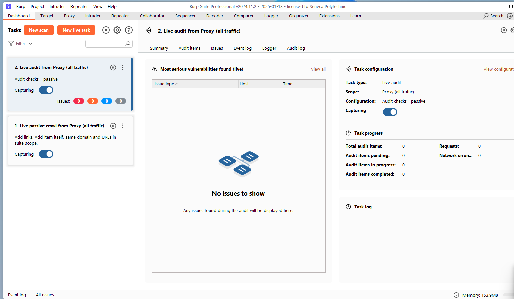
*Figure 1 — Proxy listener configured to route browser traffic through Burp Suite.*

With a request forwarded, the HTTP history view was used to inspect the full intercepted request and response.

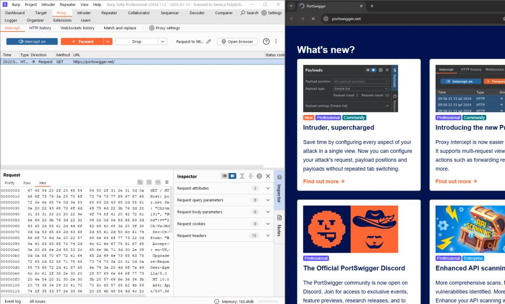
*Figure 2 — Forwarded request and its corresponding response visible in Burp's HTTP history.*

### 3.3 Modifying HTTP Requests with Burp Proxy

Burp's request-editing capability was used to directly tamper with an intercepted request — in this case, modifying the price parameter of an item to `1` before forwarding it to the server.

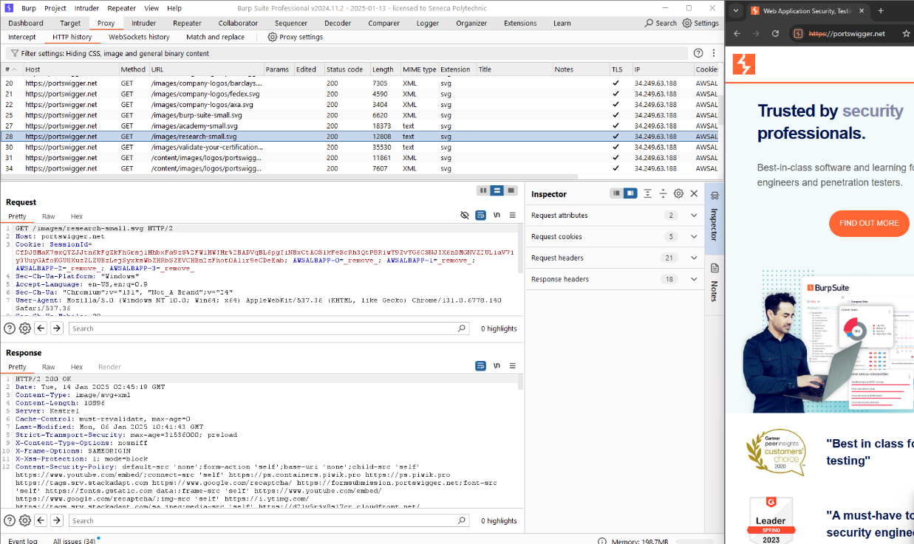
*Figure 3 — Price field altered in the intercepted request body prior to forwarding.*

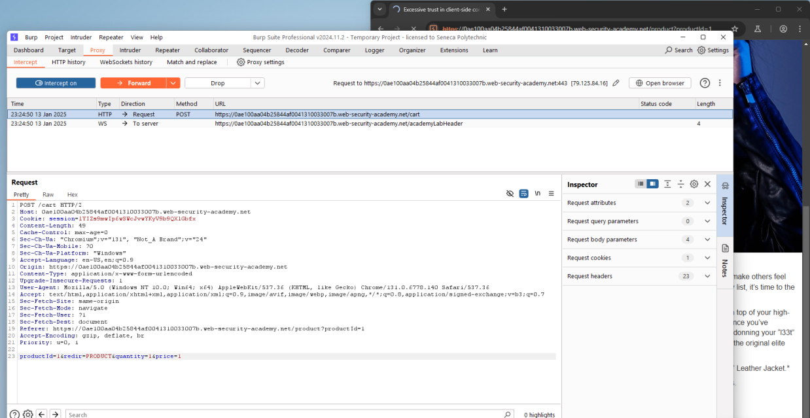
*Figure 4 — Client-side price manipulation confirmed: the item price dropped from $1337 to $0.01, reflected in the total and affected store credit.*

This demonstrates a foundational class of vulnerability: **trusting client-controllable parameters for price-sensitive logic**, which is revisited more formally in the Business Logic Vulnerabilities lab.

### 3.4 Setting the Target Scope

Defining a target scope allows filtering out irrelevant traffic. Scope was set to `https://google.com` for this exercise.

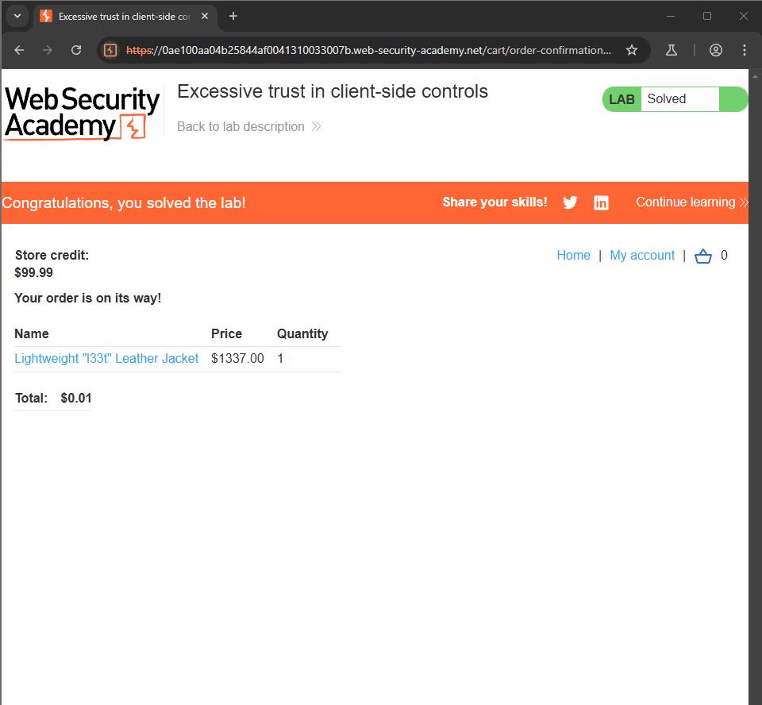
*Figure 5 — Target scope configured to `https://google.com`.*

With the scope defined, the "Show only in-scope items" filter was applied to HTTP history, isolating traffic to the target of interest.

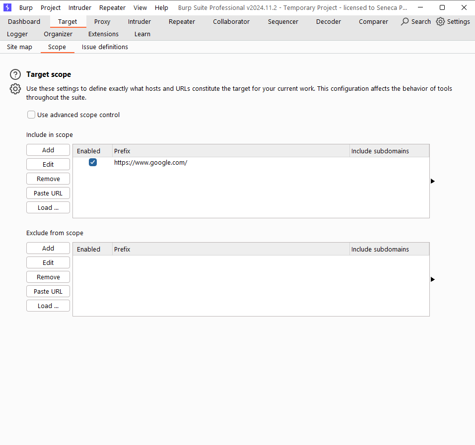
*Figure 6 — HTTP history filtered to show only in-scope traffic.*

### 3.5 Reissuing Requests with Burp Repeater

Burp Repeater allows a captured request to be resent and modified repeatedly without needing to re-trigger it from the browser. A request's product ID parameter was first changed to an arbitrary out-of-range number, correctly returning a "Not Found" response.

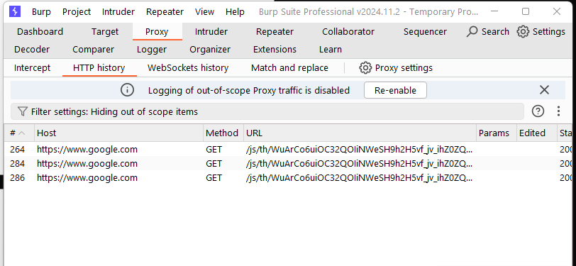
*Figure 7 — Product ID parameter changed to an arbitrary integer, returning an expected "Not Found" response.*

The parameter was then set to a non-integer value (`hello`) to probe input validation. Rather than returning a generic error, the server responded with internal server information — an information disclosure issue triggered simply by sending unexpected input type.

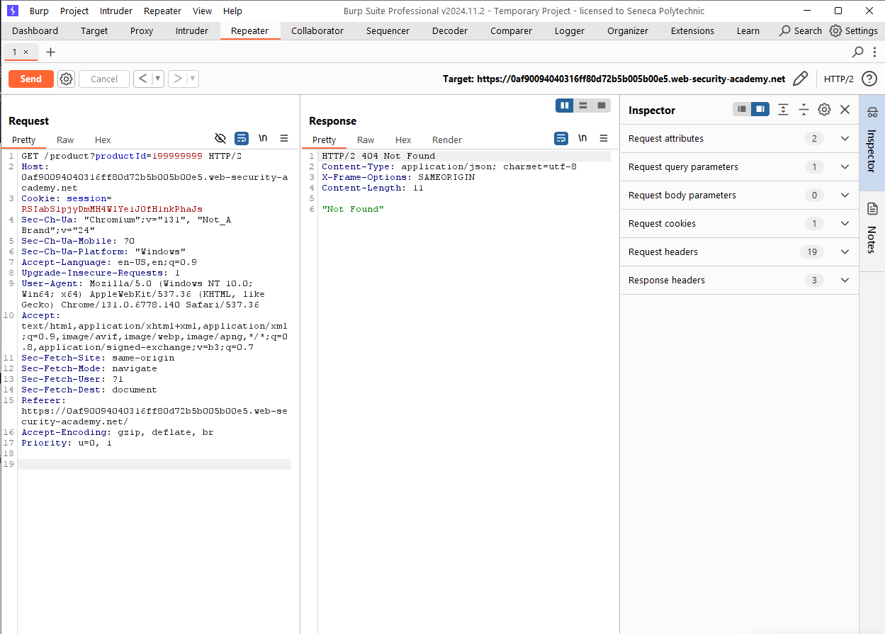
*Figure 8 — Submitting `hello` as the product ID returned server details in the response instead of a clean validation error.*

### 3.6 Running the First Automated Scan

Burp's Crawl and Audit scanner was run against `ginandjuice.shop` to automatically map the site and identify vulnerabilities, with a live crawl map and vulnerability list displayed during the scan.

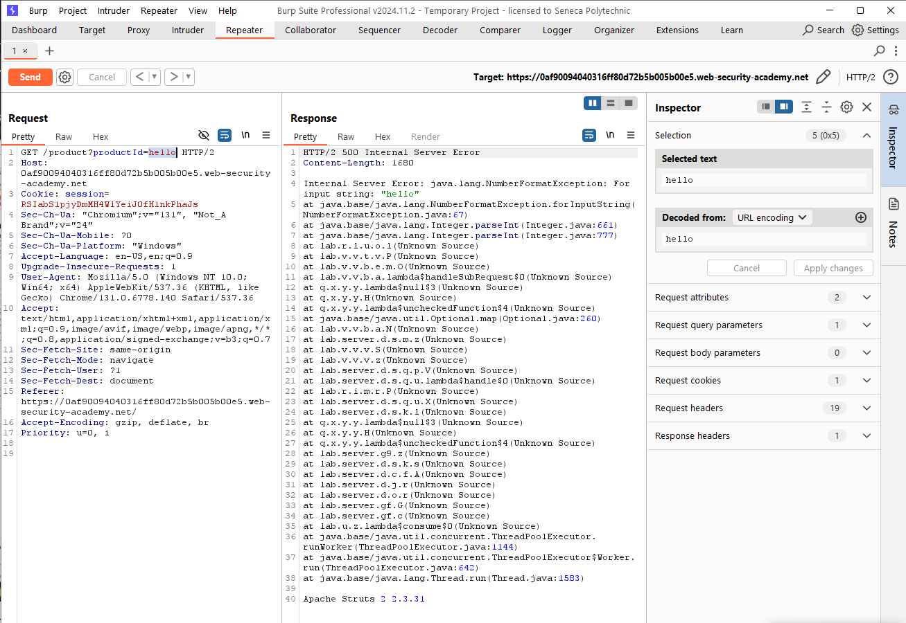
*Figure 9 — Live site map and vulnerability discovery during an automated Crawl and Audit scan.*

Selecting an individual issue from the results dashboard surfaced detailed remediation guidance for that specific finding.

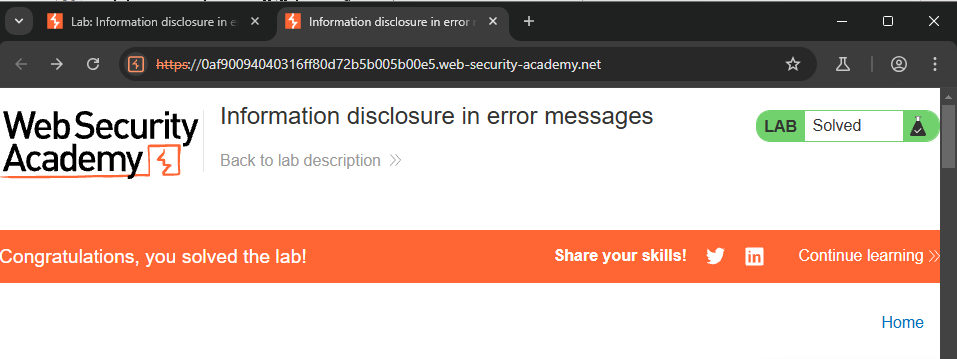
*Figure 10 — Scanner issue detail panel, including a description of the vulnerability and recommended fix.*

### 3.7 Generating a Report

Burp Suite's built-in reporting feature was used to export scan findings into a shareable report format, useful for documenting and presenting results in a real-world engagement.

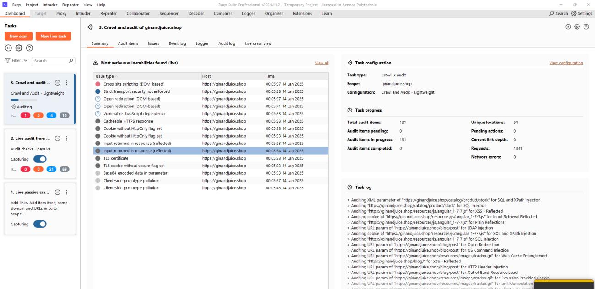
*Figure 11 — Burp Suite's report generation workflow.*

## 4. Key Takeaways

| Observation | Detail |
|---|---|
| Client-side values are not trustworthy | Modifying the price parameter via Repeater/Proxy directly altered a purchase total, illustrating why server-side validation is mandatory for any price- or quantity-sensitive logic. |
| Input type validation gaps leak information | Submitting a non-integer value where an integer was expected caused the server to return internal details instead of a generic error. |
| Scope management is essential for focused testing | Filtering to in-scope targets keeps manual and automated testing efficient on larger applications with substantial background traffic. |
| Burp Scanner accelerates triage, not replaces manual testing | The automated Crawl and Audit scan quickly surfaced a starting list of issues, but each still required manual review via the issue detail panel. |

## 5. Conclusion

This lab established the essential Burp Suite Professional workflow used throughout the remainder of the PortSwigger Web Security Academy labs: intercepting and tampering with traffic via Proxy, replaying and iterating on requests via Repeater, scoping an engagement, and running automated Crawl and Audit scans with report generation. The price-tampering and input-validation exercises here foreshadow the business logic and information disclosure vulnerability classes explored in later labs.

## 6. References

[1] PortSwigger, "Burp Suite Professional Documentation." [Online]. Available: https://portswigger.net/burp/documentation

[2] PortSwigger, "Web Security Academy." [Online]. Available: https://portswigger.net/web-security
