# Lab 1-2 — Authentication
### Companion Lab Report: PortSwigger Web Security Academy

| | |
|---|---|
| **Author** | Iliya Dehghani |
| **Topic** | Authentication (username enumeration, 2FA bypass, password reset logic, brute-force) |
| **Tooling** | Burp Suite Professional (Intruder, Repeater, Session Handling Rules) |
| **Report Type** | Vulnerability walkthrough / technical lab report |

---

## 1. Objective

This report covers eight PortSwigger Web Security Academy labs on authentication vulnerabilities, spanning Apprentice through Expert difficulty: username enumeration via response differences and timing, two-factor authentication (2FA) bypass and broken logic, password reset logic flaws, and automated brute-force attacks using Burp Intruder and session handling macros.

## 2. Background

**Authentication** verifies that a user or system is who it claims to be (passwords, biometrics, tokens), whereas **authorization** determines what an already-authenticated identity is permitted to do. Authentication vulnerabilities arise from weak passwords, absent multi-factor authentication, improper session management, insecure credential storage, or insufficient input validation that permits brute-force and credential-stuffing attacks.

**Seven ways to secure authentication/authorization mechanisms:**

1. Least privilege — users access only what their role requires
2. Role-based access control (RBAC) to reduce permission errors
3. Strong authentication mechanisms
4. Proper input validation on all authorization checks
5. Regular access monitoring/auditing
6. Multi-factor authentication (MFA)
7. Timely patching of authentication/authorization systems

**OAuth 2.0** is an open authorization framework letting users grant third-party applications limited access to their resources without sharing credentials directly — commonly used to secure API access. OAuth vulnerabilities typically stem from misconfigured redirect URIs, unsafe token storage, inadequate authorization code/token validation, overly broad scopes, or insecure flow choices. Mitigations include secure token storage, strict redirect URI validation, mandatory HTTPS, the authorization code flow with PKCE for public clients, minimal scope requests, and full token validation (scope + expiration). **OpenID Connect (OIDC)** is an identity layer built on top of OAuth 2.0 that allows applications to verify user identity and retrieve basic profile data via an ID token.

## 3. Tools Used

| Tool | Purpose |
|---|---|
| Burp Intruder | Automated payload-based attacks (Sniper, Pitchfork) for enumeration and brute-force |
| Burp Repeater | Manual request replay/modification for testing token and parameter behavior |
| Burp Session Handling Rules (macros) | Automating login sequences ahead of an Intruder attack |
| Intruder "Grep – Extract" | Filtering/flagging responses by content pattern |

## 4. Methodology and Walkthrough

### Lab 1 — Username Enumeration via Different Responses (Apprentice)

**Objective:** Identify a valid username/password pair from provided wordlists.

A captured login request was sent to Intruder, with the username parameter swapped for the provided wordlist. Reviewing response lengths, all requests returned length 3248 except one — `affiliate` — whose distinct length and "bad password" response confirmed it as a valid account.

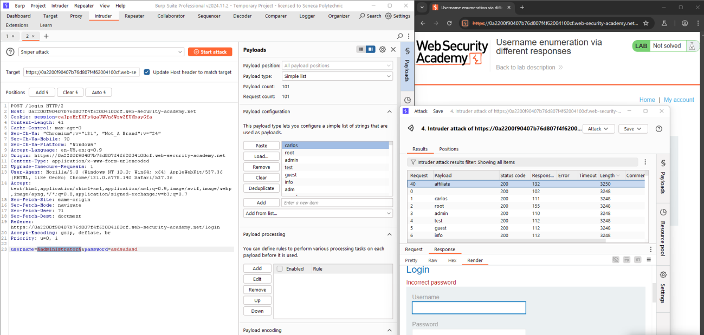
*Figure 1 — `affiliate` isolated as a valid username by its differing response length.*

The same Sniper attack was repeated against the password parameter using the confirmed username, revealing the password `killer`.

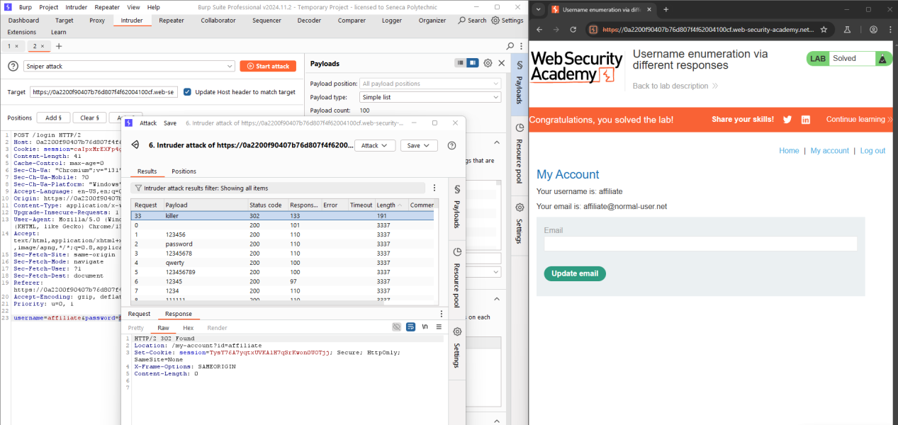
*Figure 2 — Correct password `killer` isolated by response length.*

### Lab 2 — 2FA Simple Bypass (Apprentice)

**Objective:** Log in as `carlos` despite only having 2FA access for the `wiener` account.

After logging in as `wiener`, the post-login URL was observed to contain an `id` parameter: `my-account?id=wiener`. Simply substituting `carlos` for `wiener` in that URL parameter bypassed the 2FA check entirely, since the application trusted the client-supplied `id` rather than re-verifying the authenticated session.

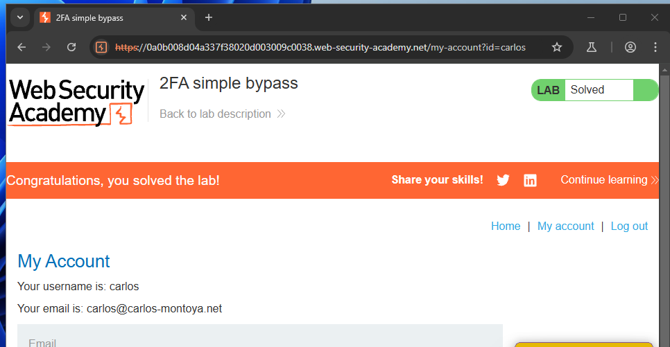
*Figure 3 — Changing `id=wiener` to `id=carlos` in the account URL bypassed 2FA verification.*

### Lab 3 — Password Reset Broken Logic (Apprentice)

**Objective:** Exploit flawed password reset logic to take over the `carlos` account.

A legitimate password reset was performed for `wiener`, and the resulting request was sent to Repeater to test which token/username/password combinations the server would accept. An empty/deleted token still produced an `HTTP 302` success response. With that confirmed, the username field was changed to `carlos` with an attacker-chosen password, resulting in a successful account takeover.

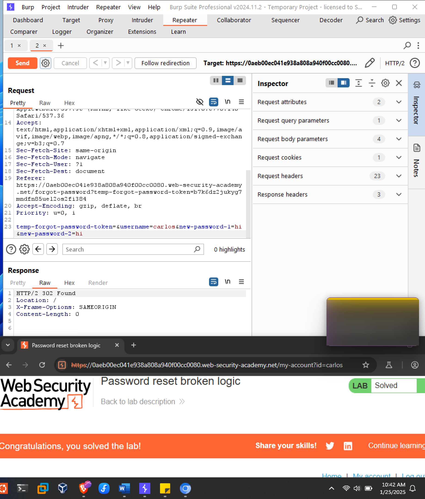
*Figure 4 — Password reset accepted for `carlos` despite an empty reset token, confirming the server never validated it.*

### Lab 4 — Username Enumeration via Subtly Different Responses (Practitioner)

**Objective:** Enumerate a valid username where response lengths are not reliably distinct.

An initial Sniper attack against the username parameter showed no consistent length differences. Reissuing a manual login and capturing the exact error text (`invalid username or password.`) allowed configuring Intruder's "Grep – Extract" feature to flag subtle deviations — revealing that the response for username `accounts` was missing the trailing period.

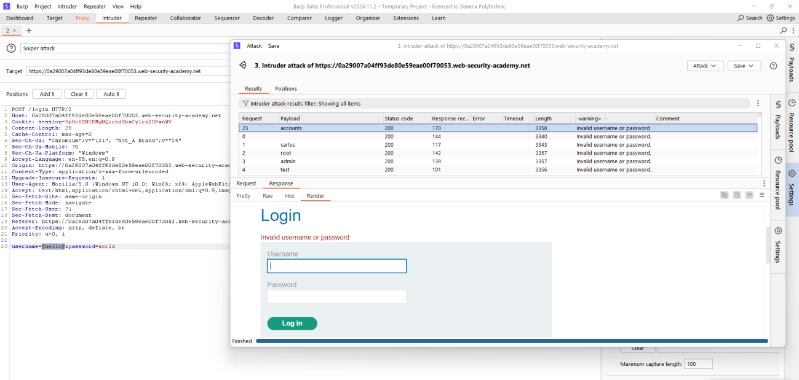
*Figure 5 — `accounts` isolated via a missing trailing period in its error response, invisible from length alone.*

With the username confirmed, the same wordlist-based attack was run against the password parameter; the correct password produced a distinctly different HTTP response code from all others.

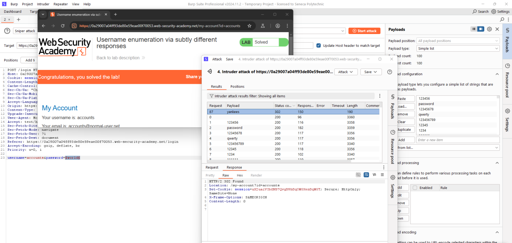
*Figure 6 — Correct password isolated by response status code rather than length or content.*

### Lab 5 — Username Enumeration via Response Timing (Practitioner)

**Objective:** Enumerate a valid username using response timing rather than content, then brute-force its password — all while bypassing IP-based brute-force protection.

IP-based rate limiting was bypassed by adding an `X-Forwarded-For` header with a spoofed, varying IP per request. Response content and length showed no distinguishing signal between valid and invalid usernames, but a **long password** consistently triggered a measurably longer processing time when checked against a *valid* username (since the application only performs the expensive password-hash comparison for existing accounts).

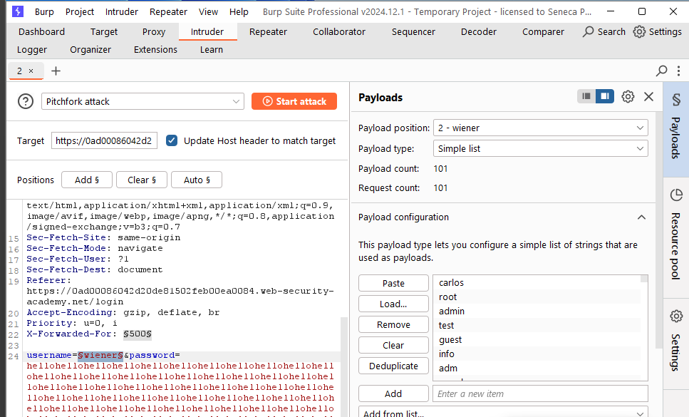
*Figure 7 — Long dummy password used as a timing oracle to detect valid usernames.*

Burp Intruder's **Pitchfork attack** was used to drive two payload sets in parallel: an incrementing `X-Forwarded-For` value (to defeat IP-based lockout) and the username wordlist.

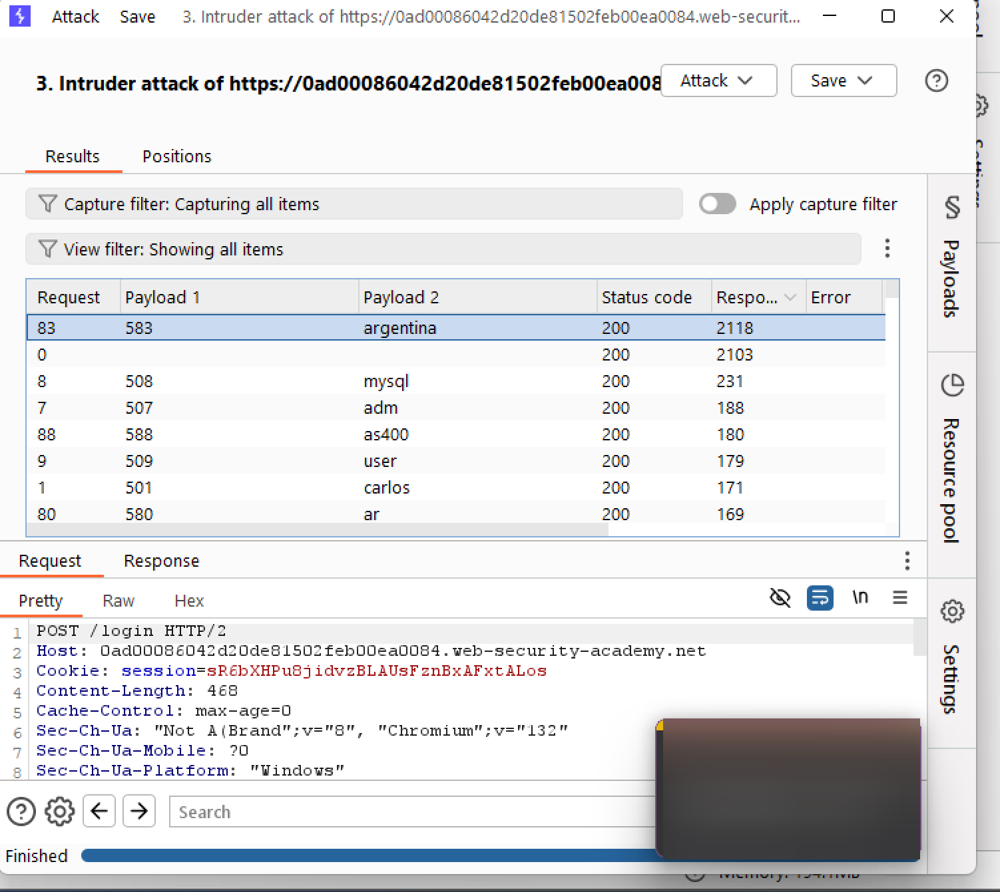
*Figure 8 — Pitchfork attack pairing spoofed `X-Forwarded-For` values with candidate usernames.*

Sorting results by response time isolated one request that took noticeably longer than the rest, identifying the valid username `argentina`.

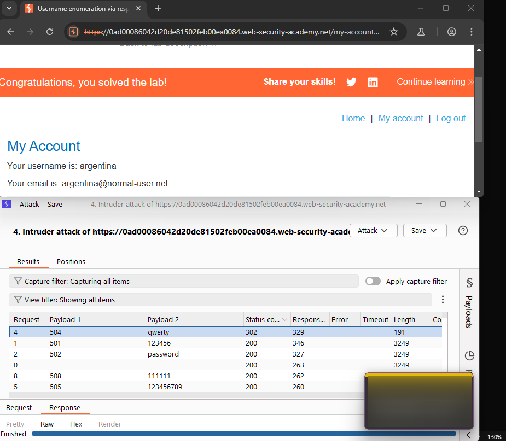
*Figure 9 — `argentina` identified as the valid username via response-time outlier detection.*

The attack was then repeated with `argentina` fixed as the username and the provided wordlist driving the password parameter, revealing the password `qwerty` — confirmed by an `HTTP 302` response with a distinctly shorter length than all failed attempts.

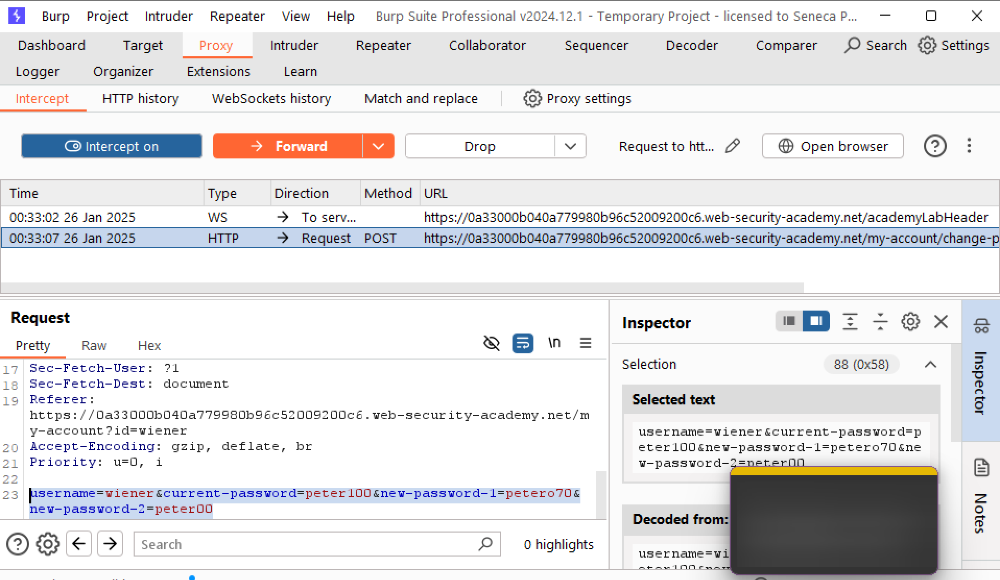
*Figure 10 — Valid credential pair confirmed: `argentina:qwerty`.*

**Flag:** `argentina:qwerty`

### Lab 6 — Password Brute-Force via Password Change (Practitioner)

**Objective:** Brute-force `carlos`'s password via the account's password-change functionality.

Logging in as `wiener` surfaced a forced password-change prompt.

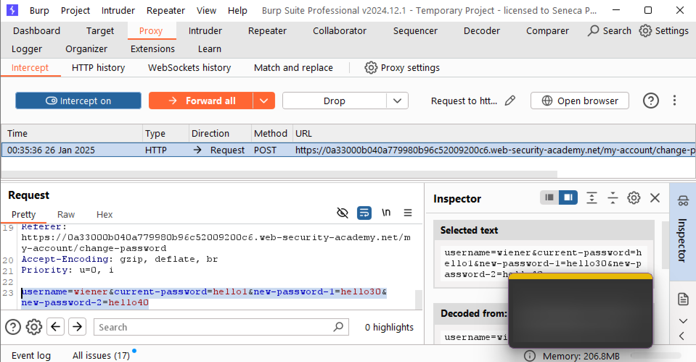
*Figure 11 — Password change form presented after login.*

Testing revealed two distinct error responses depending on input validity: an incorrect current password (with matching new-password fields) returned `Current password is incorrect`, while a correct current password with mismatched new-password fields returned `New passwords do not match`.

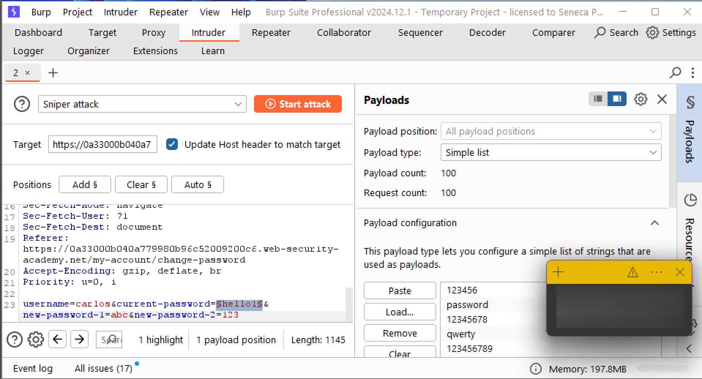
*Figure 12 — `Current password is incorrect` error, confirming the current-password field is validated first.*

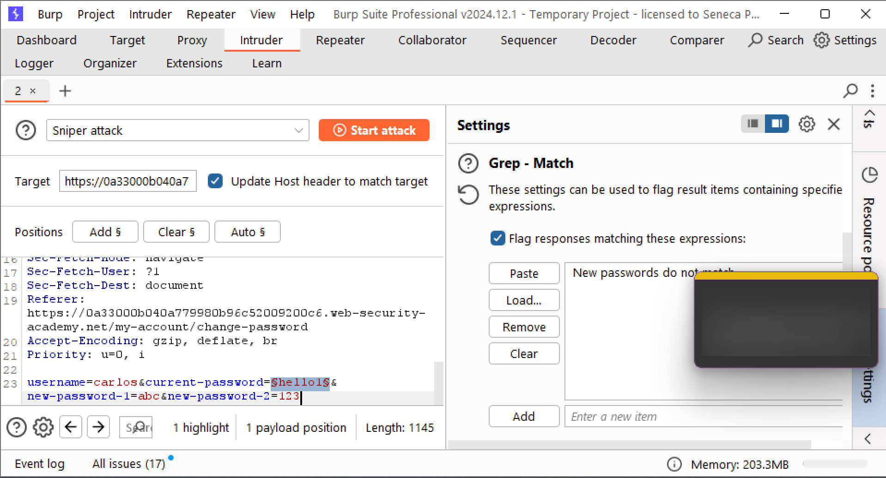
*Figure 13 — `New passwords do not match` error, used as the success oracle: if the current password is correct, the mismatch error is the *only* thing that should return, since a match would succeed outright.*

Intruder was configured to spray the provided password wordlist against the "current password" field for user `carlos`, with both new-password fields fixed to identical values, using Grep-Match to flag any response containing `New passwords do not match` (the signal that the *current* password guess was correct).

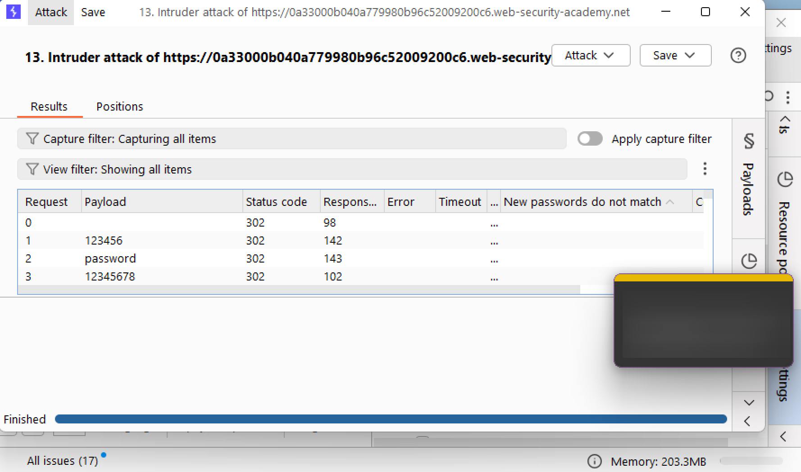
*Figure 14 — Intruder attack against `carlos`'s current-password field, with Grep-Match set to flag the "New passwords do not match" response.*

Despite multiple attempts, no response matched the expected grep pattern, and the lab was not completed successfully via this approach — documented here as an incomplete finding rather than a confirmed exploit.

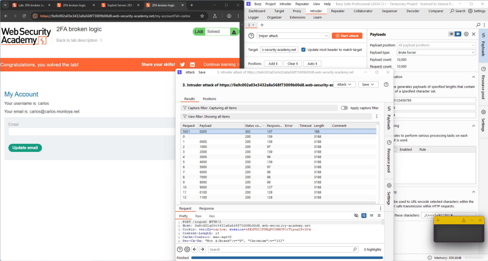
*Figure 15 — Completed Intruder attack with no responses matching the expected grep pattern.*

### Lab 7 — 2FA Broken Logic (Practitioner)

**Objective:** Access `carlos`'s account page using provided credentials `wiener:peter` and access to an email client for 2FA codes.

Logging in with the provided credentials revealed that the `POST /login2` request includes a `verify` parameter identifying which user's account is being accessed for 2FA purposes. Sending the request to Repeater and changing `verify` to `carlos` caused a temporary 2FA code to be generated for Carlos's account instead of Wiener's — while the session remained authenticated as Wiener.

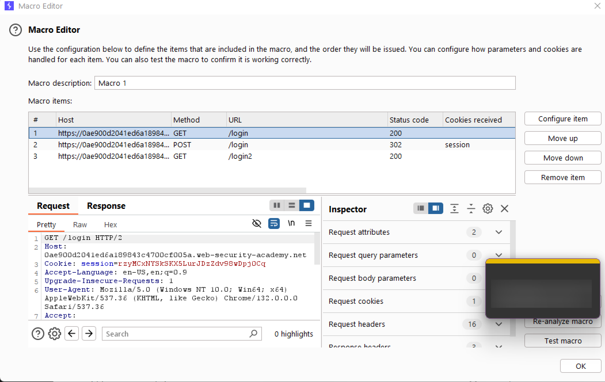
*Figure 16 — `verify=carlos` causing the server to generate a 2FA code for Carlos while the session belongs to Wiener.*

An Intruder attack was configured against `POST /login2` with `verify` fixed to `carlos` and a payload position on the `mfa-code` parameter, brute-forcing the 4-digit code. The correct code (`0205`) was identified, and replaying it in the original browser session completed the takeover.

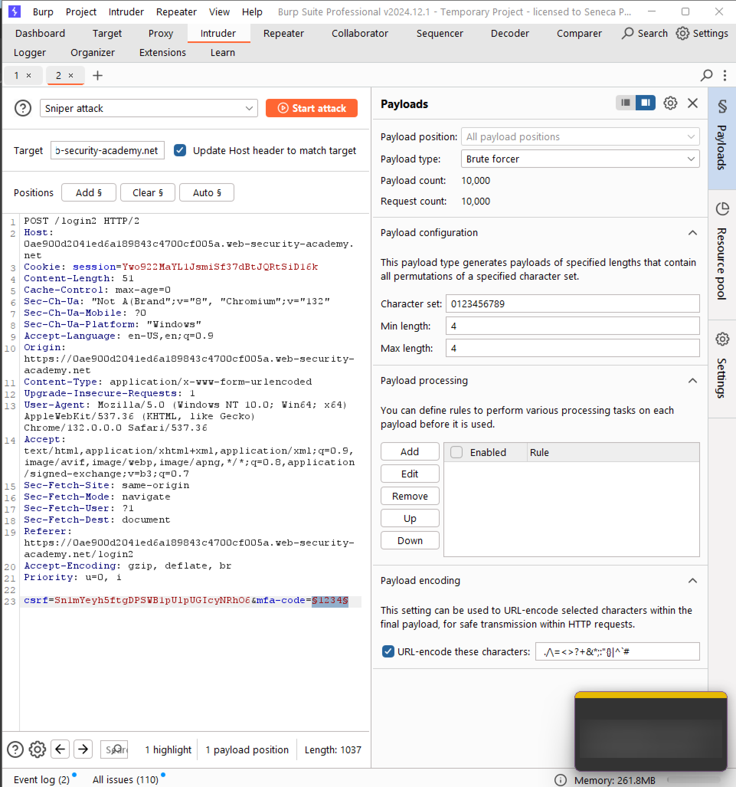
*Figure 17 — Correct 2FA code `0205` identified via Intruder, completing the account takeover.*

### Lab 8 — 2FA Bypass Using a Brute-Force Attack (Expert)

**Objective:** Brute-force a 4-digit 2FA code for the known credentials `carlos:montoya`, despite a lockout triggered after two incorrect attempts.

Since two failed 2FA attempts trigger a logout, brute-forcing the full 10,000-combination keyspace required re-authenticating before every guess. This was automated using Burp's **Session Handling Rules**: a macro was configured (scoped to all URLs) that replays the full login sequence — loading the login page, submitting credentials via `POST`, then retrieving the 2FA page — automatically ahead of every Intruder request.

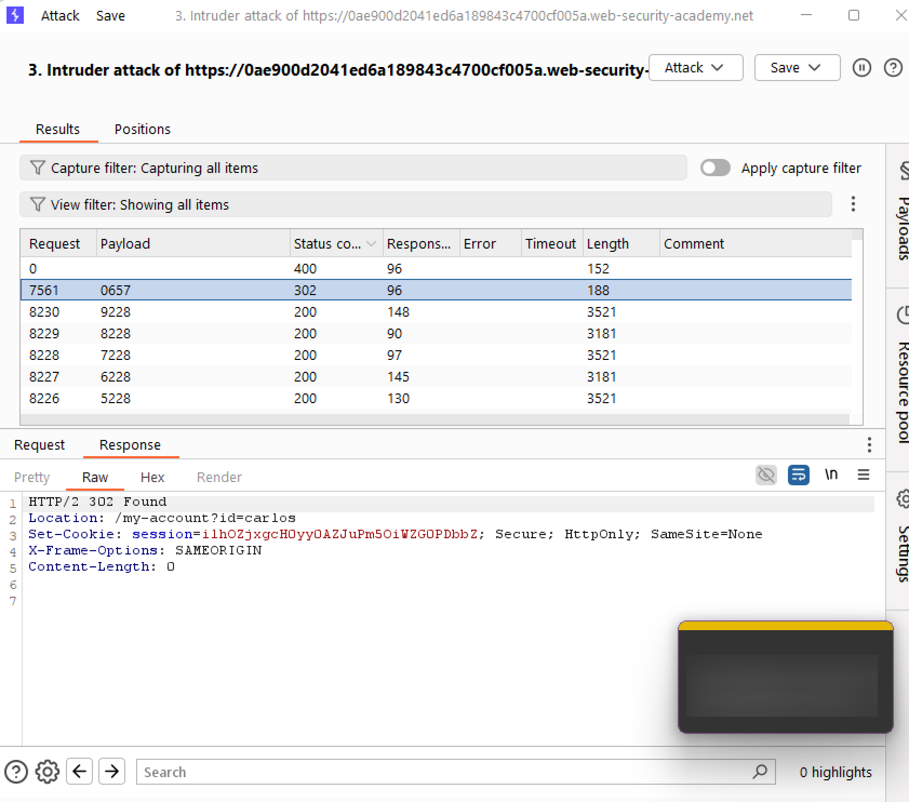
*Figure 18 — Macro configured to replay the GET login page → POST credentials → GET 2FA page sequence before each attack request.*

With the macro active, Intruder needed only a single payload position on the 2FA code field; all 10,000 possible 4-digit combinations were feasible since re-authentication was fully automated per request.

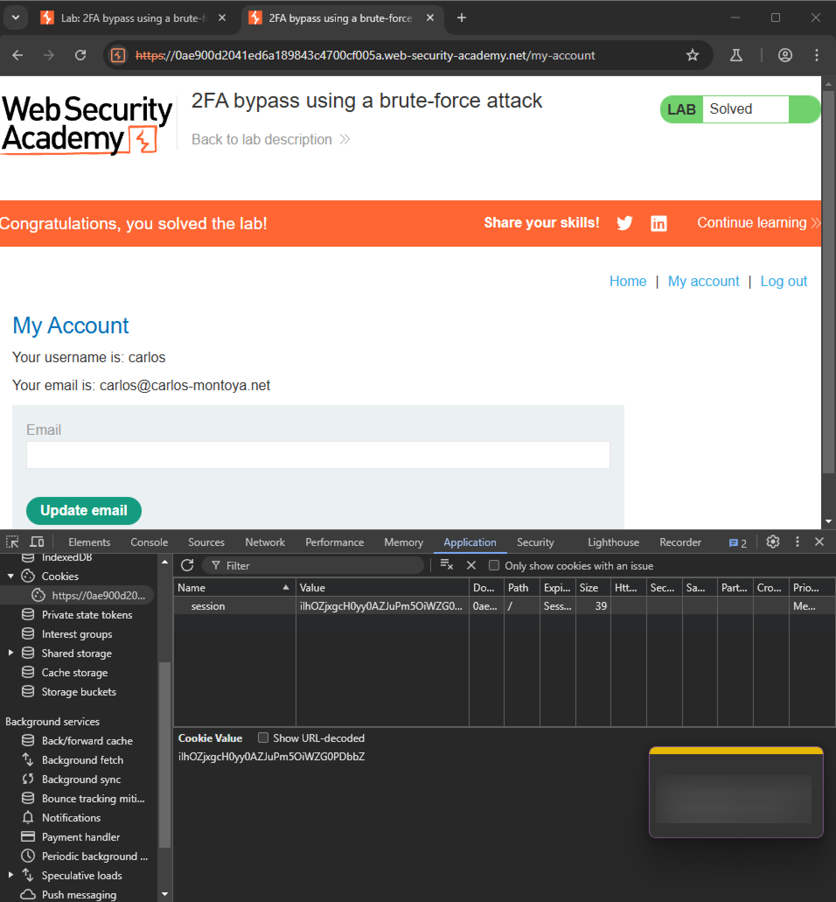
*Figure 19 — Intruder attack against the 2FA code field, with the session macro re-authenticating before each of the 8,230 attempts made until the correct code (`0657`) was found.*

The valid session ID captured at that point (`ilhOZjxgcH0yy0AZJuPm5OiWZG0PDbbZ`) was substituted into the browser's cookie, and refreshing the page completed login as Carlos.

## 5. Findings / Observations

| # | Finding | Severity | Root Cause |
|---|---|---|---|
| 1 | Username enumeration via response length/content/timing differences | Medium | Application behavior (length, error text, processing time) differs between valid and invalid usernames |
| 2 | 2FA bypass via client-controlled `id`/`verify` parameters | Critical | Post-authentication account context trusted from client input rather than server-side session state |
| 3 | Password reset accepted with an empty/deleted token | Critical | Reset token presence/validity never actually checked server-side |
| 4 | No effective rate limiting on password-change or 2FA endpoints | High | IP-based throttling alone, bypassable via `X-Forwarded-For` spoofing; no per-account lockout enforced consistently |
| 5 | 2FA lockout bypassable via automated re-authentication (macros) | Critical | Lockout resets per session rather than enforcing a durable, account-wide cooldown |

## 6. Conclusion

Across all eight labs, the authentication failures fell into two broad classes: **observable side channels** (response length, error text, and timing differences that leak whether a username or password guess is correct) and **broken trust boundaries** (accepting client-supplied identity parameters, empty tokens, or unlimited re-authentication attempts as valid). The Expert-level 2FA brute-force lab in particular demonstrates that per-session lockouts are trivially defeated once login can be scripted — durable, account-level throttling (independent of session state) is required to make brute-force genuinely impractical. Lab 6 was not successfully completed within this engagement and is documented as an open item for follow-up.

## 7. References

[1] PortSwigger, "Authentication vulnerabilities." [Online]. Available: https://portswigger.net/web-security/authentication

[2] PortSwigger, "OAuth 2.0 authentication vulnerabilities." [Online]. Available: https://portswigger.net/web-security/oauth
