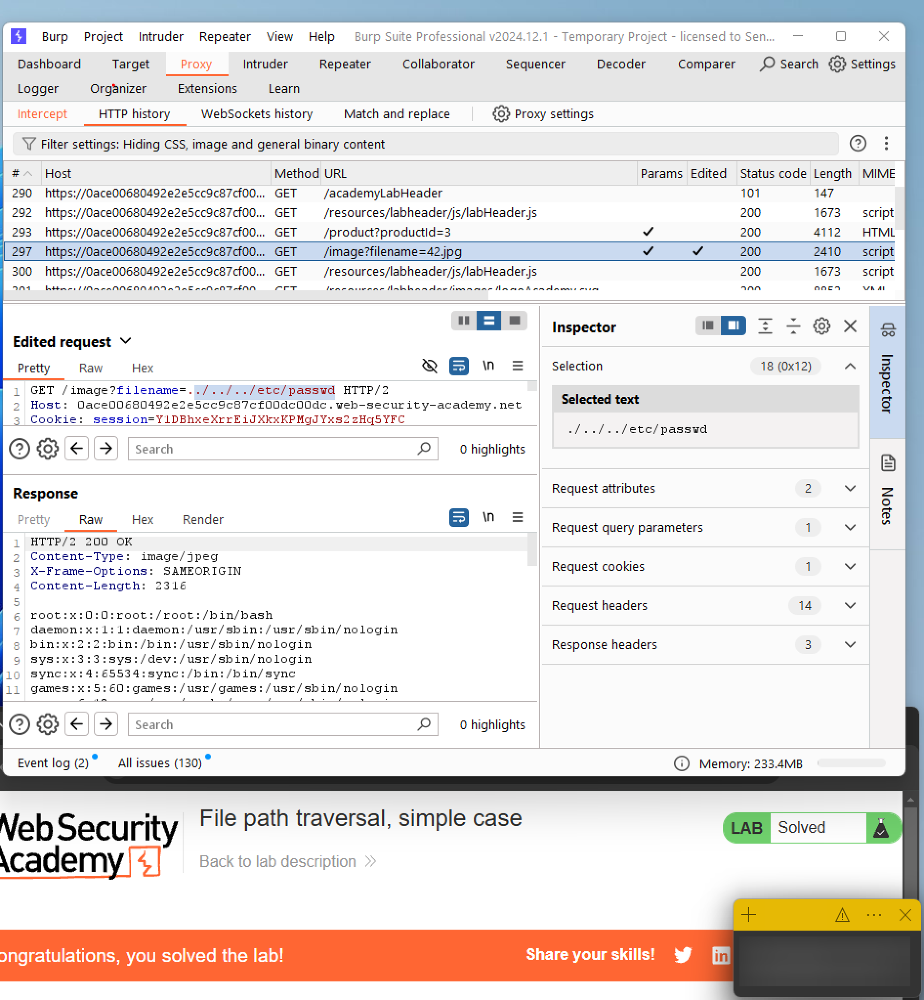
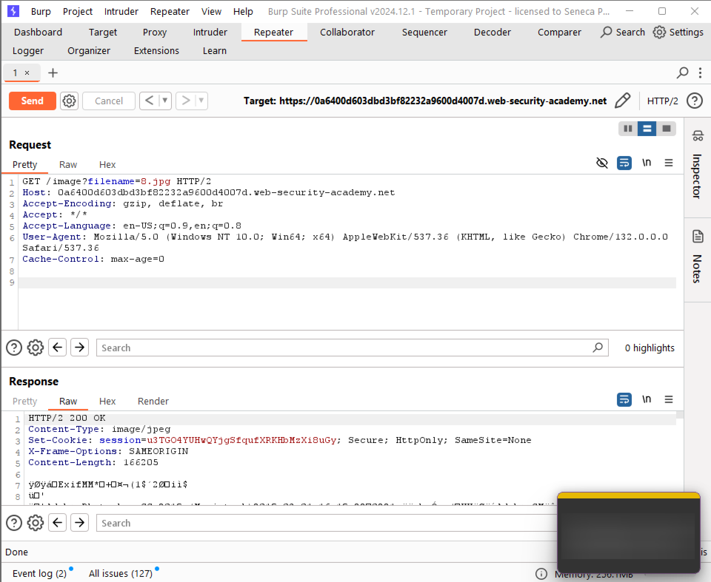
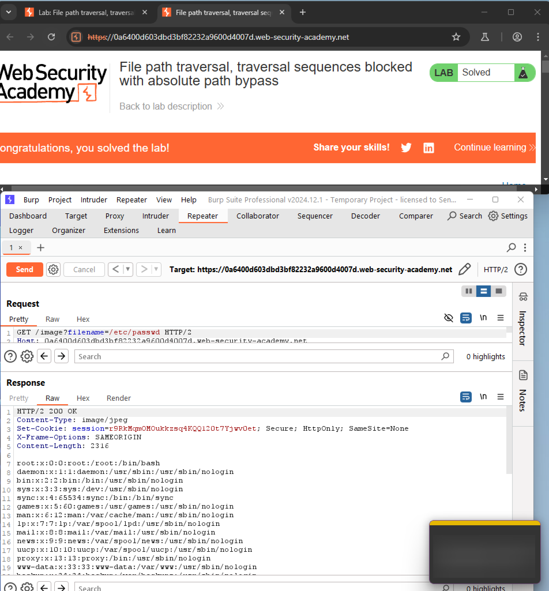
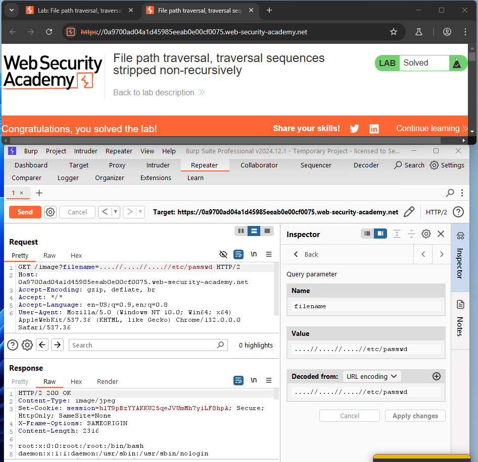
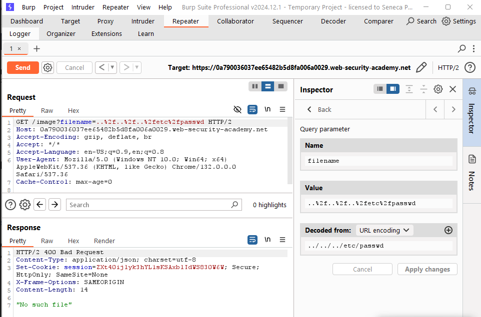
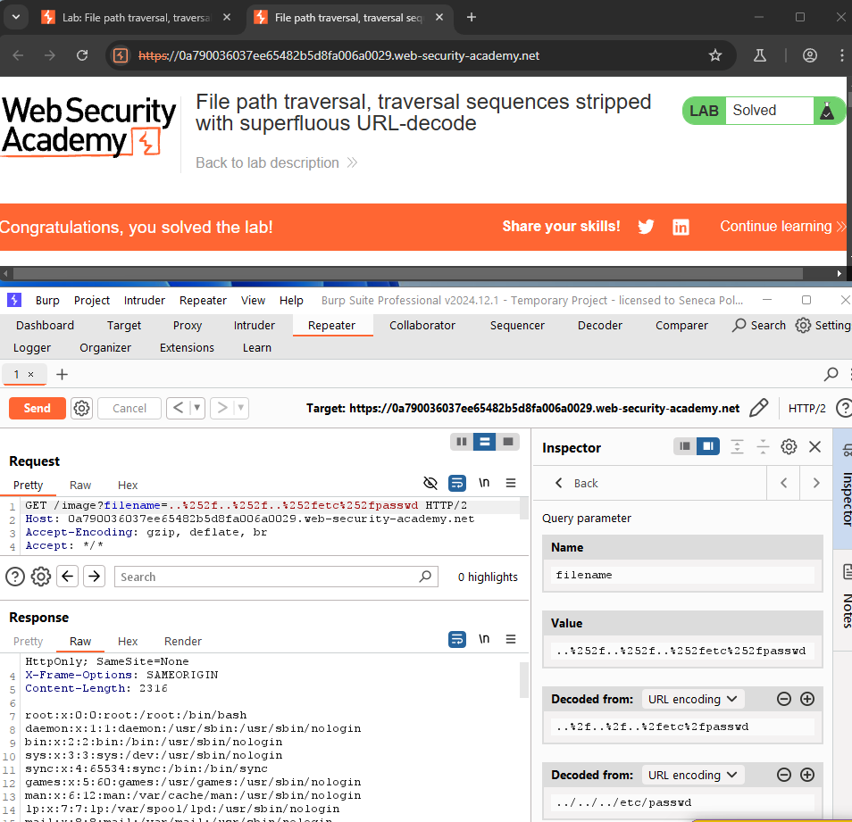
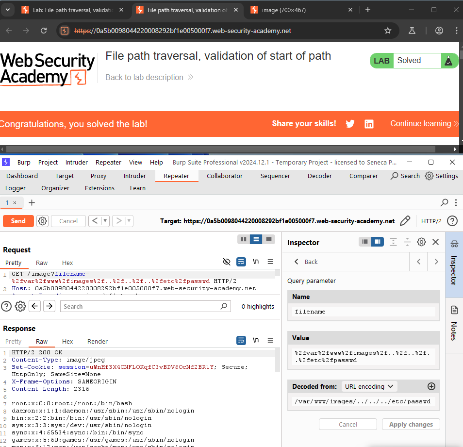
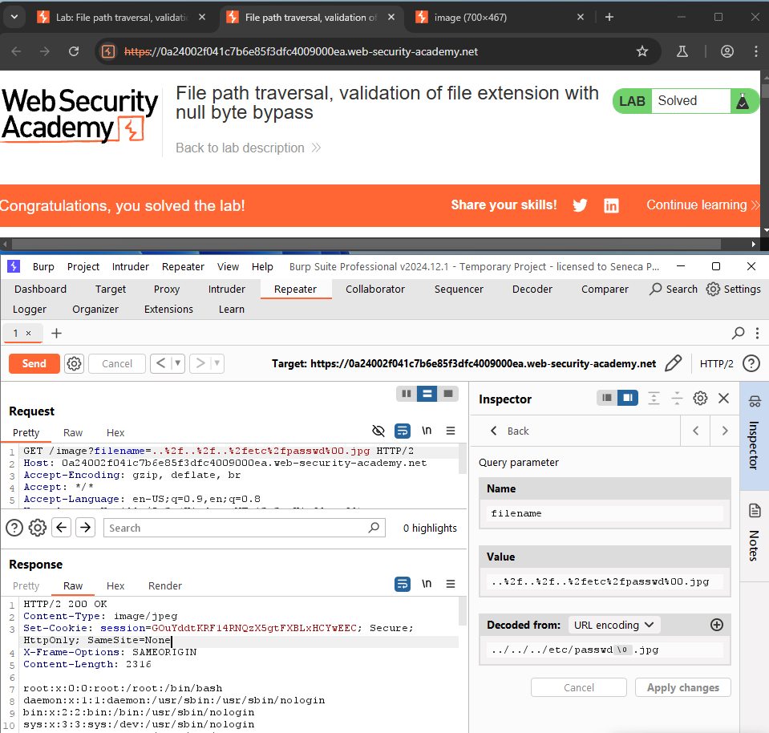

# Lab 1-3 — Directory Traversal
### Companion Lab Report: PortSwigger Web Security Academy

| | |
|---|---|
| **Author** | Iliya Dehghani |
| **Topic** | Directory (Path) Traversal, Full Path Disclosure |
| **Tooling** | Burp Suite Professional (Inspector, URL encoding) |
| **Report Type** | Vulnerability walkthrough / technical lab report |

---

## 1. Objective

This report covers six PortSwigger Web Security Academy directory traversal labs (Apprentice through Practitioner), each targeting a different filter-bypass technique for the same underlying goal — reading `/etc/passwd` via a vulnerable product-image endpoint — plus a Part B secure-code review exercise on mitigating Full Path Disclosure (FPD) and insecure file access vulnerabilities in application source code.

## 2. Background

**Directory (path) traversal** is a vulnerability that lets an attacker access files and directories outside an application's intended scope by manipulating file paths in user input. Sequences like `../` (or their encoded equivalents, e.g. `..%2f`) allow navigation outside the intended directory to sensitive files such as `/etc/passwd` (Linux) or `C:\Windows\system32\config` (Windows), leading to information disclosure, system compromise, or further attack.

**Common defenses (and their limits):**
- **Input validation/filtering** — stripping `../` and encoded variants
- **File extension whitelisting** — restricting to specific file types (e.g., `.jpg`)
- **Sandboxing** — confining the application to a restricted directory
- **Access control** — file permissions limiting what even a successful traversal can read

**Prevention best practices:** use predefined absolute paths rather than user-supplied path construction; restrict access via allowlists; normalize and validate all input (removing traversal sequences, null bytes, and their encoded forms); and apply least privilege to file system permissions. Critically, no single control is sufficient in isolation — the labs below each defeat one control precisely because it was the *only* control in place.

## 3. Tools Used

| Tool | Purpose |
|---|---|
| Burp Suite Inspector | Decoding/re-encoding request parameters |
| Burp Suite URL encoder | Applying single/double URL encoding to bypass decode-based filters |

## 4. Methodology and Walkthrough — Part A: Six Challenges

### Lab 1 — File Path Traversal, Simple Case (Apprentice)

**Objective:** Retrieve `/etc/passwd` via the vulnerable product image endpoint.

The image URL parameter (`/image?filename=1.jpg`) could be freely modified to reference other files in the same directory, confirming directory traversal was possible. Prepending `../` sequences (three levels, in this case) to move up from the images directory and back down into `/etc/passwd` returned the file's contents.


*Figure 1 — `../../../etc/passwd` successfully returning the contents of `/etc/passwd`.*

### Lab 2 — Traversal Sequences Blocked with Absolute Path Bypass (Practitioner)

**Objective:** Bypass a filter that blocks relative traversal sequences.

Relative traversal (`../../../etc/passwd`, as in Lab 1) was blocked, since the filter treats the supplied filename as relative to a fixed working directory.


*Figure 2 — Relative `../` traversal correctly rejected by the application.*

Since the filter only validated relative sequences, supplying the **absolute path** to the target file (`/etc/passwd`) bypassed it entirely, as the application never re-validated an absolute path against the expected working directory.


*Figure 3 — Absolute path `/etc/passwd` returned directly, bypassing the relative-path filter.*

### Lab 3 — Traversal Sequences Stripped Non-Recursively (Practitioner)

**Objective:** Bypass a filter that strips `../` sequences without re-checking the result.

The application removed `../` sequences from input, but only in a single, non-recursive pass. Supplying nested/overlapping sequences (e.g., `....//....//....//etc/passwd`) meant that after the inner `../` occurrences were stripped once, the surrounding characters recombined into a valid `../../../etc/passwd` path.


*Figure 4 — Overlapping traversal sequences reassembling into a valid path after a single non-recursive strip pass.*

### Lab 4 — Traversal Sequences Stripped with Superfluous URL-Decode (Practitioner)

**Objective:** Bypass a filter that blocks traversal sequences and then performs an extra URL-decode pass.

A single layer of URL encoding (`%2e%2e%2f` for `../`) was tried first but did not bypass the filter, since the filter itself decodes once before checking.


*Figure 5 — Single-encoded traversal sequence still detected and blocked.*

Because the application performs an *additional*, superfluous URL-decode pass after its filter check, **double URL-encoding** the payload (encoding the already-encoded sequence a second time) bypassed the filter: the filter checked the once-decoded (still-encoded) string and saw no traversal sequence, but the application's second decode pass revealed the real `../` sequence at request-processing time.


*Figure 6 — Double-encoded traversal sequence surviving the filter check and resolving to `/etc/passwd` after the application's extra decode pass.*

### Lab 5 — Validation of Start of Path (Practitioner)

**Objective:** Bypass a filter that validates the request path starts with the expected image directory.

The application passed the full absolute path as a request parameter (e.g., `/var/www/images/2.jpg`) and validated that it began with `/var/www/images`. Since the check only validated the *start* of the path, appending `../../../etc/passwd` after a valid-looking prefix satisfied the start-of-path check while still traversing to the target file.


*Figure 7 — Path prefixed with the required `/var/www/images` directory, then traversed via trailing `../` sequences to reach `/etc/passwd`.*

### Lab 6 — Validation of File Extension with Null Byte Bypass (Practitioner)

**Objective:** Bypass a filter requiring the requested filename to end in `.jpg`.

Appending `.jpg` after a traversal path (to satisfy the extension check) failed, since the actual file being read was then `/etc/passwd.jpg`, which does not exist.

Injecting a **null byte** (`%00`) between the target path and the required extension (e.g., `../../../etc/passwd%00.jpg`) caused the underlying file-read operation to treat the null byte as a string terminator, ignoring the trailing `.jpg` — while the extension-validation check (operating on the full string) still saw a `.jpg`-suffixed filename and passed it.


*Figure 8 — `%00` null byte terminating the effective file path before the enforced `.jpg` extension, successfully retrieving `/etc/passwd`.*

## 5. Methodology and Walkthrough — Part B: Secure Code Review

### Vulnerability 1 — Error Message Disclosure (Full Path Disclosure)

**Vulnerable code (`app.js`):**
```javascript
app.get('/read-file', (req, res) => {
  const filePath = __dirname + '/' + req.query.file;
  fs.readFile(filePath, 'utf8', (err, data) => {
    if (err) {
      res.status(500).send(`Error reading file: ${err.message} in ${filePath}`);
    } else {
      res.send(data);
    }
  });
});
```

**Issues identified:**
- The file path is built directly from unsanitized user input (`req.query.file`), permitting path traversal.
- Detailed error messages — including the full resolved file path — are returned to the client, disclosing internal server file system structure (Full Path Disclosure) and aiding further exploitation.

**Remediated code:**
```javascript
const DF = path.join(__dirname, 'public');

app.get('/read-file', (req, res) => {
  const requestedFile = req.query.file;
  if (!requestedFile) {
    return res.status(400).send('File name is required.');
  }
  const sanitizedFileName = path.basename(requestedFile);
  const filePath = path.join(DF, sanitizedFileName);
  if (!filePath.startsWith(DF)) {
    return res.status(403).send('Access to this file is not allowed.');
  }
  fs.readFile(filePath, 'utf8', (err, data) => {
    if (err) {
      return res.status(500).send('Unable to process the request.');
    }
    res.send(data);
  });
});
```

**Fixes applied:**
- **Full Path Disclosure eliminated** — the client now receives a generic error message with no path information.
- **Path traversal mitigated** — `path.basename()` strips any directory components from user input, and the resolved path is validated to confirm it still resides within the intended base directory (`DF`).
- **Input validation added** — missing filenames are rejected with `400 Bad Request` before any file system access is attempted.

### Vulnerability 2 — Insecure File Access Using User Input

**Vulnerable code (`app.js`):**
```javascript
app.get('/view', (req, res) => {
  const file = req.query.file;
  const filePath = path.join(__dirname, 'public', file);
  res.sendFile(filePath);
});
```

**Issue identified:** the `file` query parameter is concatenated into the file path with no sanitization, making the endpoint vulnerable to the same class of directory traversal demonstrated across the six PortSwigger labs above.

**Remediated approach:** rather than hand-rolling path construction and validation, Express's built-in `express.static` middleware was used to serve files from the `public` directory securely, since it already implements safe path resolution and directory containment:

```javascript
app.use(express.static(path.join(__dirname, 'public')));
```

## 6. Findings / Observations

| # | Finding | Severity | Root Cause |
|---|---|---|---|
| 1 | Unrestricted directory traversal via relative path sequences | Critical | No filtering of `../` in user-supplied filename parameter |
| 2 | Absolute-path bypass of relative-path filtering | Critical | Filter validates only relative traversal, not absolute paths |
| 3 | Filter bypass via nested/non-recursive sanitization | Critical | Single-pass sanitization vulnerable to overlapping sequences |
| 4 | Filter bypass via double URL-encoding | Critical | Application decodes input a second time after the security filter runs |
| 5 | Start-of-path validation bypass via trailing traversal | Critical | Prefix-only validation, no full-path resolution check |
| 6 | Extension check bypass via null byte injection | Critical | Extension validated on the raw string, not the string as interpreted by the underlying OS file API |
| 7 | Full Path Disclosure via verbose error messages | Medium | Internal file paths and error details returned directly to the client |

## 7. Conclusion

Each of the six Part A labs defeated exactly one specific traversal control in isolation — filtering, absolute-path bypass, non-recursive stripping, decode-order mismatches, prefix-only validation, and extension whitelisting with null byte injection — reinforcing that no single defense is adequate on its own. The Part B code review reached the same conclusion from the developer side: robust protection requires input sanitization (`path.basename`), post-resolution path containment checks, and generic error responses used together, ideally backed by a well-tested framework primitive like `express.static` rather than custom path-joining logic.

## 8. References

[1] PortSwigger, "Path traversal." [Online]. Available: https://portswigger.net/web-security/file-path-traversal

[2] OWASP, "Path Traversal." [Online]. Available: https://owasp.org/www-community/attacks/Path_Traversal
