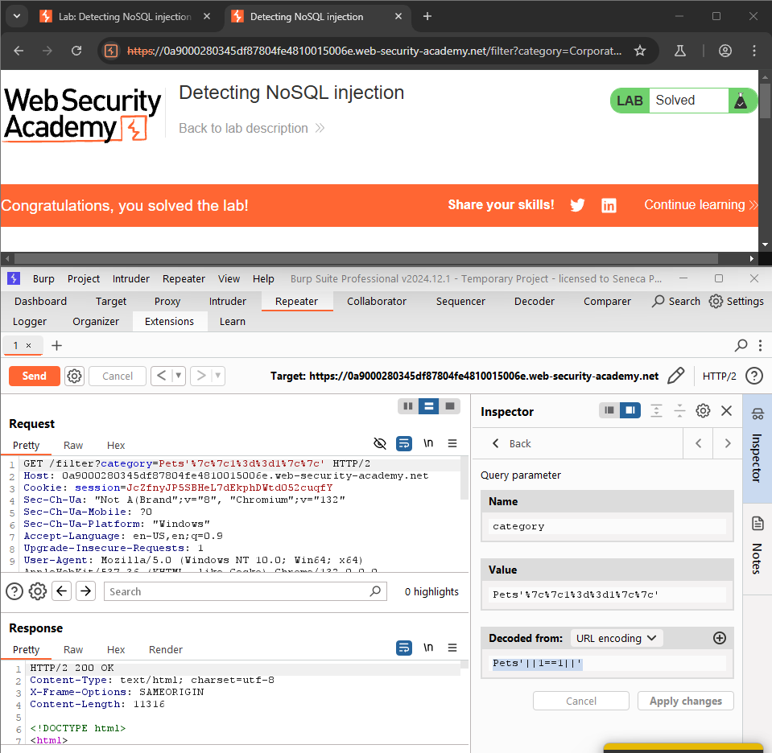
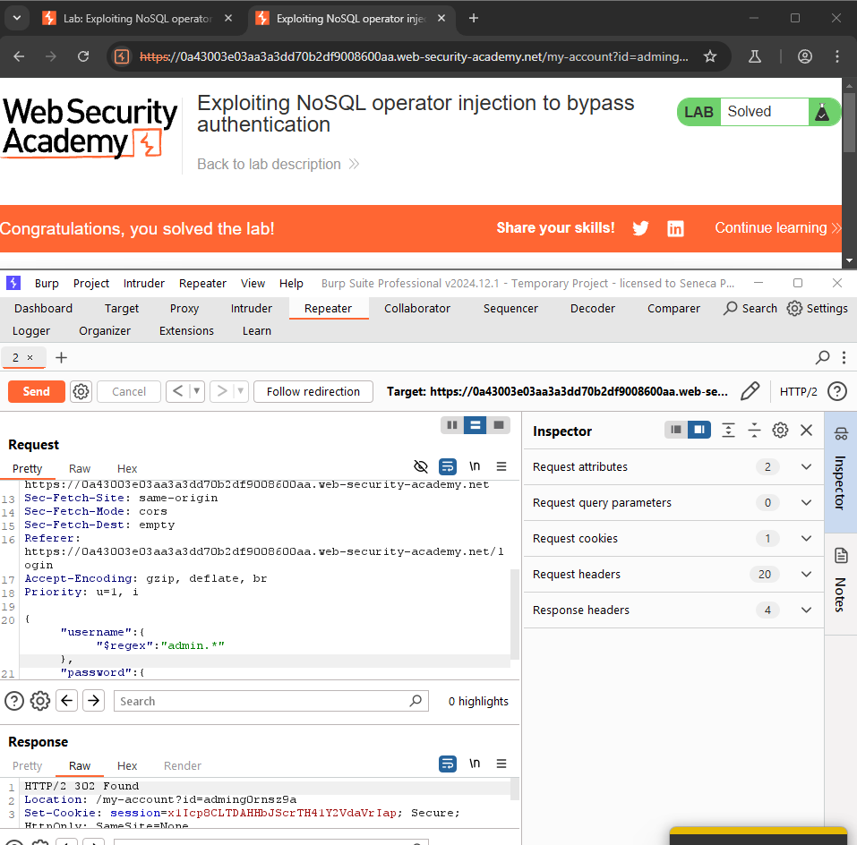
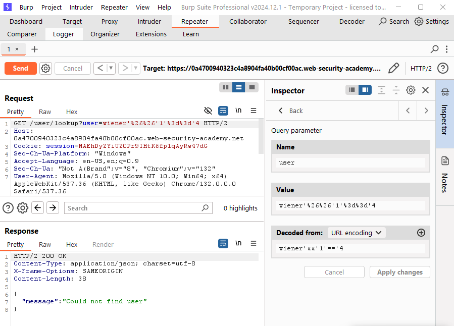
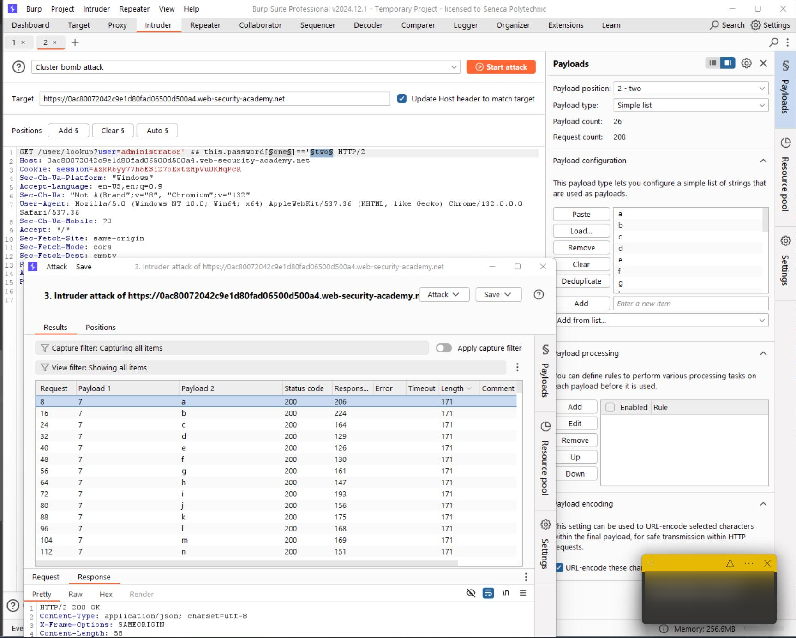

# Lab 1-5 — NoSQL Injection
### Companion Lab Report: PortSwigger Web Security Academy

| | |
|---|---|
| **Author** | Iliya Dehghani |
| **Topic** | NoSQL Injection (MongoDB) |
| **Tooling** | Burp Suite Professional (Inspector, Intruder) |
| **Report Type** | Vulnerability walkthrough / technical lab report |

---

## 1. Objective

This report covers three PortSwigger Web Security Academy labs on NoSQL injection against MongoDB-backed application logic: detecting injection via syntax errors, bypassing authentication using MongoDB query operators, and attempting boolean-based blind data extraction.

## 2. Background

**NoSQL injection** is a vulnerability where an attacker manipulates NoSQL database queries by injecting malicious input, potentially leading to unauthorized data access, modification, or deletion — analogous to SQL injection but targeting document/operator-based query languages like MongoDB's.

**Testing approach:** submit specially crafted payloads and observe whether queries behave unexpectedly; watch for error messages or anomalous results in API responses; supplement manual testing with automated scanning tools.

**Prevention:** validate and sanitize input to allow only expected data formats/types; disable JavaScript execution within the database engine where supported (e.g., MongoDB's `$where` sandboxing); enforce proper access controls and least privilege on database accounts.

## 3. Tools Used

| Tool | Purpose |
|---|---|
| Burp Suite Inspector | Crafting and URL-encoding MongoDB operator injection payloads |
| Burp Intruder (Cluster Bomb) | Attempted boolean-based blind character-by-character extraction |

## 4. Methodology and Walkthrough

### Lab 1 — Detecting NoSQL Injection (Apprentice)

**Objective:** Force the MongoDB-backed product category filter to reveal unreleased products.

Since MongoDB query syntax places the category filter value in single quotes, appending a stray single quote to the filter parameter triggered an internal JavaScript syntax error — confirming the input was passed unsanitized into the query.

*Figure 1 — Internal JavaScript syntax error triggered by an unescaped single quote in the category parameter.*

With injection confirmed, a logical OR (`||`) condition that always evaluates true was appended (`'||'1'=='1`), breaking the intended filter logic regardless of the original condition's outcome and causing all products — including unreleased ones — to be returned.

*Figure 2 — `||'1'=='1` injected into the category filter, forcing the query to always evaluate true.*

### Lab 2 — Exploiting NoSQL Operator Injection to Bypass Authentication (Apprentice)

**Objective:** Log in as `administrator` by exploiting MongoDB operator injection in the login form (with `wiener:peter` available as a known-valid account for baseline testing).

MongoDB operators such as `$ne` (not equal) and `$regex` can be injected as structured JSON values in place of plain strings, altering query logic. Injecting `$ne` for both the username and password fields caused a successful login (any user not equal to an empty/nonexistent value matched), while using `$ne` for *both* fields simultaneously triggered an internal server error — indicating the query had matched more than one user record.

*Figure 3 — `$ne` operator injected into both username and password fields, causing an internal server error from an over-broad match.*

Refining the attack, `{"$regex":"admin.*"}` was injected as the username (matching any account beginning with "admin") combined with `$ne` on the password field to bypass the credential check entirely — succeeding because the application only verified that a matching user record existed, not that the password itself was correct.

*Figure 4 — `{"$regex":"admin.*"}` matching the administrator username combined with `$ne` bypassing password verification.*

### Lab 3 — Exploiting NoSQL Injection to Extract Data (Practitioner)

**Objective:** Log in as `administrator` via boolean-based blind NoSQL data extraction (with `wiener:peter` again available as a baseline account).

As in Lab 1, appending a single quote to the username parameter broke the underlying query, confirming the injection point. Using Burp Inspector, a URL-encoded boolean-false condition (`1==4`) was injected, producing a "Could not find user" response — establishing the true/false response oracle needed for blind extraction.

Following the lab's guidance, a **Cluster Bomb** attack in Burp Intruder was configured to brute-force the administrator's password character by character: one payload set covering digits 0–7 (encoding character position), and a second covering the lowercase alphabet (candidate character value). This attack did not succeed in this attempt — no request reliably isolated additional administrator account information, with or without URL encoding applied to the payloads.

## 5. Findings / Observations

| # | Finding | Severity | Root Cause |
|---|---|---|---|
| 1 | Unsanitized input in MongoDB query strings enables tautology-based filter bypass | High | Category filter parameter concatenated directly into a MongoDB query without type/structure validation |
| 2 | Authentication bypass via injected MongoDB operators (`$ne`, `$regex`) | Critical | Login endpoint accepts structured JSON/operator input in place of expected string values, with no schema validation |
| 3 | Boolean-based blind extraction theoretically viable via true/false response oracle | Medium (unconfirmed) | Query structure permits boolean condition injection; full character-by-character extraction not completed in this attempt |

## 6. Conclusion

The first two labs demonstrated that MongoDB's operator-based query syntax introduces an injection surface fundamentally different from classic SQL injection — instead of breaking out of a string literal, the attacker submits structured JSON operators (`$ne`, `$regex`) that the application's input parser accepts as legitimate query conditions rather than plain data. The root cause in every case was the same as in SQL injection: **no schema/type validation on user-controlled input before it reaches the query engine**. Lab 3's blind extraction attempt was not completed successfully and is documented as an open item; a follow-up attempt should validate the Cluster Bomb payload encoding and response-length grep configuration against the "Could not find user" oracle established during manual testing.

## 7. References

[1] PortSwigger, "NoSQL injection." [Online]. Available: https://portswigger.net/web-security/nosql-injection
