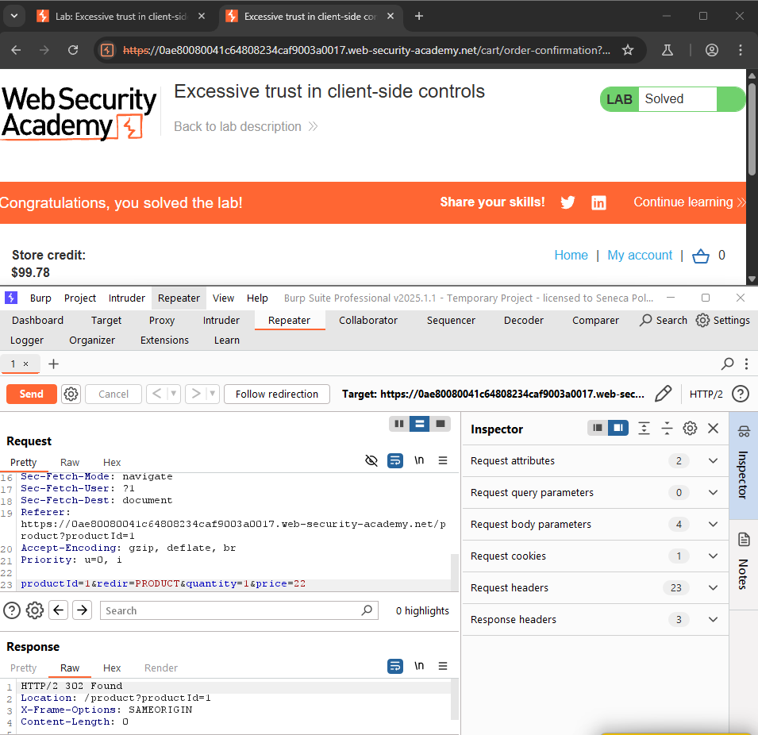
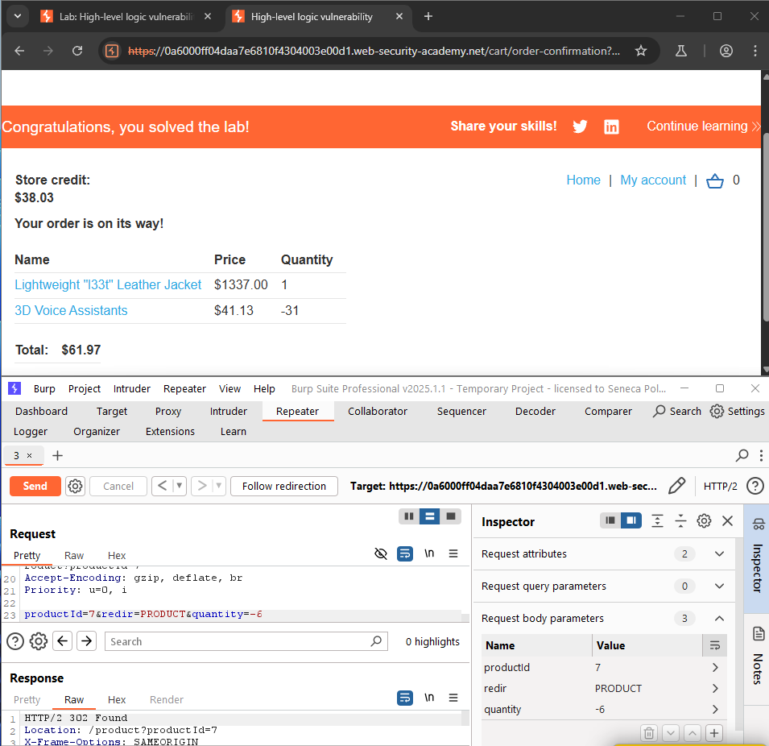
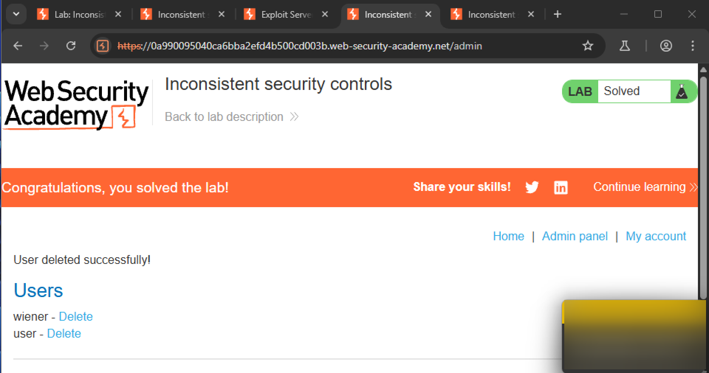
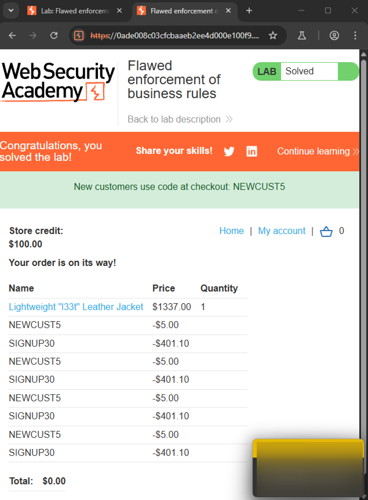
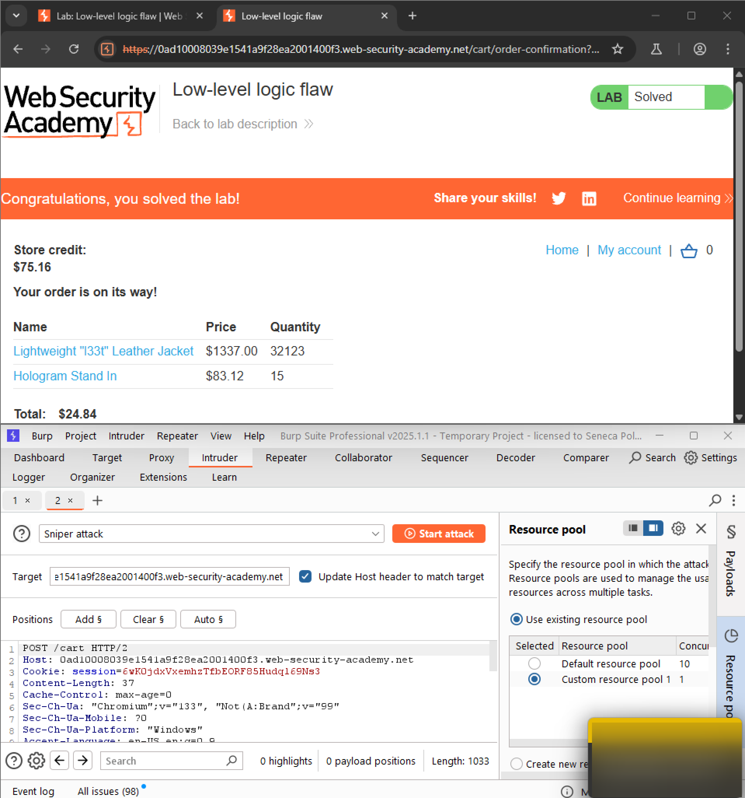
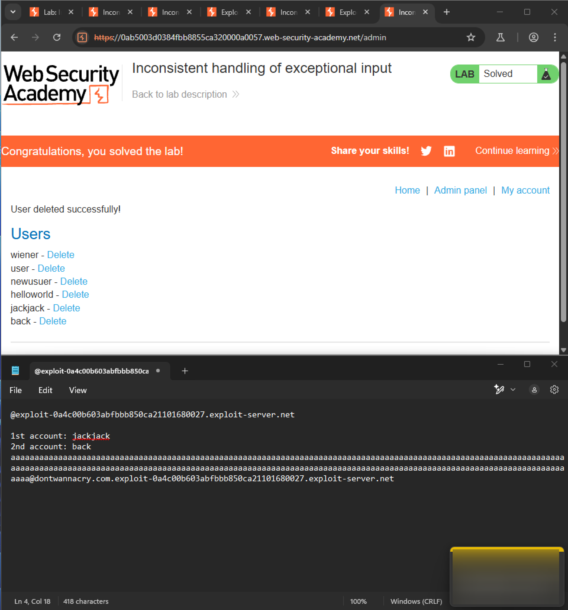
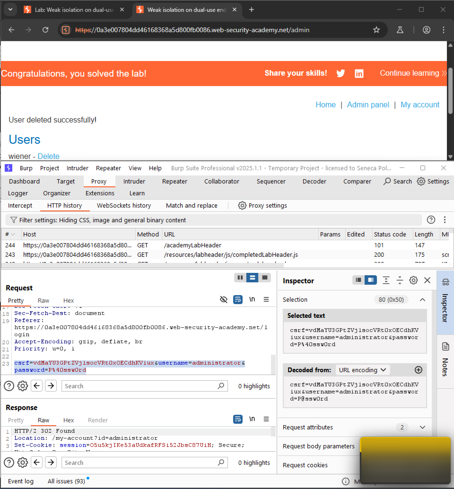
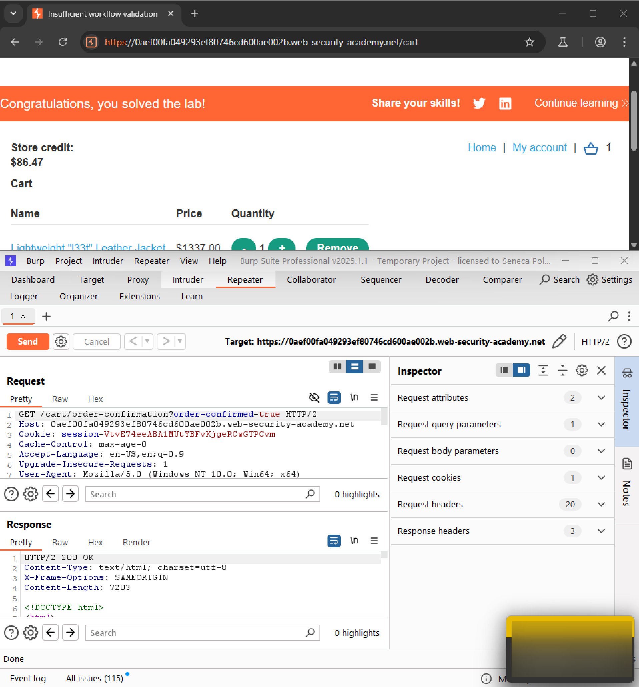
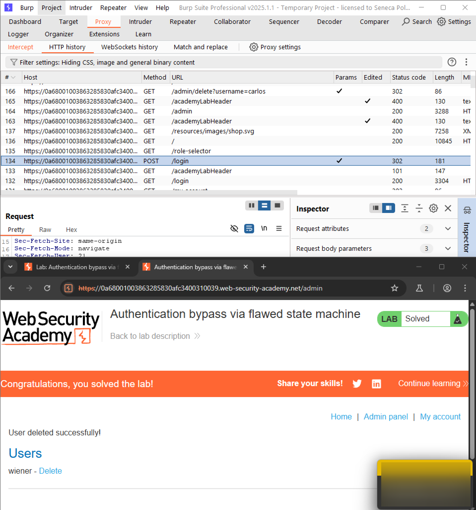
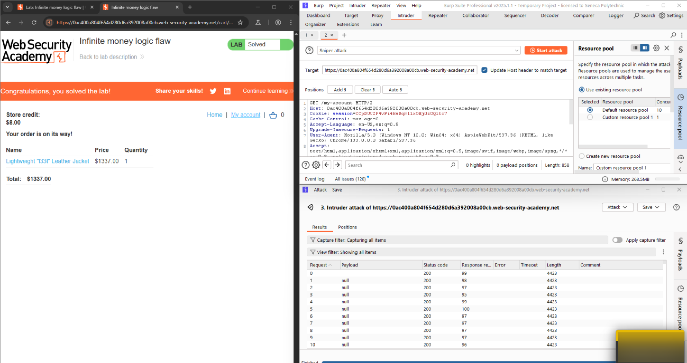

# Lab 1-6 — Business Logic Vulnerabilities
### Companion Lab Report: PortSwigger Web Security Academy

| | |
|---|---|
| **Author** | Iliya Dehghani |
| **Topic** | Business Logic Vulnerabilities |
| **Tooling** | Burp Suite Professional (Repeater, Intruder, Session Handling Rules) |
| **Report Type** | Vulnerability walkthrough / technical lab report |

---

## 1. Objective

This report covers ten PortSwigger Web Security Academy labs on business logic vulnerabilities (Apprentice through Practitioner) — flaws in application design and workflow enforcement rather than in code-level input sanitization — plus a Part B secure-code review exercise fixing a related discount-abuse flaw.

## 2. Background

**Business logic vulnerabilities** are flaws in an application's design and implementation that let an attacker elicit undesired behavior or manipulate legitimate functionality for malicious ends. They typically arise from **incorrect assumptions about user behavior** — e.g., assuming users will only interact via a browser and therefore over-relying on client-side controls attackers can freely bypass. Impact ranges from authentication bypass to direct financial loss through manipulated transactions.

**Common categories:**
- Excessive trust in client-side controls
- Failing to handle unconventional/unexpected input
- Flawed assumptions about user workflow ordering
- Domain-specific flaws unique to a particular business process
- Encryption oracles (predictable responses enabling decryption)
- Email parser discrepancies enabling validation bypass

**Prevention:** deep developer/tester understanding of the application domain to anticipate misuse; explicit, server-side enforcement of all business rules rather than implicit assumptions; and comprehensive input validation paired with consistent state management across the full user workflow.

## 3. Tools Used

| Tool | Purpose |
|---|---|
| Burp Repeater | Manually replaying and modifying purchase/cart/registration requests |
| Burp Intruder | Automating repeated exploitation of the "infinite money" gift card flaw |
| Burp Session Handling Rules (macros) | Automating the gift-card purchase → redemption cycle |

## 4. Methodology and Walkthrough — Part A: Ten Challenges

Each lab's objective was to purchase the "Lightweight l33t leather jacket" or gain unauthorized administrative access, using credentials `wiener:peter` where a baseline account was provided.

### Lab 1 — Excessive Trust in Client-Side Controls (Apprentice)

The purchase request's `price` parameter was directly editable client-side. Modifying it to an arbitrary low value and submitting the request purchased the jacket at that price — the server performed no independent price validation.


*Figure 1 — Arbitrary `price` value accepted by the server with no server-side re-validation.*

### Lab 2 — High-Level Logic Vulnerability (Apprentice)

The cart's `quantity` field accepted **negative values**. Adding a negative quantity of a separate, cheaper item ("3D Voice Assistants," 31 units at $41.13 = a large negative offset) alongside the jacket reduced the cart total below the available store credit, allowing checkout to succeed.


*Figure 2 — Negative quantity on a secondary item driving the total below the available store credit.*

### Lab 3 — Inconsistent Security Controls (Apprentice)

Access to `/admin` was gated solely on whether the logged-in user's **email domain** was `@dontwannacry.com`, with no additional verification. Registering with an arbitrary email and then changing it to a `@dontwannacry.com` address granted unauthorized administrative access.


*Figure 3 — Email changed to a `@dontwannacry.com` address, granting `/admin` access with no further verification.*

### Lab 4 — Flawed Enforcement of Business Rules (Apprentice)

Two coupon codes were available: `NEWCUST5` and a second (`SIGNUP30`) unlocked via newsletter signup. The application blocked the *same* code from being applied twice in a row, but did not prevent **alternating** between two different codes — allowing both discounts to be stacked well beyond the intended single-use restriction.


*Figure 4 — `NEWCUST5` and `SIGNUP30` alternately applied, bypassing the same-code reuse restriction.*

### Lab 5 — Low-Level Logic Flaw (Practitioner)

Repeatedly adding the maximum allowed quantity (99 units) of the high-priced jacket caused the cart total to exceed the maximum value representable by the server's integer type, wrapping the total into a **negative value** via integer overflow — bringing the effective price below $100 and within reach of the available store credit.


*Figure 5 — Repeated maximum-quantity additions overflowing the price integer into a negative, purchasable total.*

### Lab 6 — Inconsistent Handling of Exceptional Input (Practitioner)

The `/admin` restriction (again gated on a `@dontwannacry.com` email suffix) failed to enforce a reasonable maximum email length. Submitting a registration email **exceeding 255 characters**, engineered so the `@dontwannacry.com` domain fell within the first 255 characters (where the domain check apparently operated), bypassed the restriction despite the actual email being invalid/unusable.


*Figure 6 — Email exceeding 255 characters, with `@dontwannacry.com` positioned within the validated prefix, bypassing the domain check.*

### Lab 7 — Weak Isolation on Dual-Use Endpoint (Practitioner)

The password-change endpoint assumed a user would always supply their *own* current password. Omitting the `current-password` parameter entirely and specifying `administrator` as the target username allowed setting a new password for the administrator account with no knowledge of the original — a direct account takeover via a shared, insufficiently isolated endpoint.


*Figure 7 — `current-password` parameter omitted, allowing an arbitrary new password to be set for `administrator`.*

### Lab 8 — Insufficient Workflow Validation (Practitioner)

The purchase workflow assumed a strict sequence: add to cart → checkout → complete purchase. Placing one legitimate order (within available credit) and then **replaying the same completion request a second time**, while the target item remained in the cart, resulted in the jacket being obtained without the cost being deducted a second time — the server never re-validated cart/credit state on the replayed request.


*Figure 8 — Duplicate submission of the order-completion request exploiting missing workflow state validation.*

### Lab 9 — Authentication Bypass via Flawed State Machine (Practitioner)

After login, users were expected to complete a `GET /role-selector` step before reaching the home page. **Intercepting and dropping** this request entirely caused the application to default to an **administrator** role rather than failing closed — granting unauthorized admin access without ever completing the intended role-selection step.


*Figure 9 — `GET /role-selector` intercepted and dropped, causing the application to default to an administrator session.*

### Lab 10 — Infinite Money Logic Flaw (Practitioner)

The newsletter-signup discount code (`SIGNUP30`, 30% off) was not excluded from **gift card purchases**. Buying a $10 gift card for $7 with the discount, then redeeming it for $10 in store credit, netted a **$3 profit per transaction**. This was automated using a Burp Session Handling Rule (macro) that recorded the purchase → redemption request sequence, extracted the newly issued gift card code from the order-confirmation response, and fed it into the redemption request — then driven repeatedly via Intruder until sufficient store credit accumulated to purchase the jacket outright.


*Figure 10 — Macro-driven, Intruder-automated gift card purchase/redemption cycle exploiting the discount-on-gift-cards flaw for net-positive store credit per iteration.*

## 5. Methodology and Walkthrough — Part B: Secure Code Review

**Vulnerability:** the discount-abuse pattern demonstrated in Lab 4 (alternating coupon codes) and Lab 10 (unrestricted discount-on-gift-card abuse) both stem from missing server-side enforcement of a "discount applied once per user" rule.

**Remediated `/apply-discount` route:**
```javascript
app.get('/apply-discount', async (req, res) => {
  if (!req.session.userId) {
    return res.redirect('/login');
  }
  const user = await User.findById(req.session.userId);

  if (user.hasDiscount || user.discountCount >= 1) {
    return res.send(`
      <h1>Discount Already Applied!</h1>
      <p>You have already used your discount.</p>
      <a href="/">Home</a>
    `);
  }

  user.hasDiscount = true;
  user.discountCount = 1;
  await user.save();

  res.send(`
    <h1>Discount Applied!</h1>
    <p>You have applied the discount successfully.</p>
    <a href="/">Home</a>
  `);
});
```

**Fix explanation:** the route now checks a persisted, server-side `hasDiscount`/`discountCount` flag on the user record *before* applying any discount. If a discount has already been used, the request is rejected with a clear message rather than silently reapplying it — closing the alternating-coupon and repeated-redemption abuse paths demonstrated in Labs 4 and 10 by tying discount eligibility to durable server state instead of trusting the client's request sequence.

## 6. Findings / Observations

| # | Finding | Severity | Root Cause |
|---|---|---|---|
| 1 | Client-controllable price/quantity parameters accepted without server-side validation | Critical | No server-side re-derivation of price/total from trusted catalog data |
| 2 | Access control gated on a client-supplied/unverified attribute (email domain) | Critical | Authorization decision based on unverified user-editable data |
| 3 | Discount/coupon logic enforces single-code reuse but not combined/alternating reuse | High | Business rule enforced too narrowly (per-code) rather than per-user/per-order |
| 4 | Integer overflow in cart total calculation | High | No bounds checking on quantity × price before arithmetic operations |
| 5 | Sensitive action (password reset) reachable without verifying actor identity | Critical | Endpoint shared between self-service and administrative use cases without adequate isolation |
| 6 | Workflow steps (role selection, order completion) enforceable only by client cooperation | Critical | No server-side state machine enforcing step order or request idempotency |
| 7 | Financial logic permits net-positive value creation via discount/gift-card interaction | Critical | Discount eligibility not tracked persistently per user |

## 7. Conclusion

Every lab in this set shared a common thread distinct from the injection-class vulnerabilities in earlier labs: **the application code was not "broken" in a technical sense — it simply failed to encode the intended business rule as an explicit, server-enforced constraint.** Prices, quantities, coupon reuse, workflow ordering, and role assignment were all left to implicit assumptions about how a well-behaved client would behave, and every assumption was defeated by simply sending a different sequence or value than expected. The Part B fix illustrates the general remedy: **persist the state a business rule depends on server-side, and check it explicitly before every sensitive action**, rather than inferring it from the current request's shape.

## 8. References

[1] PortSwigger, "Business logic vulnerabilities." [Online]. Available: https://portswigger.net/web-security/logic-flaws

[2] PortSwigger, "All labs — Business logic vulnerabilities." [Online]. Available: https://portswigger.net/web-security/all-labs#business-logic-vulnerabilities
