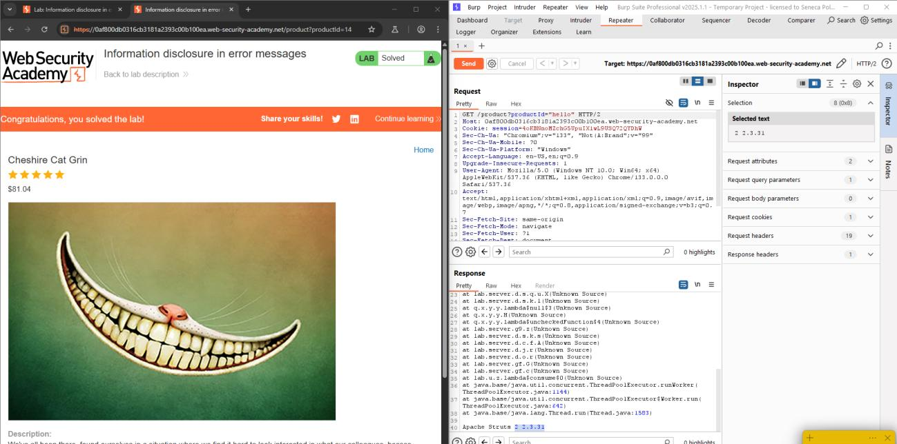
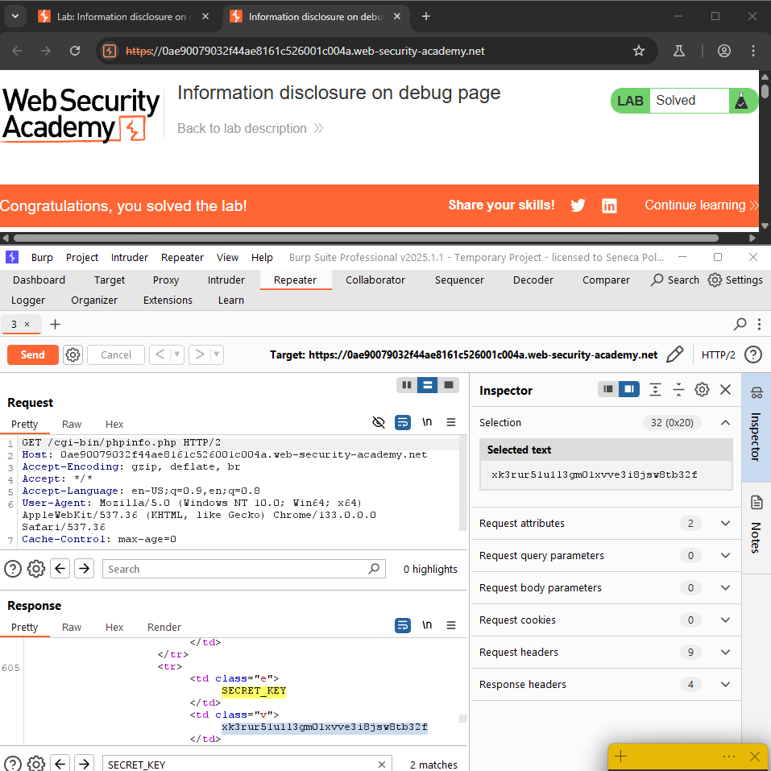
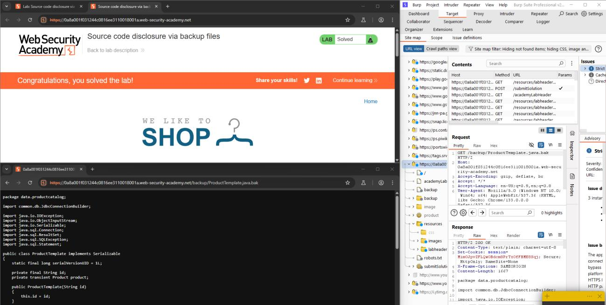
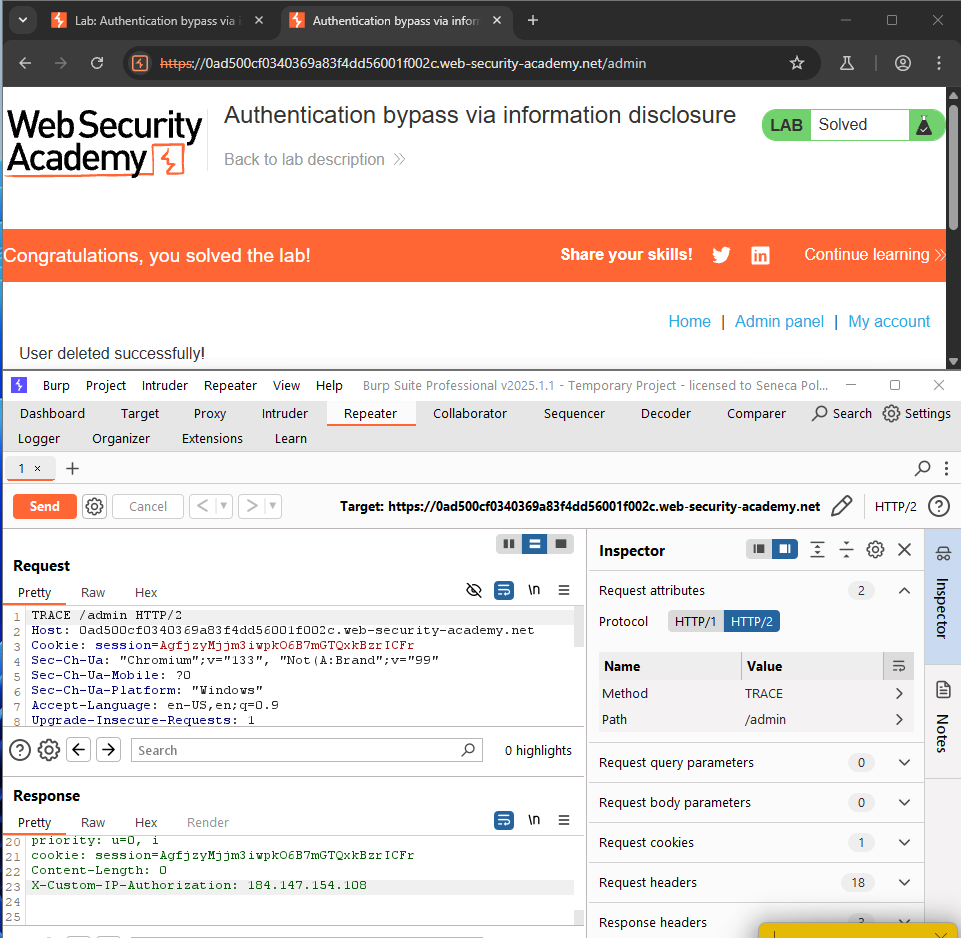
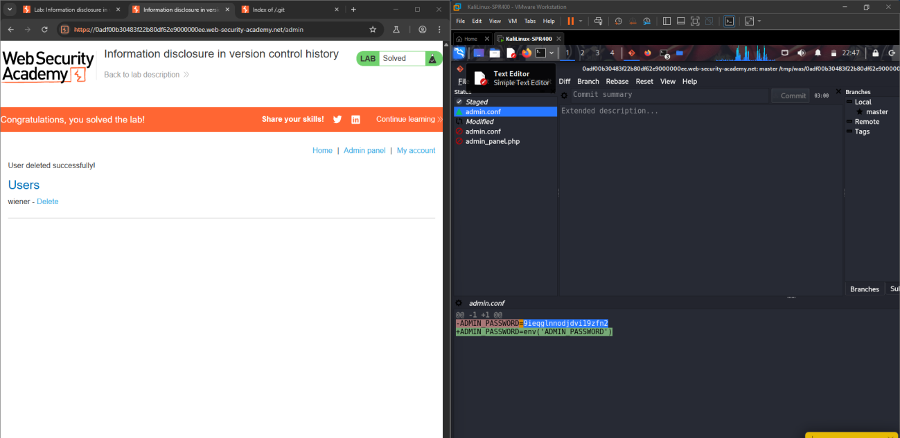

# Lab 1-7 — Information Disclosure
### Companion Lab Report: PortSwigger Web Security Academy

| | |
|---|---|
| **Author** | Iliya Dehghani |
| **Topic** | Information Disclosure |
| **Tooling** | Burp Suite Professional (site map, TRACE requests, Repeater) |
| **Report Type** | Vulnerability walkthrough / technical lab report |

---

## 1. Objective

This report covers five PortSwigger Web Security Academy labs on information disclosure: verbose error messages, exposed debug pages, source code disclosure via backup files, authentication bypass via a leaked internal header, and sensitive data exposure through an accessible version control directory.

## 2. Background

**Information disclosure** (information leakage) occurs when a website unintentionally exposes sensitive information to users — including other users' data, sensitive commercial/corporate information, or technical details about the application and its infrastructure.

**Common examples:** exposed `robots.txt`/directory listings revealing hidden paths; source code accessible via temporary backup files; error messages naming database tables/columns; unnecessary exposure of sensitive data (e.g., credit card numbers); hard-coded secrets in source code; and subtle behavioral differences that hint at the presence or absence of resources/usernames.

**Root causes:** failure to separate internal from public content (e.g., developer comments left in production markup); insecure default configuration (debugging/diagnostic features left enabled); and application logic that behaves differently under different error conditions, enabling enumeration.

**Impact:** direct (sensitive user/business data exposed outright) and indirect (technical details, e.g., directory structure or framework versions, that help an attacker plan further attacks).

**Testing techniques:** fuzzing with unusual input to observe how the application responds; automated scanning (e.g., Burp Scanner) flagging exposure risks during normal browsing; engagement tools like "Find comments" and "Discover content"; and deliberately engineering error conditions to elicit informative responses.

**Prevention:** developer awareness of what data is sensitive; regular code audits for leakage as part of QA/build; generic (non-verbose) error messages; disabling debug/diagnostic features in production; and secure, minimal configuration of third-party components.

## 3. Tools Used

| Tool | Purpose |
|---|---|
| Burp Suite site map | Discovering unlinked/hidden endpoints such as debug pages |
| Burp Repeater | Crafting malformed input to trigger verbose error responses; sending TRACE requests |
| Git Cola (Kali Linux) | Inspecting and reverting commits in an exposed `.git` repository |

## 4. Methodology and Walkthrough

### Lab 1 — Information Disclosure in Error Messages (Apprentice)

**Objective:** Identify the version number of a vulnerable third-party framework disclosed via verbose error messages.

Submitting a non-integer value to the `productId` parameter triggered an unhandled exception, returning a detailed stack trace that revealed the application was running **Apache Struts version 2.3.31**.

*Figure 1 — Non-integer `productId` input triggering a verbose stack trace that discloses Apache Struts 2.3.31.*

### Lab 2 — Information Disclosure on Debug Page (Apprentice)

**Objective:** Retrieve the `SECRET_KEY` environment variable from an exposed debug page.

Burp Suite's automatically generated site map surfaced a link to `/cgi-bin/phpinfo.php`, an unlinked debug page exposing extensive server diagnostic details, including environment variables — among them the target `SECRET_KEY`.

*Figure 2 — `/cgi-bin/phpinfo.php`, discovered via Burp's site map, exposing the `SECRET_KEY` environment variable.*

### Lab 3 — Source Code Disclosure via Backup Files (Apprentice)

**Objective:** Retrieve a hard-coded database password from leaked source code.

Inspecting `/robots.txt` revealed a disallowed `/backup` directory containing `ProductTemplate.java.bak`. Accessing this backup file directly exposed the application's Java source code, within which the database password was hard-coded in plaintext.

*Figure 3 — `ProductTemplate.java.bak` retrieved from a `robots.txt`-disallowed backup directory, revealing a hard-coded database password.*

### Lab 4 — Authentication Bypass via Information Disclosure (Apprentice)

**Objective:** Bypass authentication on the admin interface using a leaked internal HTTP header, then delete user `carlos` (baseline credentials: `wiener:peter`).

Sending an HTTP `TRACE` request to `/admin` caused the server to echo the request back verbatim, revealing an internal header — `X-Custom-IP-Authorization` — set to the requester's own IP address. Adding this header to subsequent requests with the value `127.0.0.1` caused the back-end to treat the request as originating from localhost, granting admin access without any credentials.

*Figure 4 — `X-Custom-IP-Authorization: 127.0.0.1` spoofing a localhost origin to bypass admin authentication entirely.*

### Lab 5 — Information Disclosure in Version Control History (Practitioner)

**Objective:** Retrieve the administrator's password from exposed version control history, then delete user `carlos`.

The application's `/.git/` directory was publicly accessible, allowing the full repository (including commit history) to be downloaded. Using Git Cola to inspect and revert the most recent commit revealed the administrator's password, which had been present in an earlier commit before being removed from the current codebase (but not from history).

*Figure 5 — Administrator password recovered by reverting the latest commit in the exposed `.git` repository.*

## 5. Findings / Observations

| # | Finding | Severity | Root Cause |
|---|---|---|---|
| 1 | Framework version disclosed via unhandled exception stack trace | Medium | Verbose error handling exposes internal implementation details |
| 2 | Debug/diagnostic page (`phpinfo.php`) accessible in production | High | Debug feature not disabled prior to deployment |
| 3 | Source code and hard-coded credentials exposed via `.bak` backup file | Critical | Temporary backup files left accessible within the web root |
| 4 | Internal trust header disclosed via HTTP `TRACE`, enabling authentication bypass | Critical | `TRACE` method enabled; internal-only trust header not stripped/validated at the edge |
| 5 | Credential history recoverable from an exposed `.git` directory | Critical | Version control metadata deployed alongside production application files |

## 6. Conclusion

Every lab in this set demonstrated a different *channel* for the same underlying failure: **internal implementation detail leaking into a context an external user can reach.** Stack traces, debug endpoints, backup files, the `TRACE` HTTP method, and deployed `.git` metadata all served as unintended windows into the application's internals, and in two cases (Labs 4 and 5) that leaked information directly enabled a full authentication bypass rather than merely disclosing "harmless" technical detail. The consistent remediation theme is **production hardening as a deployment step**, not just a coding practice: disabling verbose errors, debug endpoints, and unnecessary HTTP methods, and ensuring build artifacts (backups, VCS metadata) never ship to the web root.

## 7. References

[1] PortSwigger, "Information disclosure vulnerabilities." [Online]. Available: https://portswigger.net/web-security/information-disclosure

[2] PortSwigger, "All labs — Information disclosure." [Online]. Available: https://portswigger.net/web-security/all-labs#information-disclosure
