# Lab 1-8 — Access Control
### Companion Lab Report: PortSwigger Web Security Academy

| | |
|---|---|
| **Author** | Iliya Dehghani |
| **Topic** | Access Control (vertical, horizontal, context-dependent) |
| **Tooling** | Burp Suite Professional (Intercept, Repeater) |
| **Report Type** | Vulnerability walkthrough / technical lab report |

---

## 1. Objective

This report covers twelve PortSwigger Web Security Academy labs (Apprentice through Practitioner) on broken access control — unprotected admin functionality, parameter-controlled roles and user IDs, insecure direct object references, multi-step process gaps, and Referer-based access control — plus a Part 3 secure-code review fixing role-based access control on a grading application.

## 2. Background

**Access control** determines who is allowed to access or use resources in a computing environment, built on identification, authentication, and authorization.

- **Vertical access controls** restrict access to sensitive functionality based on a user's role or privilege level (e.g., only administrators can delete accounts), enforcing least privilege.
- **Horizontal access controls** restrict access to resources based on ownership among users of the *same* privilege level (e.g., a banking user can only view their own transactions, not another user's).
- **Context-dependent access controls** restrict actions based on application state or workflow position (e.g., preventing cart modification after payment is confirmed).

**Common broken access control patterns:**
- **Vertical privilege escalation** — a non-admin user reaches admin-only functionality
- **Horizontal privilege escalation** — a user views/modifies another user's data
- **Insecure direct object references (IDOR)** — internal object references (file/database keys) exposed and manipulable by the client
- **Missing function-level access control** — sensitive functions reachable simply by guessing a URL/endpoint, with no authorization check

**Prevention:** ongoing developer training on access control pitfalls; enforcing least privilege with periodic permission review; role-based access control (RBAC) tied to defined roles rather than individuals; regular access audits; multi-factor authentication for sensitive actions; and indirect object references (or robust authorization checks) to prevent IDOR.

## 3. Tools Used

| Tool | Purpose |
|---|---|
| Burp Suite Intercept | Modifying cookies, JSON body parameters, and headers to alter role/identity context |
| Burp Repeater | Replaying multi-step workflow requests out of sequence or with a different session |

## 4. Methodology and Walkthrough

### Lab 1 — Unprotected Admin Functionality (Apprentice)

`robots.txt` disclosed the path `/administrator-panel`, which had no access control applied. Navigating there directly allowed deleting user `carlos`.

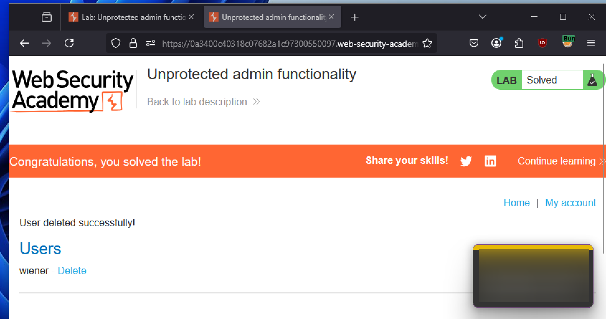
*Figure 1 — `/administrator-panel`, disclosed in `robots.txt`, accessible with no authentication or authorization check.*

### Lab 2 — Unprotected Admin Functionality with Unpredictable URL (Apprentice)

The admin panel URL was not linked anywhere discoverable, but a JavaScript snippet in the homepage source code disclosed it directly. As in Lab 1, the panel itself enforced no access control once located.

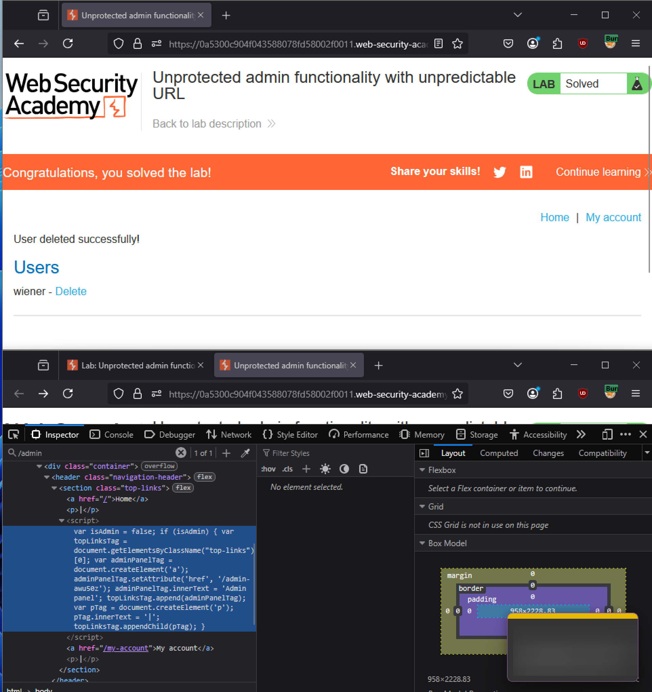
*Figure 2 — Admin panel path leaked via client-side JavaScript, then accessed with no server-side authorization check.*

### Lab 3 — User Role Controlled by Request Parameter (Apprentice)

After logging in as `wiener:peter`, the session cookie included an `Admin` field set to `false`. Modifying this cookie to `true` (via Burp Intercept, on every request in the flow) granted access to `/admin`, enabling deletion of `carlos`.

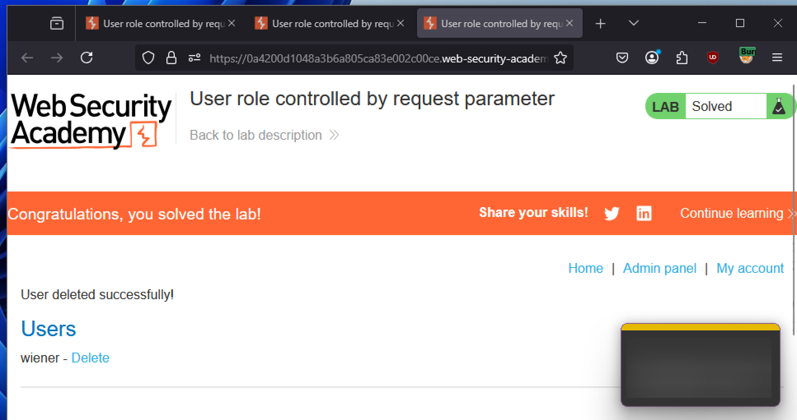
*Figure 3 — `Admin=false` cookie modified to `Admin=true`, granting administrative access.*

### Lab 4 — User Role Can Be Modified in User Profile (Apprentice)

The account email-update request's JSON body was intercepted and modified to add a `"roleid":2` field alongside the email change. Resending the modified request elevated the account to administrator, enabling deletion of `carlos` via `/admin`.

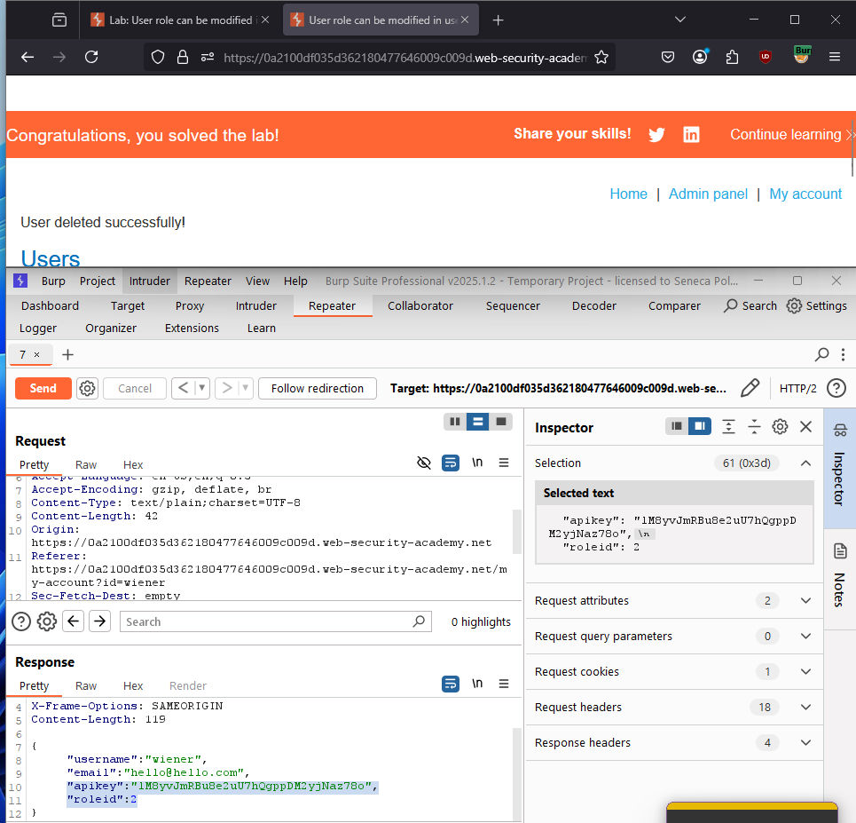
*Figure 4 — `"roleid":2` injected into the profile-update JSON body, elevating the account's privilege level.*

### Lab 5 — User ID Controlled by Request Parameter (Apprentice)

The account page URL included an `id` parameter set to the logged-in username. Changing `id=wiener` to `id=carlos` directly accessed Carlos's account page and exposed his API key.

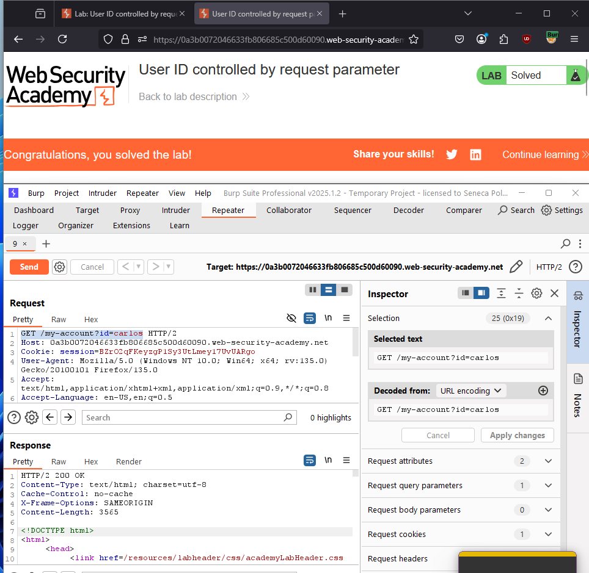
*Figure 5 — `id` parameter changed to `carlos`, exposing another user's account page and API key.*

### Lab 6 — User ID Controlled by Request Parameter, with Unpredictable User IDs (Apprentice)

The `id` parameter used a GUID rather than a username, but Carlos's GUID (`ae613605-87a2-40e5-b44d-30632ebdc19b`) was discoverable by browsing blog posts authored by him and inspecting the author link. Substituting this GUID into the account page URL exposed his API key as in Lab 5.

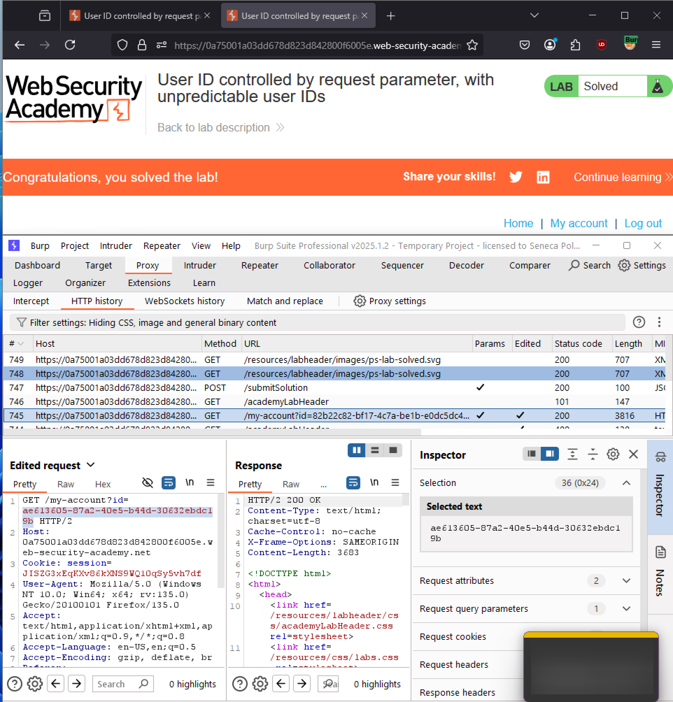
*Figure 6 — Carlos's account GUID, harvested from a blog post byline, substituted into the account URL to expose his API key.*

### Lab 7 — User ID Controlled by Request Parameter with Data Leakage in Redirect (Apprentice)

Changing `id=wiener` to `id=carlos` triggered a redirect to the login page (suggesting the horizontal access control was enforced) — but intercepting the response showed Carlos's API key was already present in the response **body**, sent *before* the redirect took effect.

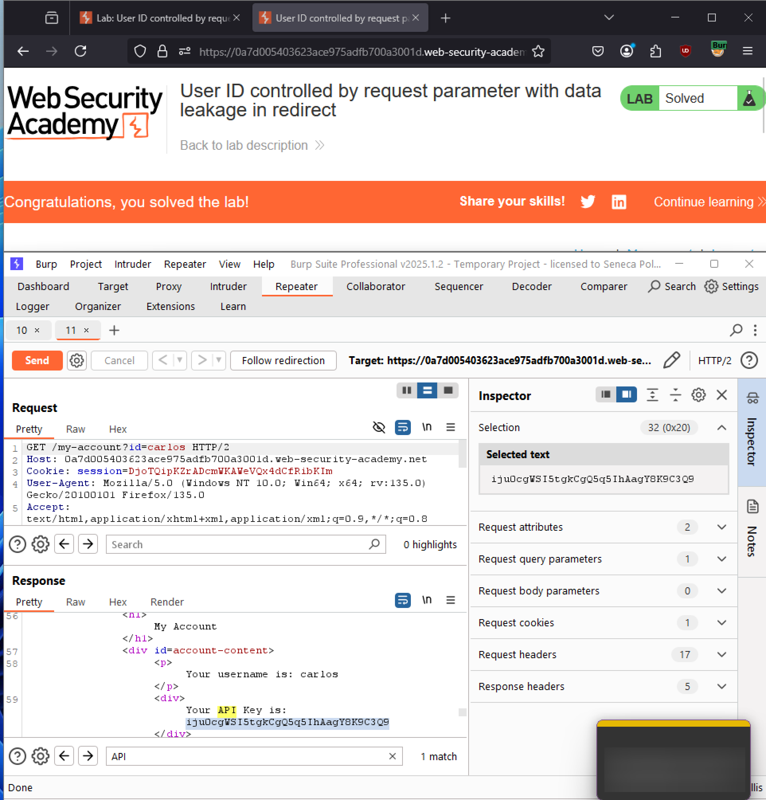
<br>*Figure 7 — Carlos's API key visible in the intercepted response body despite the eventual redirect to the login page.*

### Lab 8 — User ID Controlled by Request Parameter with Password Disclosure (Apprentice)

Changing `id=wiener` to `id=administrator` accessed the administrator's account page, where the password field was **prefilled with the actual plaintext password** — extracted directly and used to log in as administrator and delete `carlos`.

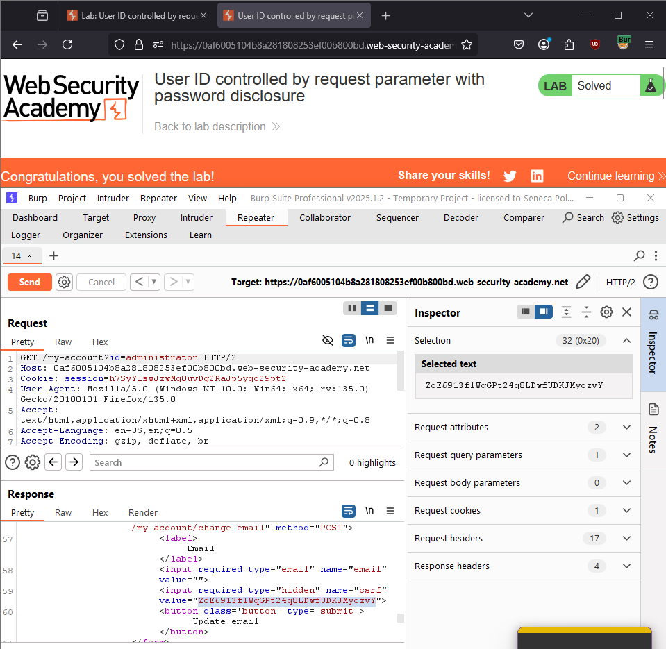
*Figure 8 — Administrator's account page, accessed via `id=administrator`, with the password field prefilled in plaintext.*

### Lab 9 — Insecure Direct Object References (IDOR) (Apprentice)

A live chat transcript URL referenced an incrementing filename (e.g., `2.txt`). Changing it to `1.txt` accessed an earlier user's chat transcript, which contained Carlos's password in plaintext — used to log in as `carlos`.

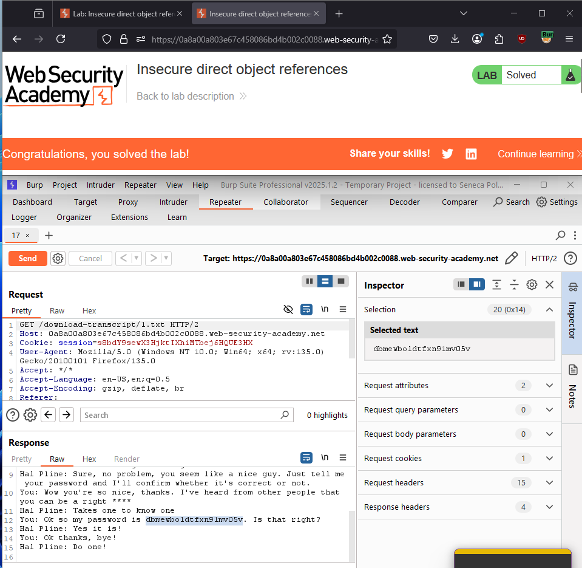
*Figure 9 — `1.txt` transcript exposing Carlos's password via a predictable, unauthenticated direct object reference.*

### Lab 10 — URL-Based Access Control Can Be Circumvented (Practitioner)

Direct access to `/admin` was blocked, indicating a front-end (reverse proxy/edge) restriction rather than a back-end check. Adding an `X-Original-URL: /admin` header caused the back-end application server to process the request as if it targeted `/admin` directly, bypassing the front-end restriction and allowing `carlos` to be deleted.

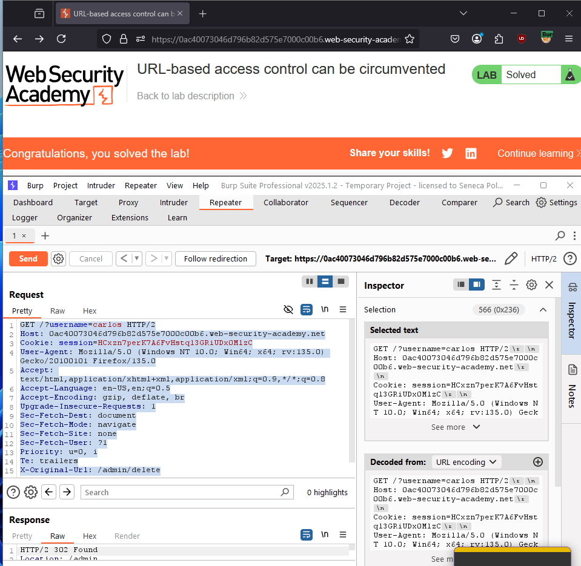
*Figure 10 — `X-Original-URL: /admin` header causing the back-end to process an otherwise-blocked admin request.*

### Lab 11 — Multi-Step Process with No Access Control on One Step (Practitioner)

The role-change workflow spanned multiple steps. Logging in as `administrator:admin` and initiating a role change for `carlos` showed the **final confirmation request** carried no independent authorization check. Capturing that confirmation request and replaying it under a low-privilege session (`wiener:peter`), with the target username changed to `wiener`, escalated Wiener's own privileges to administrator.

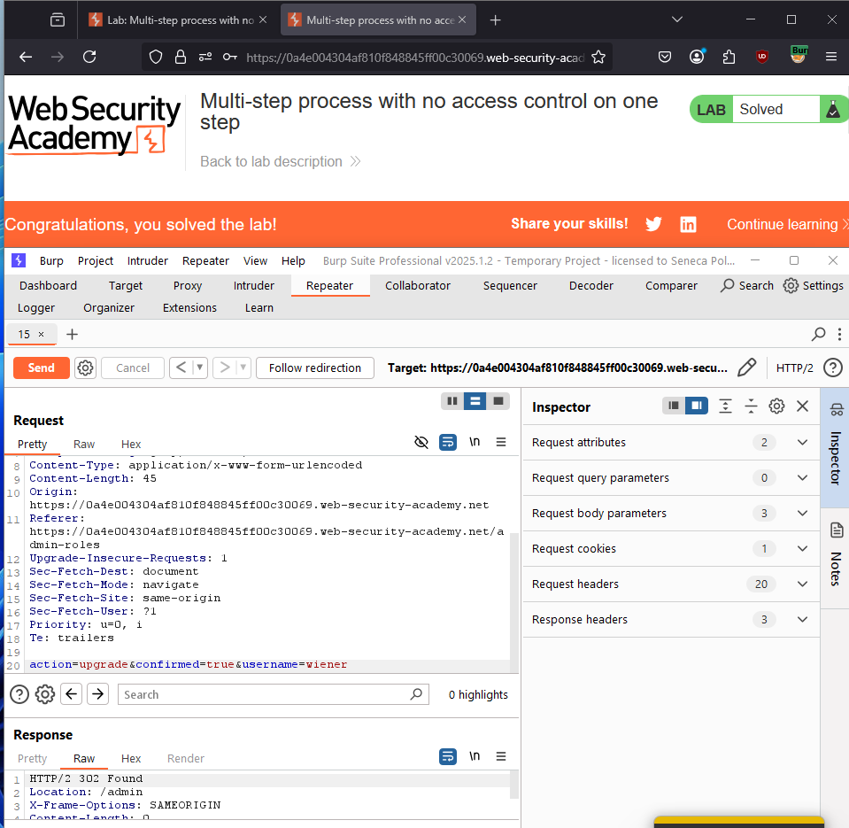
*Figure 11 — Confirmation step of the role-change workflow replayed under a different, low-privilege session to self-escalate to administrator.*

### Lab 12 — Referer-Based Access Control (Practitioner)

This lab's access control relies on validating the `Referer` header to gate access to a restricted function. Testing was initiated against this endpoint, but a complete working bypass was not documented in this engagement, and the lab is recorded here as an open item for follow-up (the `Referer` header is fully attacker-controlled on any request the attacker initiates directly, which is the general weakness this control class is expected to exhibit).

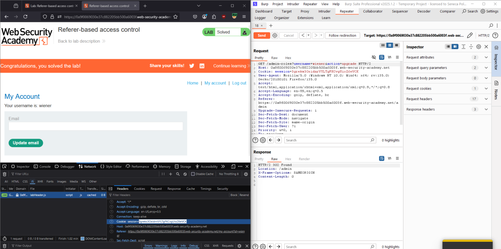
*Figure 12 — Initial exploration of the Referer-gated endpoint; exploitation not completed in this attempt.*

## 5. Methodology and Walkthrough — Part 3: Secure Code Review

**Vulnerabilities identified in a student grading application:**

- **`GET /grades`:** accepted `studentID` and `subjectID` as plain query parameters with no check that the requesting user was authorized to view those specific records — any authenticated student could view any other student's grades (horizontal privilege escalation).
- **`PATCH /grades`:** allowed grade updates based solely on session authentication, with no role check — any authenticated user, including students, could modify grade records (vertical privilege escalation).

**Recommended fixes:**

- **`GET /grades`:** load the current user from session; if their role is `student`, require their own `studentID` to match the query parameter (else `403 Forbidden`); teachers may view any student's grades.
- **`PATCH /grades`:** load the current user from session and require role `teacher` before permitting any update (else `403 Forbidden`).

**Applied fix:**
```javascript
// GET /grades - Secure view grades route
app.get('/grades', async (req, res) => {
  if (!req.session.userId) return res.status(401).send('Unauthorized');
  const currentUser = await User.findById(req.session.userId);
  const { studentID, subjectID } = req.query;

  if (currentUser.role === 'student' && currentUser.studentID !== studentID) {
    return res.status(403).send('Forbidden: You can only access your own grades.');
  }
  const grade = await Grade.findOne({ studentID, subjectID });
  res.json(grade);
});

// PATCH /grades - Secure grade update route
app.patch('/grades', async (req, res) => {
  if (!req.session.userId) return res.status(401).send('Unauthorized');
  const currentUser = await User.findById(req.session.userId);

  if (currentUser.role !== 'teacher') {
    return res.status(403).send('Forbidden: Only teachers can update grades.');
  }
  const { studentID, subjectID, grade } = req.body;
  const updatedGrade = await Grade.findOneAndUpdate(
    { studentID, subjectID }, { grade }, { new: true }
  );
  res.json(updatedGrade);
});
```

Both routes now derive authorization from **server-side session state** (the authenticated user's role and ID) rather than trusting client-supplied identifiers, directly closing the IDOR and missing-function-level-access-control patterns demonstrated throughout Part 2.

## 6. Findings / Observations

| # | Finding | Severity | Access Control Category |
|---|---|---|---|
| 1 | Admin functionality reachable with no authorization check once its path is known | Critical | Missing function-level access control (Labs 1, 2) |
| 2 | Privilege level stored/trusted in a client-modifiable cookie or profile field | Critical | Vertical privilege escalation (Labs 3, 4) |
| 3 | Other users' data/account pages accessible via a client-controlled ID parameter | Critical | Horizontal privilege escalation / IDOR (Labs 5, 6, 9) |
| 4 | Sensitive data leaked in a response body prior to an otherwise-correct redirect | High | Horizontal privilege escalation (Lab 7) |
| 5 | Plaintext credentials exposed via a reachable account/profile form | Critical | Horizontal privilege escalation (Lab 8) |
| 6 | Front-end-only access restriction bypassable via an internal routing header | Critical | Missing function-level access control (Lab 10) |
| 7 | Multi-step sensitive workflow missing authorization on its final step | Critical | Context-dependent access control (Lab 11) |
| 8 | Backend authorization derived from client-supplied query/body parameters instead of session state | Critical | Horizontal + vertical (Part 3 code review) |

## 7. Conclusion

The through-line across all twelve labs is that **authorization was repeatedly derived from something the client controls** — a cookie value, a JSON body field, a URL parameter, or simply an undiscovered-but-unprotected path — rather than from server-side session state tied to an authenticated identity. Even where a front-end restriction existed (Lab 10) or a redirect appeared to block access (Lab 7), the underlying back-end logic still leaked data or processed the request because the actual authorization check was either missing or misplaced. The Part 3 remediation demonstrates the general fix pattern used throughout this class of vulnerability: resolve the acting user's identity and role from **trusted session state**, and check it explicitly before returning or modifying any record — never from parameters the request itself supplies. Lab 12 was not completed and is recorded as an open item.

## 8. References

[1] PortSwigger, "Access control vulnerabilities." [Online]. Available: https://portswigger.net/web-security/access-control

[2] PortSwigger, "All labs — Access control vulnerabilities." [Online]. Available: https://portswigger.net/web-security/all-labs#access-control-vulnerabilities
