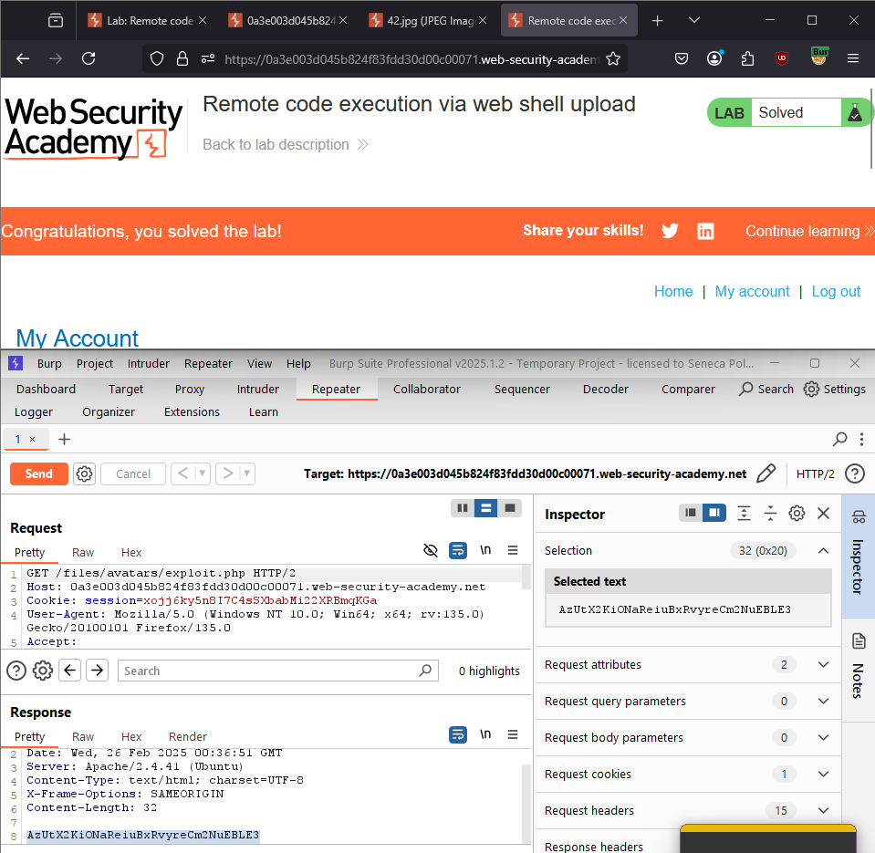
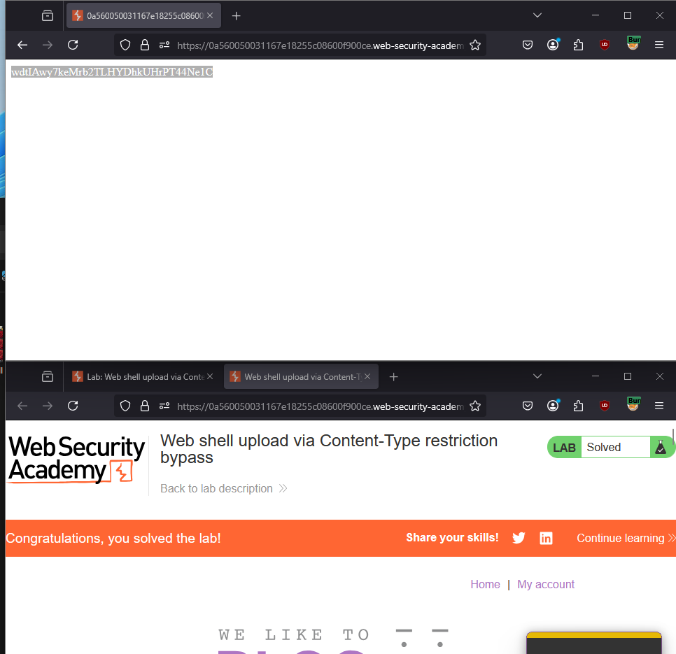
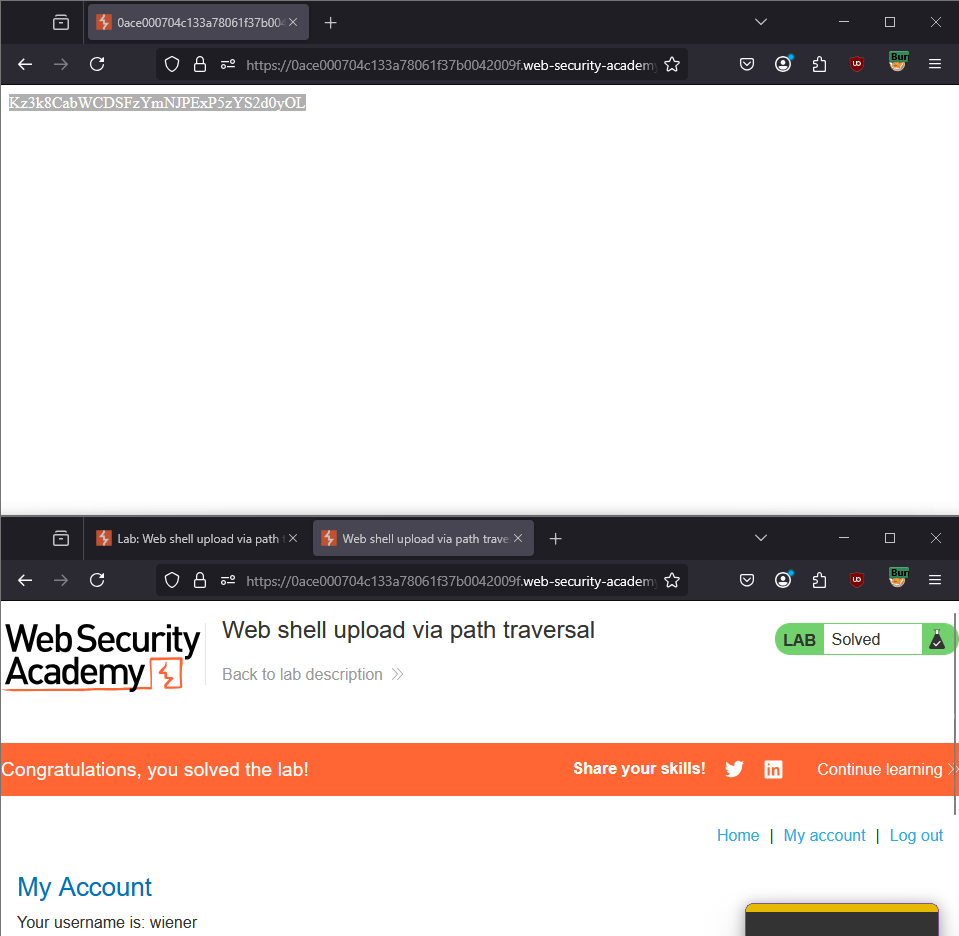
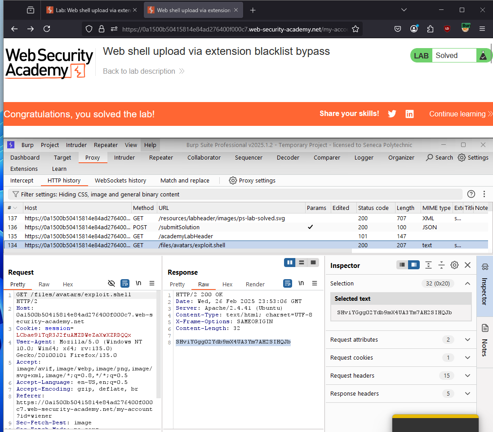
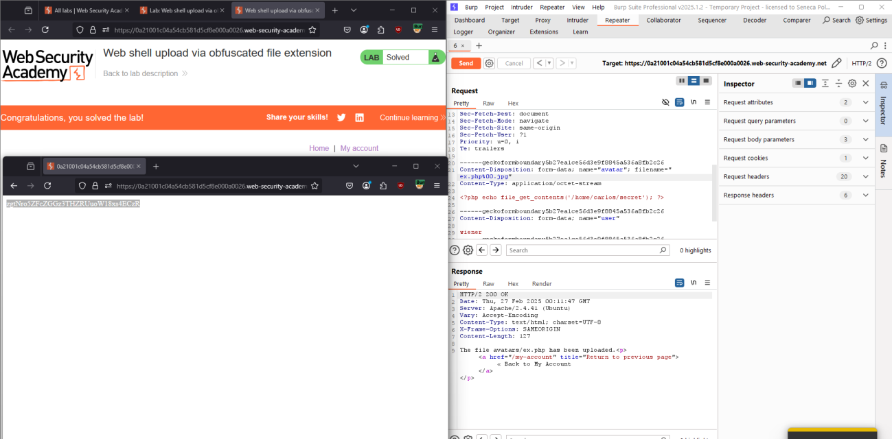
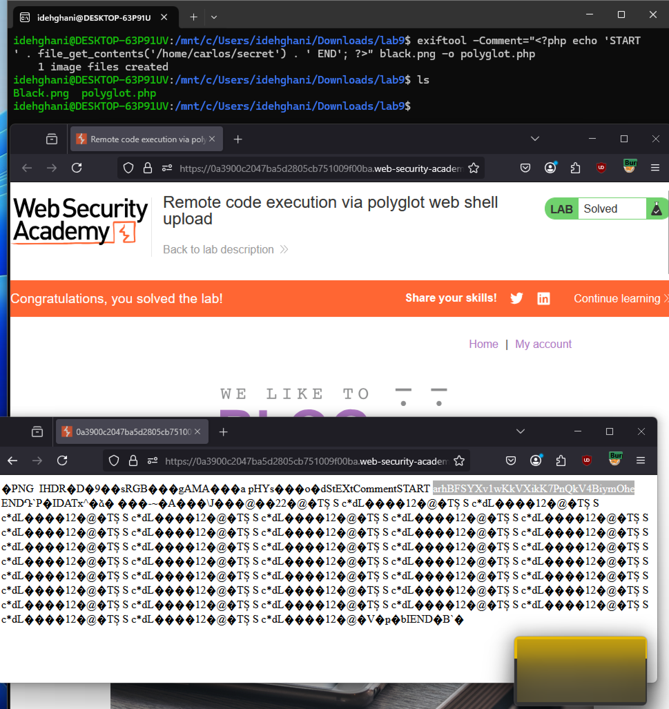

# Lab 1-9 — File Upload Vulnerabilities
### Companion Lab Report: PortSwigger Web Security Academy

| | |
|---|---|
| **Author** | Iliya Dehghani |
| **Topic** | File Upload Vulnerabilities |
| **Tooling** | Burp Suite Professional (Repeater, Intercept), ExifTool |
| **Report Type** | Vulnerability walkthrough / technical lab report |

---

## 1. Objective

This report covers six PortSwigger Web Security Academy labs on file upload vulnerabilities, progressing from unrestricted upload leading directly to remote code execution (RCE), through increasingly sophisticated bypasses of Content-Type validation, path traversal, extension blacklists, null byte obfuscation, and polyglot file crafting.

## 2. Background

**File upload vulnerabilities** arise when a web server allows users to upload files without sufficiently validating their size, content, type, or name — enabling an attacker to upload malicious files, including server-side scripts, and potentially execute arbitrary code on the server.

**Impact** ranges depending on validation gaps and post-upload restrictions: in the worst case, an attacker gains full server control by uploading and executing scripts; other effects include service disruption and unauthorized data access.

**Root causes:** insufficient file permission controls, flawed file-type checking, inadequate input validation, or missing content validation — all of which can be bypassed by uploading files with malicious scripts disguised behind misleading extensions or metadata.

**How web servers handle static files:** the server typically determines file type by extension; non-executable files (images, static HTML) are served directly, while executable types (e.g., PHP) are processed by the server with the output returned to the client. Misconfiguration in this determination is precisely what each lab below exploits.

**Prevention:** strict allowlist validation of file type/attributes; renaming uploaded files to server-generated, non-predictable names; storing uploads outside the web root; restrictive file permissions on uploaded content; and antivirus/content-scanning tools to detect malicious payloads.

## 3. Tools Used

| Tool | Purpose |
|---|---|
| Burp Suite Repeater/Intercept | Modifying upload requests (filename, Content-Type, body) |
| ExifTool | Embedding a PHP payload into PNG image metadata for polyglot file crafting |

## 4. Methodology and Walkthrough

### Lab 1 — Remote Code Execution via Web Shell Upload (Apprentice)

**Objective:** Read `/home/carlos/secret` via an uploaded web shell.

The avatar upload feature performed no validation whatsoever, storing uploaded files directly and serving them from a predictable, accessible path. A minimal PHP web shell was uploaded:

```php
<?php echo file_get_contents('/home/carlos/secret'); ?>
```

Navigating to the uploaded file's URL executed the PHP code server-side, returning the target secret directly in the response.


*Figure 1 — PHP web shell uploaded with no validation, executed on access to reveal `/home/carlos/secret`.*

### Lab 2 — Web Shell Upload via Content-Type Restriction Bypass (Apprentice)

**Objective:** Bypass MIME-type validation on the upload endpoint.

The server restricted uploads by validating the `Content-Type` header — but this header is entirely client-controlled. Uploading the same PHP web shell with the `Content-Type` header spoofed to `image/jpeg` satisfied the check while the file content and extension remained a functional PHP script, which executed normally once accessed.


*Figure 2 — `Content-Type: image/jpeg` spoofed on a PHP payload, bypassing MIME-type validation entirely.*

### Lab 3 — Web Shell Upload via Path Traversal (Practitioner)

**Objective:** Bypass an execution restriction scoped to the upload directory.

The server prevented execution of files within the designated upload directory, but the `filename` parameter itself was not sanitized for traversal sequences. Setting the filename to `../exploit.php` (URL-encoded as `..%2fexploit.php`) stored the file **outside** the restricted directory, in a location where server-side execution was permitted.


*Figure 3 — `..%2fexploit.php` filename traversing out of the non-executable upload directory into an executable path.*

### Lab 4 — Web Shell Upload via Extension Blacklist Bypass (Practitioner)

**Objective:** Bypass a blacklist blocking known executable extensions.

Rather than attacking the blacklist directly, a `.htaccess` file was uploaded containing:
```
AddType application/x-httpd-php .shell
```
This reconfigured the server (via Apache's per-directory configuration mechanism) to treat the arbitrary `.shell` extension as executable PHP — an extension not present on the blacklist. A web shell with the `.shell` extension was then uploaded and executed normally.


*Figure 4 — Uploaded `.htaccess` mapping `.shell` to PHP execution, followed by a `.shell`-extension web shell executing successfully.*

### Lab 5 — Web Shell Upload via Obfuscated File Extension (Practitioner)

**Objective:** Bypass a blacklist filter using filename obfuscation.

The `filename` parameter was set to `exploit.php%00.jpg` — a URL-encoded **null byte** between the disallowed `.php` extension and an allowed `.jpg` suffix. The blacklist filter, operating on the full string, saw an allowed `.jpg` extension; the underlying file system call, however, treated the null byte as a string terminator and saved the file as `exploit.php`, which executed as PHP when accessed.


*Figure 5 — `exploit.php%00.jpg` filename bypassing extension blacklisting via null byte truncation.*

### Lab 6 — Remote Code Execution via Polyglot Web Shell Upload (Practitioner)

**Objective:** Bypass content-based file-type validation using a polyglot file.

A legitimate PNG image was modified using **ExifTool** to embed a PHP web shell payload within its metadata, producing a file that is simultaneously a valid PNG image *and* valid PHP code (a polyglot). Saved with a `.php` extension and uploaded via the avatar feature, the file passed any image-content validation (since it remained a structurally valid image), and executed the embedded PHP payload when accessed directly, revealing the target secret.


*Figure 6 — ExifTool-crafted PNG/PHP polyglot, valid as both an image and executable code, revealing `/home/carlos/secret` on access.*

## 5. Findings / Observations

| # | Finding | Severity | Bypass Technique |
|---|---|---|---|
| 1 | No file validation at all on the avatar upload endpoint | Critical | N/A — direct upload and execution |
| 2 | MIME-type validation based solely on client-supplied `Content-Type` header | Critical | Header spoofing |
| 3 | Execution restriction scoped only to a single directory | Critical | Path traversal via unsanitized `filename` parameter |
| 4 | Extension blacklist bypassable by redefining server behavior | Critical | Malicious `.htaccess` upload |
| 5 | Extension blacklist checked against the full filename string, not the OS-resolved name | Critical | Null byte truncation |
| 6 | Content validation checks file structure but not for embedded/appended executable payloads | Critical | Polyglot file crafting |

## 6. Conclusion

Every lab in this set defeated a validation control that checked the **wrong signal** — a client-controlled header, a single directory scope, a denylist rather than an allowlist, a raw string rather than an OS-resolved path, or file structure without considering embedded payloads. The consistent, general remediation across all six is the same set of practices outlined in the background section: validate file content (not just claimed type), rename uploads to server-generated names that strip any meaningful extension or embedded logic, store uploads outside the web root entirely, and apply restrictive execution permissions to the upload directory regardless of what filter logic exists upstream — so that even a successful upload bypass cannot result in code execution.

## 7. References

[1] PortSwigger, "File upload vulnerabilities." [Online]. Available: https://portswigger.net/web-security/file-upload

[2] PortSwigger, "Lab: Remote code execution via web shell upload." [Online]. Available: https://portswigger.net/web-security/file-upload/lab-file-upload-remote-code-execution-via-web-shell-upload
