# Lab 1-10 — Race Conditions
### Companion Lab Report: PortSwigger Web Security Academy

| | |
|---|---|
| **Author** | Iliya Dehghani |
| **Topic** | Race Conditions |
| **Tooling** | Burp Suite Professional (Repeater, Turbo Intruder) |
| **Report Type** | Vulnerability walkthrough / technical lab report |

> **Note on source material:** the original submitted PDF for this lab was titled "SSRF - Server-side Request Forgery," but its actual content covers five race condition labs (limit overrun, rate-limit bypass, multi-endpoint, single-endpoint, and time-sensitive token generation) with no SSRF material present. This report reflects the lab's actual content and has been retitled/relocated accordingly; the discrepancy is noted here for traceability back to the source file.

---

## 1. Objective

This report covers five PortSwigger Web Security Academy labs on race conditions: exploiting a discount-coupon limit-overrun, bypassing login rate limiting, chaining a race across multiple endpoints, exploiting a race within a single endpoint (email change), and exploiting a time-sensitive password reset token generator — using Burp Repeater's parallel request feature and the Turbo Intruder extension.

## 2. Background

A **race condition** vulnerability occurs when an application's behavior depends on the relative timing of concurrent operations, and that timing can be manipulated by an attacker to produce an unintended state — such as applying a limited-use discount multiple times, bypassing a rate limit, or completing a purchase that should have been blocked by insufficient funds. These attacks typically exploit the gap between when a value is **checked** (e.g., "has this coupon been used?") and when it is **used** (e.g., "mark this coupon as used"), by sending multiple requests in quick, near-simultaneous succession so several requests pass the check before any of them completes the corresponding update.

**Exploitation approach:** send multiple requests to the target endpoint(s) in parallel (rather than sequentially) using tools built for precise request timing — Burp Repeater's parallel request-group feature or the Turbo Intruder extension's single-packet attack — to maximize the chance that multiple requests land inside the vulnerable timing window simultaneously.

## 3. Tools Used

| Tool | Purpose |
|---|---|
| Burp Repeater (parallel requests / request groups) | Sending precisely-timed concurrent requests to a single or multiple endpoints |
| Turbo Intruder (`race-single-packet-attack.py`) | High-precision parallel request delivery for brute-force + race condition combination attacks |

## 4. Methodology and Walkthrough

### Lab 1 — Limit Overrun Race Conditions (Apprentice)

**Objective:** Purchase the "Lightweight l33t Leather Jacket" at a reduced price by applying a 20% discount coupon multiple times.

Multiple `POST /cart/coupon` requests carrying the same single-use discount coupon were sent in parallel using Burp Repeater's request-group feature. Because the server checked-then-applied the coupon without atomic locking, several parallel requests passed the "not yet used" check before any of them recorded the coupon as consumed, stacking the discount and reducing the item's price into an affordable range.

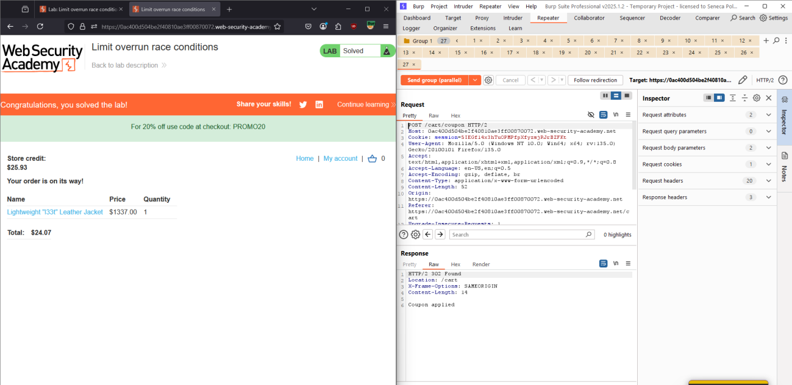
*Figure 1 — Parallel `POST /cart/coupon` requests exploiting the check-then-use gap to apply the discount repeatedly.*

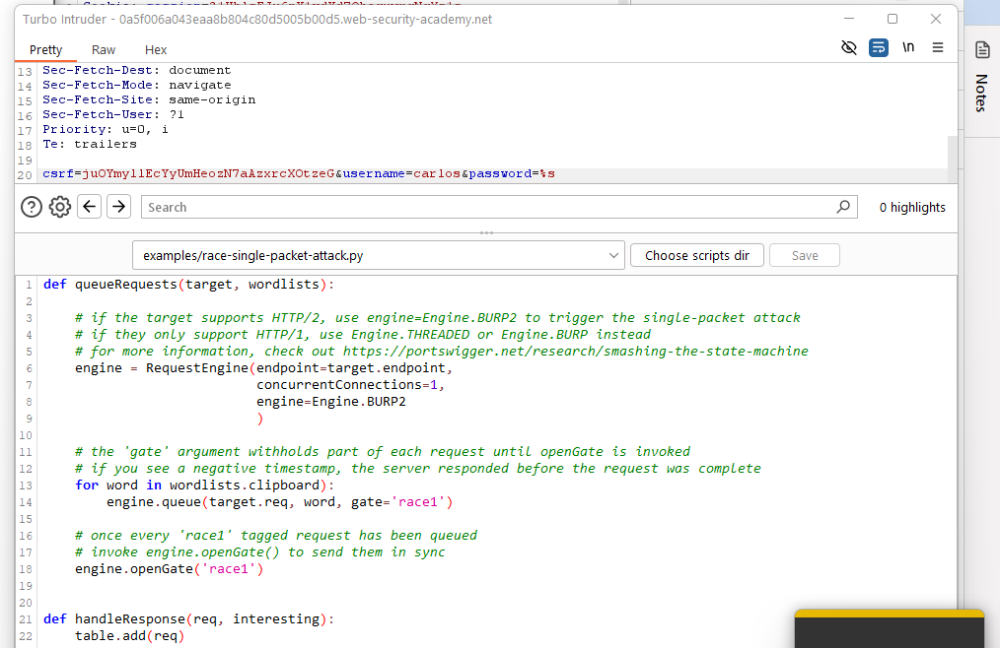
*Figure 2 — Cumulative discount stacking bringing the jacket's price within reach of the available store credit.*

### Lab 2 — Bypassing Rate Limits via Race Conditions (Practitioner)

**Objective:** Brute-force `carlos`'s password despite login rate limiting, then delete the user via the admin panel.

Standard sequential brute-forcing was blocked by rate limiting. Turbo Intruder's `race-single-packet-attack.py` script was used to fire the entire password wordlist as a burst of near-simultaneous requests, exploiting the fact that rate-limit counters are typically updated *after* each request completes — meaning a sufficiently large burst can have many requests "in flight" and evaluated against credentials before the rate limiter registers enough failures to block further attempts.

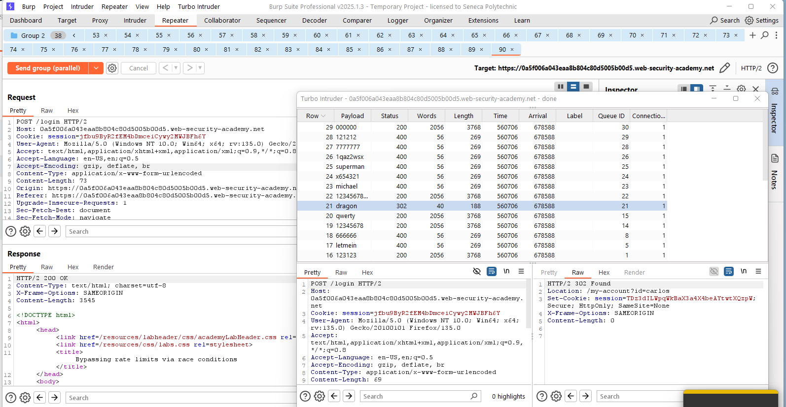
*Figure 3 — Turbo Intruder's race-single-packet script configured with the password wordlist against user `carlos`.*

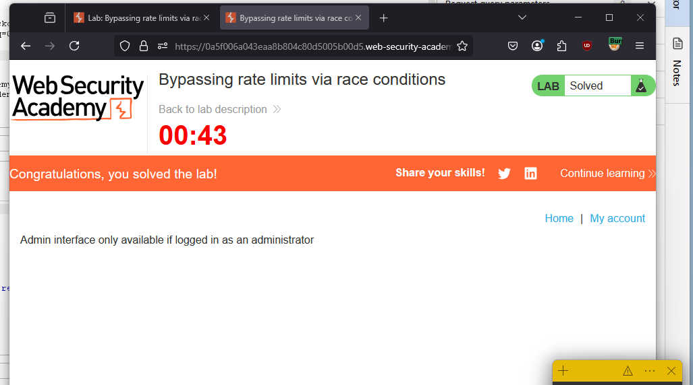
*Figure 4 — Correct password `dragon` identified, having bypassed the rate limiter via parallel delivery.*

Logging in with `carlos:dragon` succeeded, and the user was deleted through the admin panel to complete the lab.

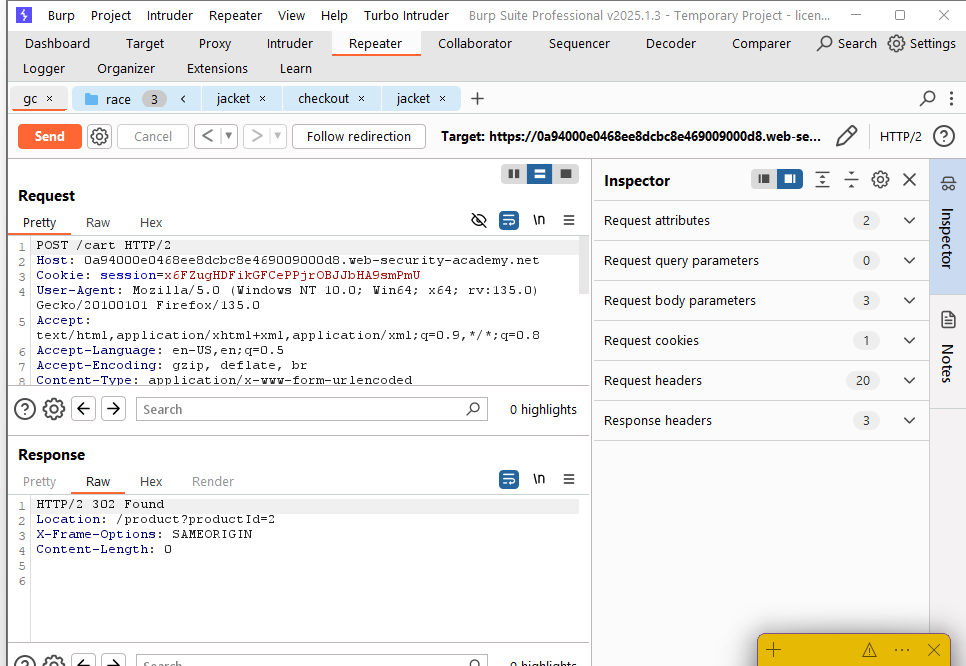
*Figure 5 — Login as `carlos` confirmed, followed by deletion of the account via the admin panel.*

### Lab 3 — Multi-Endpoint Race Conditions (Practitioner)

**Objective:** Purchase the jacket despite insufficient store credit, exploiting a race between two different endpoints.

A $10 gift card was first added to the cart via `POST /cart`.

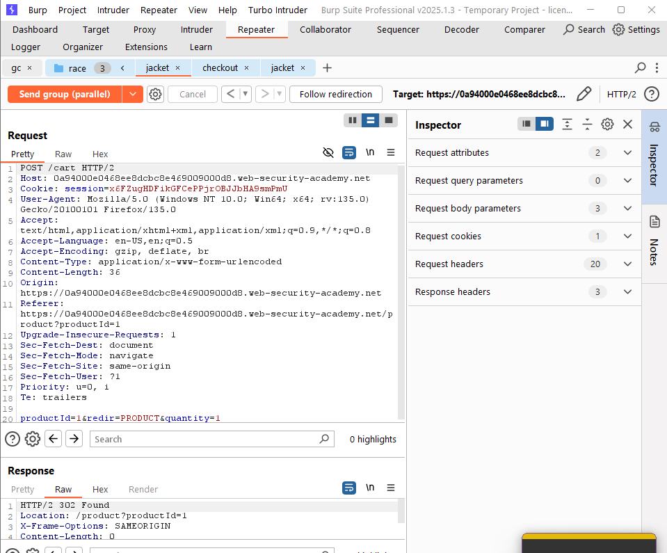
*Figure 6 — Gift card added via `POST /cart`, setting up the exploitable checkout race.*

Three requests were then sent in parallel: the first and third added the jacket to the cart (`POST /cart`), while the middle request initiated checkout (`POST /cart/checkout`). Because order validation and confirmation were not atomic, this sequencing allowed the jacket to be added to the cart *during* the window between checkout validation and confirmation, letting it ride through checkout without being separately validated against available funds.

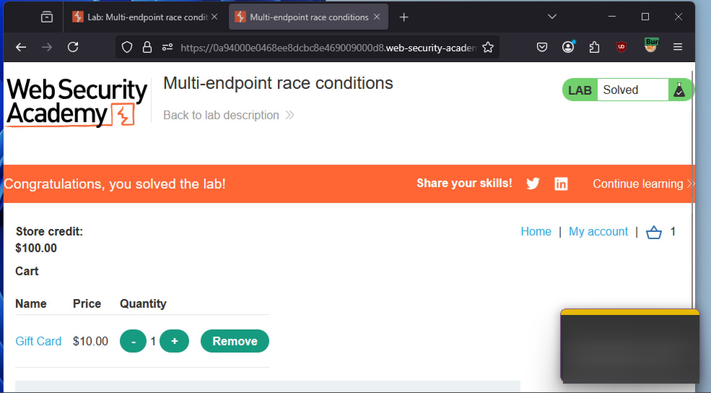
*Figure 7 — Interleaved `POST /cart` and `POST /cart/checkout` requests exploiting the validation/confirmation gap to check out the jacket without sufficient funds.*

### Lab 4 — Single-Endpoint Race Conditions (Practitioner)

**Objective:** Associate `carlos@ginandjuice.shop` with the attacker's own account to inherit admin privileges, via a race in the email-change confirmation flow.

The vulnerability was first characterized by sending two parallel `POST /my-account/change-email` requests with two different made-up addresses; the resulting confirmation links were cross-wired (e.g., the confirmation link intended for `test1` instead confirmed `test2`), revealing that the confirmation-token generation and email-association logic were not properly isolated per-request under concurrent load.

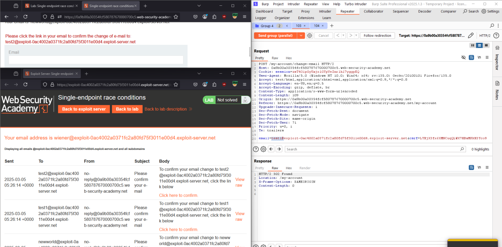
*Figure 8 — Two parallel email-change requests producing a cross-wired confirmation link, exposing the underlying race condition.*

Exploiting this directly, one parallel request set the target email to a made-up address (`test1`) while the second set it to `carlos@ginandjuice.shop`.

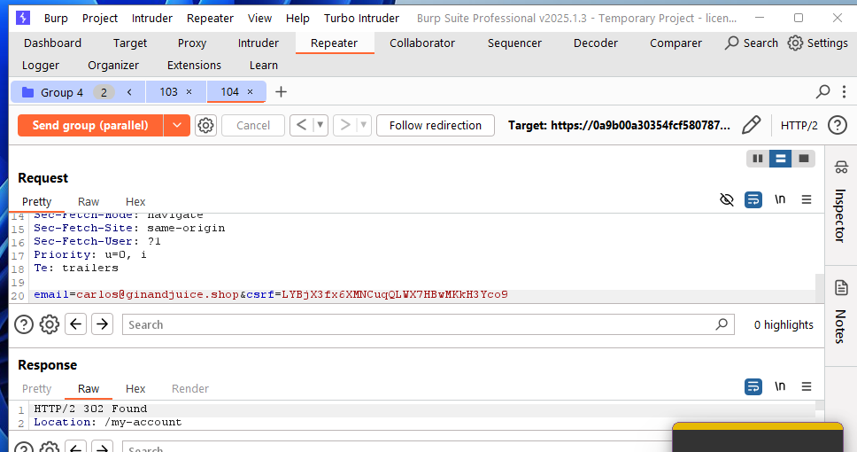
*Figure 9 — Second parallel request set to `carlos@ginandjuice.shop`, racing against the first to cross-wire the resulting confirmation token.*

The confirmation link generated for `test1` was then used to confirm the change to `carlos@ginandjuice.shop` instead, granting the attacker's session ownership of Carlos's email and, with it, his account's privilege level.

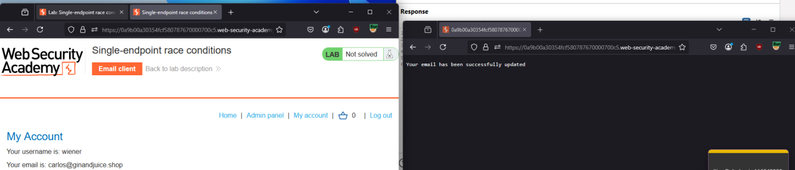
*Figure 10 — Confirmation link issued for `test1` successfully confirming `carlos@ginandjuice.shop`, completing the account takeover.*

### Lab 5 — Exploiting Time-Sensitive Vulnerabilities (Practitioner)

**Objective:** Reset `carlos`'s password by exploiting a predictable, timestamp-based password reset token generator.

If reset tokens are derived from a timestamp with insufficient precision/entropy, two reset requests issued at nearly the same instant can receive **identical tokens**. A `GET /forgot-password` request was sent to Repeater; its session cookie and CSRF token were removed and replaced with a freshly issued pair extracted from the response, producing two independent password-reset request contexts.

*Figure 11 — Two `POST /forgot-password` requests, from separate sessions, prepared to be fired with matching processing timestamps.*

One request targeted the attacker's own account and the other targeted `carlos`, sent as close to simultaneously as possible; observed processing times for both were effectively identical.

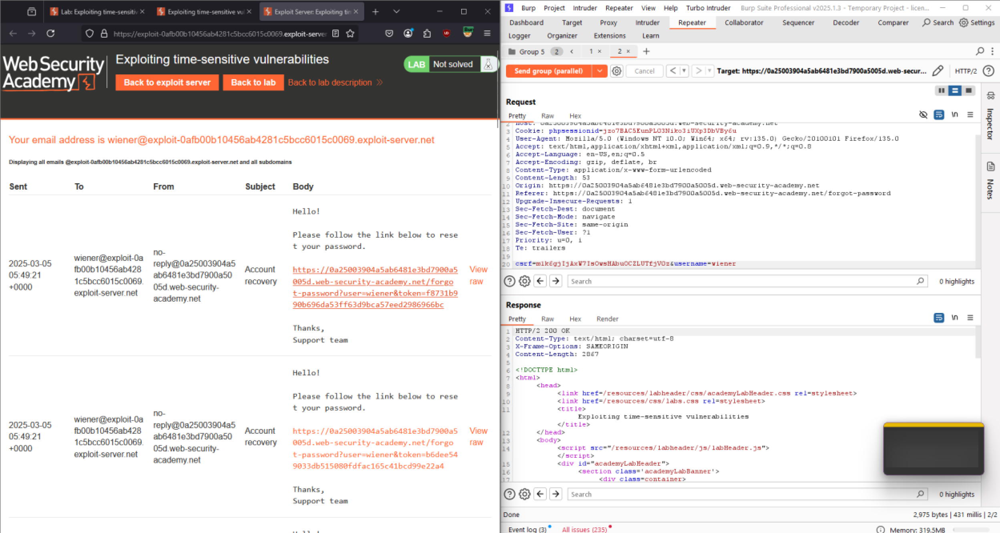
*Figure 12 — Reset requests for the attacker's own account and for `carlos` sent in parallel with matched processing time.*

Because both requests were processed within the same timestamp window, the token generated for the attacker's own account confirmation email was **identical** to the one generated for Carlos's — allowing the attacker to use their own received token to complete Carlos's password reset directly.

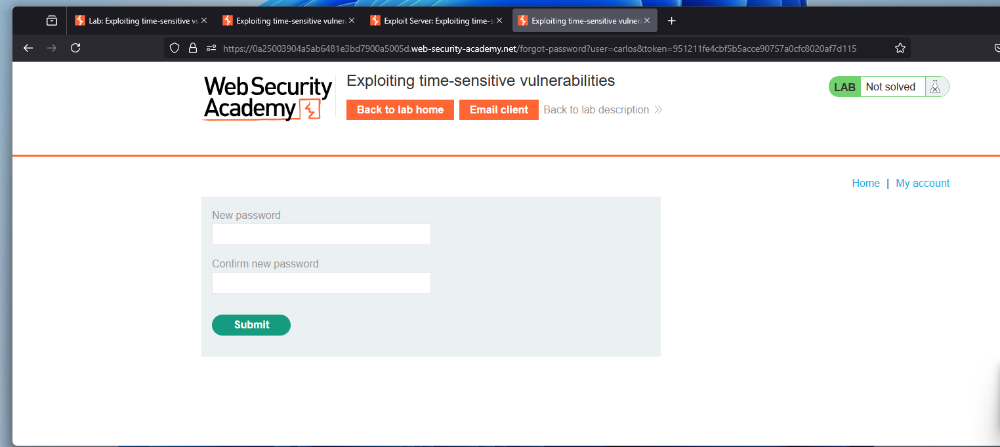
*Figure 13 — Token received via the attacker's own reset email matching the token required for Carlos's account, confirming the timestamp-based collision.*

## 5. Findings / Observations

| # | Finding | Severity | Root Cause |
|---|---|---|---|
| 1 | Single-use discount coupon applicable multiple times under concurrent requests | High | Non-atomic check-then-apply logic on coupon redemption |
| 2 | Login rate limiting bypassable via burst/parallel request delivery | Critical | Rate-limit counter updated after request completion rather than enforced atomically per attempt |
| 3 | Checkout completable without sufficient funds via a cross-endpoint race | Critical | Cart mutation and checkout validation not treated as a single atomic transaction |
| 4 | Account takeover via cross-wired email confirmation tokens under concurrent requests | Critical | Confirmation token generation/association not isolated per-request |
| 5 | Password reset tokens derived from a low-precision timestamp, enabling token collision | Critical | Insufficient entropy/uniqueness in reset token generation under concurrent load |

## 6. Conclusion

All five labs shared the same structural weakness: **operations that must be atomic — a check followed by a state update — were implemented as separate steps with a window of vulnerability between them.** Coupon redemption, login rate limiting, checkout validation, email confirmation, and token generation were all exploitable specifically because concurrent requests could interleave within that window. The general remediation is consistent across all five: enforce atomicity at the data layer (e.g., database-level locking or compare-and-swap operations on the relevant state), rather than relying on sequential application logic that assumes requests arrive one at a time.

## 7. References

[1] PortSwigger, "Race conditions." [Online]. Available: https://portswigger.net/web-security/race-conditions

[2] Kettle, J. (2023, March 9). "Cracking the lens: targeting HTTP's hidden attack-surface." PortSwigger Research. [Online]. Available: https://portswigger.net/research/cracking-the-lens-targeting-https-hidden-attack-surface#aux
