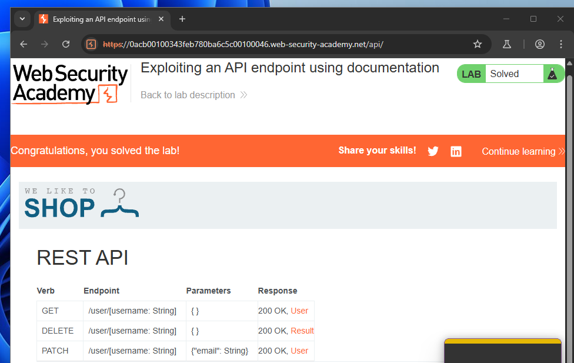
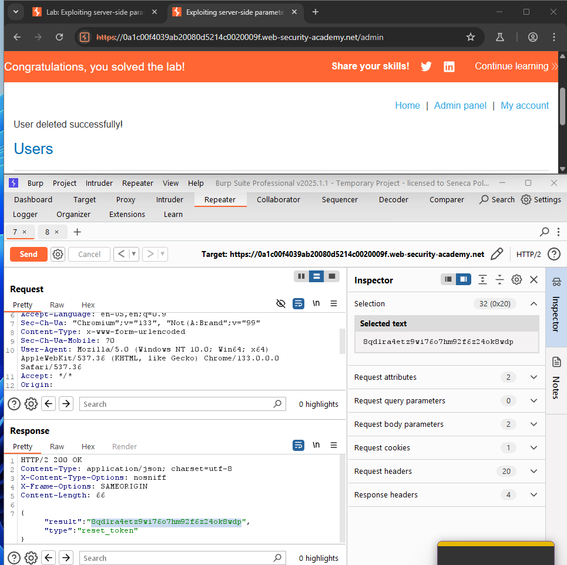
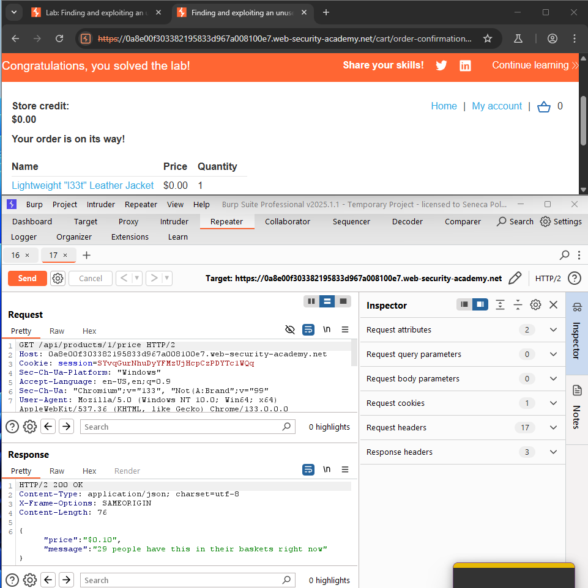
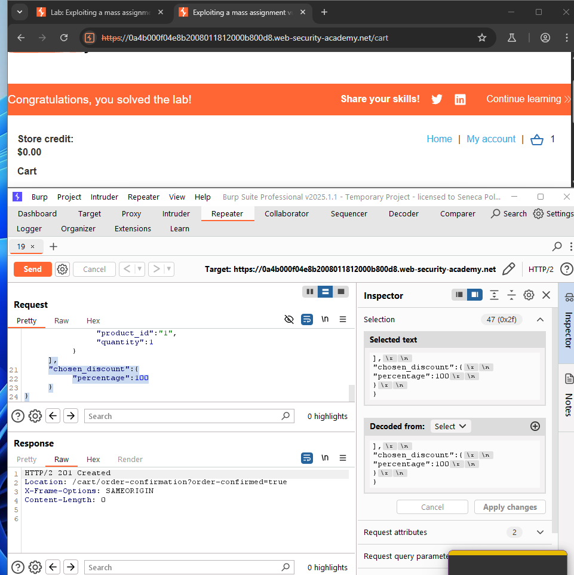
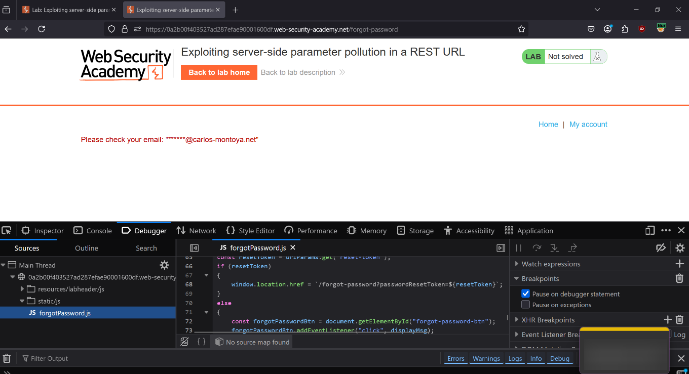
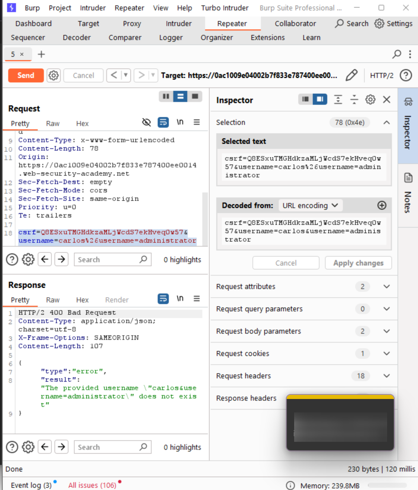
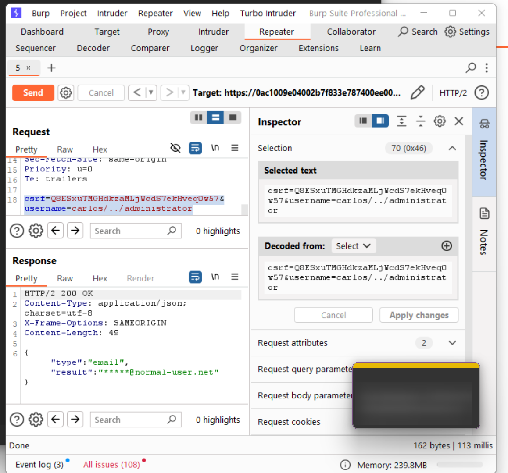
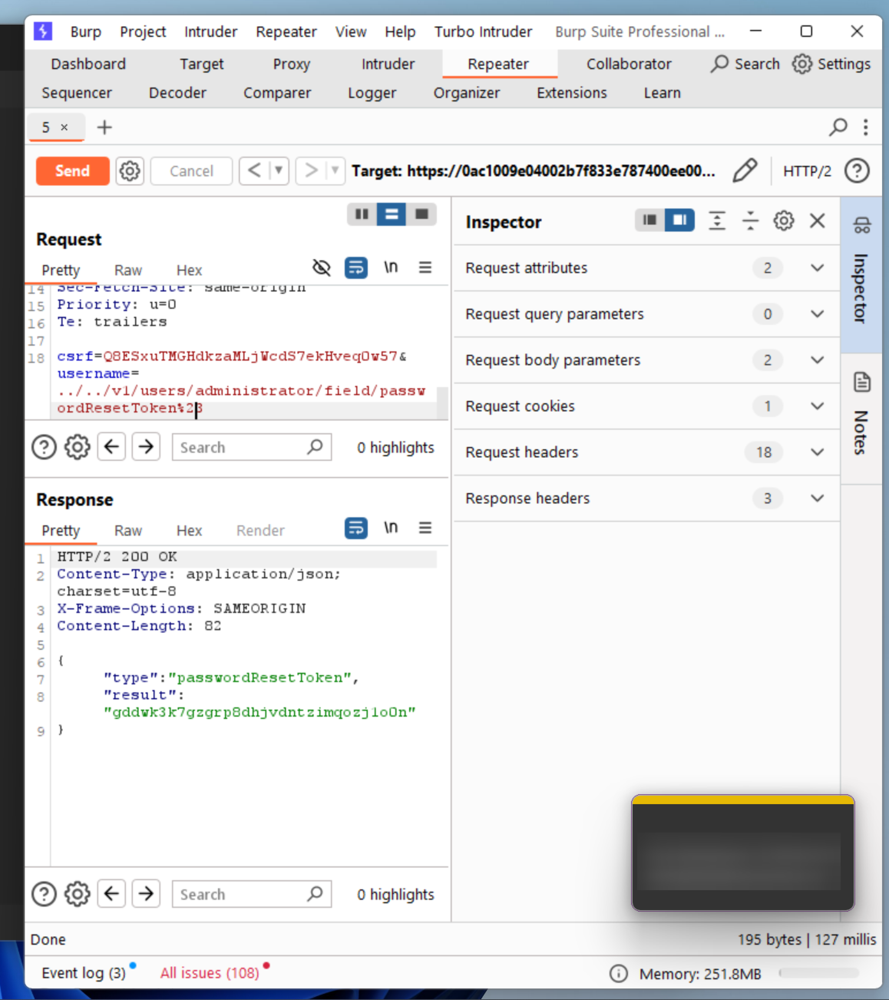

# Lab 1-11 — API Testing
### Companion Lab Report: PortSwigger Web Security Academy

| | |
|---|---|
| **Author** | Iliya Dehghani |
| **Topic** | API Testing (server-side parameter pollution, mass assignment, hidden endpoints) |
| **Tooling** | Burp Suite Professional (Repeater, Param Miner) |
| **Report Type** | Vulnerability walkthrough / technical lab report |

---

## 1. Objective

This report covers five PortSwigger Web Security Academy labs on API security testing: exploiting a documented endpoint directly, server-side parameter pollution in both a query string and a REST URL path, discovering and exploiting an undocumented endpoint, and exploiting a mass assignment vulnerability in checkout logic.

## 2. Background

A **web API** is a set of rules and protocols allowing software to communicate over the web, typically using HTTP methods (`GET`, `POST`, `PUT`, `DELETE`) and structured data formats (JSON, XML).

**API reconnaissance (API recon)** is the process of identifying and mapping an API's structure, functionality, and potential vulnerabilities — essential groundwork before targeted testing. **API documentation discovery** identifies and catalogs available documentation (endpoints, parameters, expected responses) to understand what surface exists to test.

**Identifying API endpoints:**
- Reviewing official API documentation for listed endpoints/methods/parameters
- Browser DevTools, filtering Fetch/XHR traffic during normal application use
- Analyzing client-side source code (JavaScript) for hardcoded endpoint references
- Automated scanning tools
- Path prediction based on observed naming conventions

**Finding hidden parameters:**
- Fuzzing candidate parameter names and observing response differences
- Reviewing JavaScript for parameter references absent from the visible UI
- Automated tools such as Burp's **Param Miner** extension, which guesses common parameter names and analyzes server response deltas

## 3. Tools Used

| Tool | Purpose |
|---|---|
| Burp Suite Repeater | Crafting and replaying modified API requests |
| Param Miner (Burp extension) | Automated hidden-parameter discovery |
| API documentation (in-app) | Identifying legitimate endpoints for abuse |

## 4. Methodology and Walkthrough

### Lab 1 — Exploiting an API Endpoint Using Documentation

**Objective:** Delete user `carlos` using an endpoint identified from exposed API documentation.

Reviewing the application's own exposed API documentation revealed a set of user-management endpoints, including one enabling user deletion. This endpoint was invoked directly against `carlos`, requiring no further discovery effort since the documentation itself disclosed the attack surface.


*Figure 1 — User-management endpoint, identified via the application's own API documentation, used to delete `carlos` directly.*

### Lab 2 — Exploiting Server-Side Parameter Pollution in a Query String

**Objective:** Obtain the administrator's password reset token by polluting server-side query parameters.

The password reset request's `username` parameter was modified to smuggle an additional query parameter into the server-side request the application constructs internally:

```
username=administrator%26field=reset_token%23
```

The `%26` (`&`) injects a second parameter (`field=reset_token`) and the trailing `%23` (`#`) truncates anything the application would normally append after the username — causing the server-side request to return the `reset_token` field for the `administrator` account instead of the expected response. This token was then used to reset the administrator's password and complete the lab.


*Figure 2 — `username=administrator%26field=reset_token%23` polluting the server-side query, exposing the administrator's password reset token.*

### Lab 3 — Finding and Exploiting an Unused API Endpoint

**Objective:** Obtain the "Lightweight l33t Leather Jacket" for free via an undocumented endpoint.

An endpoint `/api/products/<productId>/price` was discovered (returning a product's price via `GET`). Switching the HTTP method from `GET` to `PATCH` and supplying a JSON body revealed the endpoint also accepted price *updates* with no additional authorization:

```
PATCH /api/products/1/price
{"price":0}
```

This set the jacket's price to $0.00, allowing a free purchase.


*Figure 3 — `PATCH /api/products/1/price` with `{"price":0}`, exploiting an undocumented write capability on a read-only-looking endpoint.*

### Lab 4 — Exploiting a Mass Assignment Vulnerability

**Objective:** Purchase a product with no store credit by exploiting mass assignment in the checkout API.

Comparing the `GET /api/checkout` response against the `POST /api/checkout` request body revealed a discrepancy: the `GET` response included a `chosen_discount` field (with a `percentage` sub-value) that was entirely absent from the `POST` request template. Adding `chosen_discount` with `percentage: 100` to the `POST /api/checkout` body was accepted by the server — a classic **mass assignment** flaw, where the API blindly binds any client-supplied field onto the underlying order object rather than restricting writable fields to an explicit allowlist — resulting in a 100% discount and a $0.00 checkout.


*Figure 4 — `chosen_discount: {percentage: 100}` injected into the checkout `POST` body, exploiting mass assignment to apply a full discount.*

### Lab 5 — Exploiting Server-Side Parameter Pollution in a REST URL

**Objective:** Reset the administrator's password with no initial credentials, exploiting parameter pollution in a REST-style URL path (rather than a query string).

Initiating a password reset for `carlos` (with no login required) revealed two things: a partially masked email (`******@carlos-montoya.net`) and the internal API mechanism handling reset requests.


*Figure 5 — Password reset flow for `carlos` disclosing a partially masked email and the backing API mechanism.*

Attempting to inject `administrator` into the path-based reset request using several encodings (`%23`, `%26`, `#`) produced an `Invalid route` error — indicating the input was being placed directly into an internal REST path and that a fragment (`#`) was truncating trailing data, with the error message additionally referencing an internal API definition file.


*Figure 6 — `Invalid route` error triggered by path pollution attempts, revealing internal path-truncation behavior and a reference to an internal API definition.*

A directory traversal sequence in the same position **did** succeed in navigating the internal REST path structure.


*Figure 7 — Directory traversal (`../`) successfully navigating the internal API's REST path structure.*

Combining the correct path with the `/api/` endpoint and adjusting the API version value (identified during testing) caused the server to return a valid password reset token.


*Figure 8 — Adjusted `/api/` path and version value returning a valid password reset token for the target account.*

That token was then submitted via `/forgot-password?passwordResetToken=...`, successfully resetting the administrator's password and completing the lab.

## 5. Findings / Observations

| # | Finding | Severity | Root Cause |
|---|---|---|---|
| 1 | Sensitive user-management endpoints discoverable and directly exploitable from exposed documentation | High | API documentation exposed without corresponding access control on the documented endpoints |
| 2 | Server-side parameter pollution via unsanitized query-string input | Critical | User input concatenated into an internal server-side request without escaping delimiter characters |
| 3 | Undocumented endpoint accepts unauthenticated write operations via an unexpected HTTP method | Critical | Method-level authorization not enforced consistently across `GET`/`PATCH` on the same resource |
| 4 | Mass assignment binding client-supplied fields directly onto server-side objects | Critical | No allowlist restricting which fields a client request may set |
| 5 | Server-side parameter pollution via unsanitized REST path segments | Critical | User input placed directly into an internal REST path with insufficient encoding/boundary handling |

## 6. Conclusion

The unifying theme across these five labs is that **API attack surface frequently exceeds what documentation or the visible UI suggests** — undocumented HTTP methods, hidden response fields, and internal routing details leaked through error messages all expanded the practical attack surface well beyond the endpoints an attacker would find by simply reading the docs. Server-side parameter pollution (Labs 2 and 5) in particular demonstrates that any user input forwarded into an internally constructed request — whether a query string or a REST path — must be strictly delimited and encoded, since the application's *own* request-construction logic becomes the injection vector rather than a database or shell. Mass assignment (Lab 4) reinforces a broader API design principle: bind only an explicit allowlist of client-writable fields, never the full body of an incoming request.

## 7. References

[1] PortSwigger, "API testing." [Online]. Available: https://portswigger.net/web-security/api-testing

[2] PortSwigger, "All labs — API testing." [Online]. Available: https://portswigger.net/web-security/all-labs#api-testing
