# Lab 2-1-A — Cross-Site Scripting (XSS), Part 1
### Companion Lab Report: PortSwigger Web Security Academy

| | |
|---|---|
| **Author** | Iliya Dehghani |
| **Topic** | Cross-Site Scripting (Reflected, Stored, DOM-based) |
| **Tooling** | Burp Suite Professional (Repeater, Intruder, Site Map), CodeQL |
| **Report Type** | Vulnerability walkthrough / technical lab report |

---

## 1. Objective

This report covers the first fifteen PortSwigger Web Security Academy XSS labs (Apprentice through Practitioner) — reflected, stored, and DOM-based XSS across HTML, attribute, JavaScript-string, jQuery, and AngularJS sink contexts, plus filter-evasion techniques against tag/attribute blocklists — along with a Part B exercise applying GitHub CodeQL static analysis to the OWASP Juice Shop application.

## 2. Background

**Cross-site scripting (XSS)** allows an attacker to inject malicious scripts into pages viewed by other users, exploiting an application's failure to validate or escape untrusted data before including it in a response. A successful XSS attack executes in the victim's browser session, enabling impersonation, credential theft, or unauthorized actions.

**Three types of XSS:**
- **Stored (persistent) XSS** — malicious input is saved server-side (e.g., a database) and served to other users later
- **Reflected (non-persistent) XSS** — malicious input is included in the immediate response (e.g., via URL parameters), executing when a victim follows a crafted link
- **DOM-based XSS** — the vulnerability exists entirely in client-side script that processes user input, with no server involvement in the injection itself

**Impact:** stealing session tokens/cookies (identity theft, account takeover), impersonating users, delivering malware, and defacing site content.

**Content Security Policy (CSP)** is a browser feature that can mitigate XSS impact, though it can frequently be bypassed to still exploit the underlying vulnerability. **Dangling markup injection** is a technique for exfiltrating data across domains when a full script-injection payload is blocked by input filters — often used to capture CSRF tokens or other sensitive values visible to another user.

**Prevention:** strict input validation on arrival (reject anything not matching expected type/format); context-appropriate output encoding (HTML, URL, JavaScript, or CSS encoding depending on where data is inserted); correct response headers (`Content-Type`, `X-Content-Type-Options`) to prevent MIME-sniffing-based execution; and CSP as a defense-in-depth layer.

## 3. Tools Used

| Tool | Purpose |
|---|---|
| Burp Suite Repeater/Intercept | Crafting and testing XSS payloads against various injection contexts |
| Burp Intruder | Fuzzing allowed tags/attributes against a filtering WAF |
| Burp Site Map | Locating client-side JavaScript sinks (e.g., `searchResults.js`) |
| GitHub CodeQL | Static analysis vulnerability scanning (Part B) |

## 4. Methodology and Walkthrough

### Lab 1 — Reflected XSS into HTML Context with Nothing Encoded (Apprentice)

The payload `` was submitted via the search box. With no encoding applied to the reflected value, the script executed directly in the HTML response.

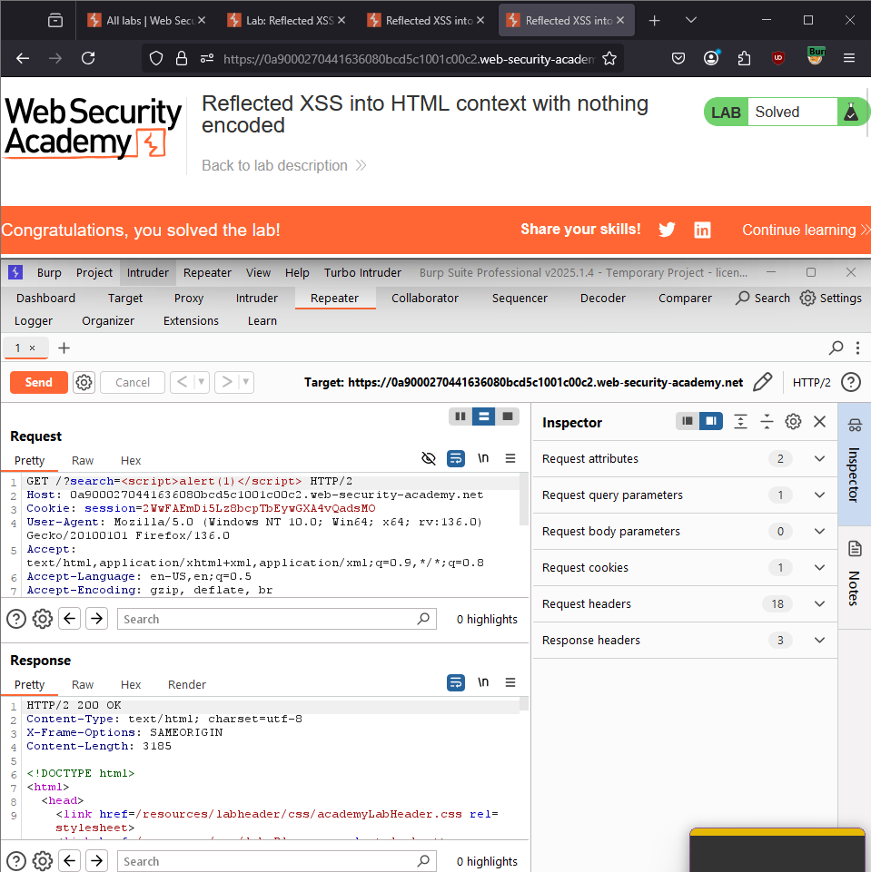
*Figure 1 — `` reflected without encoding, executing directly in the page.*

### Lab 2 — Stored XSS into HTML Context with Nothing Encoded (Apprentice)

The same payload was submitted into a persisted field (a comment). Since the stored value was later rendered without encoding, the script executed for any user viewing the comment.

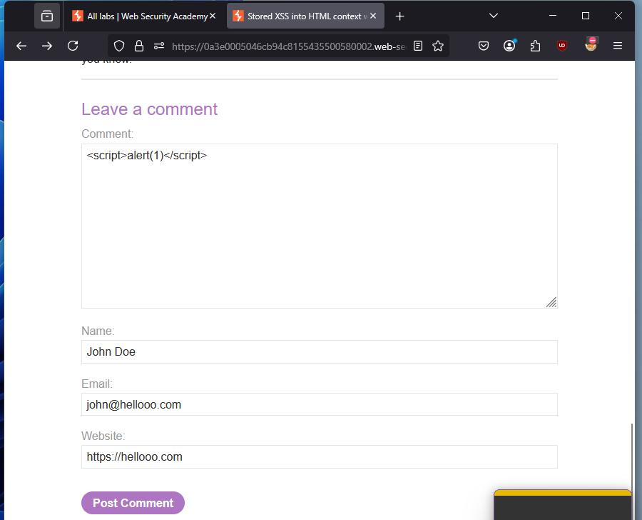
*Figure 2 — `` submitted as a comment.*

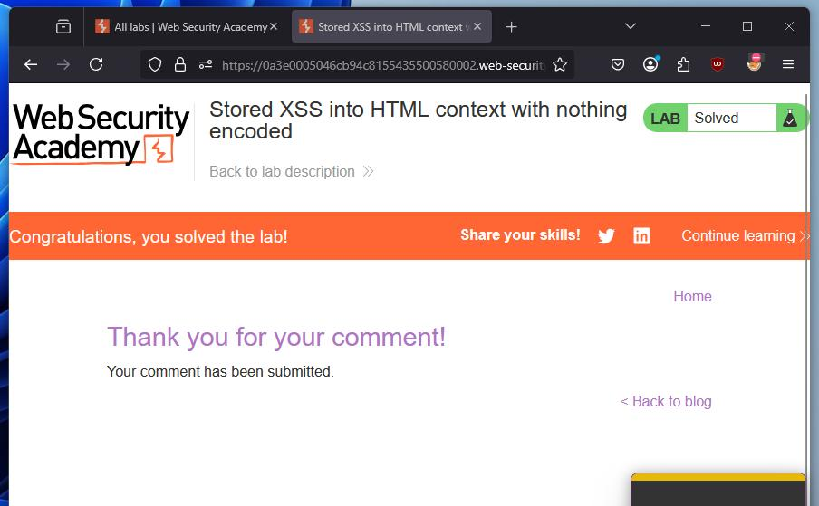
*Figure 3 — Stored payload executing automatically when the comment page renders.*

### Lab 3 — DOM XSS in `document.write` Sink Using Source `location.search` (Apprentice)

A crafted URL parameter containing `"><svg onload=alert(1)>` was passed to a client-side `document.write` call with no sanitization, executing on page load.

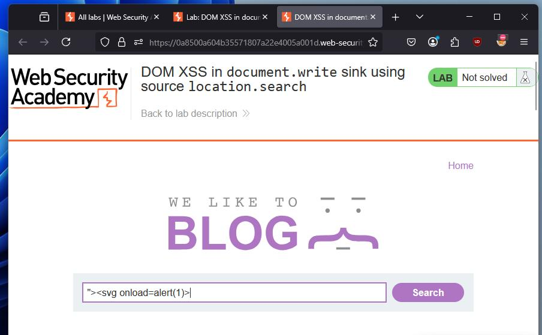
*Figure 4 — `"><svg onload=alert(1)>` breaking out of the `document.write` context via `location.search`.*

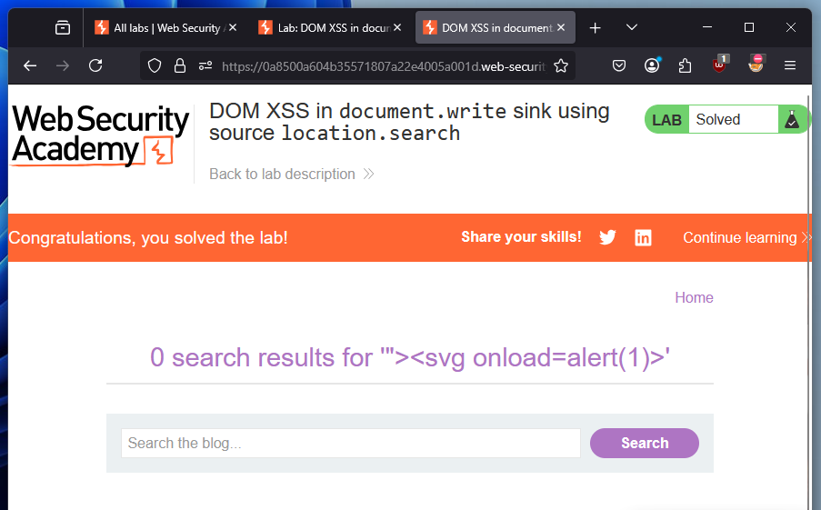
*Figure 5 — Payload executing automatically as the page renders the unsanitized `document.write` output.*

### Lab 4 — DOM XSS in `innerHTML` Sink Using Source `location.search` (Apprentice)

The payload `` was injected into a parameter later assigned to an element's `innerHTML`, triggering the `onerror` handler once the browser failed to load the invalid image source.

*Figure 6 — `` executing via unsanitized `innerHTML` assignment.*

### Lab 5 — DOM XSS in jQuery Anchor `href` Attribute Sink Using `location.search` Source (Apprentice)

Modifying the `returnPath` query parameter placed its value directly inside an anchor's `href` attribute (confirmed by supplying a random alphanumeric string and observing its placement).

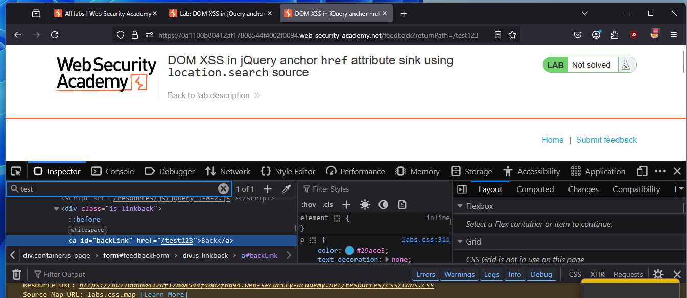
*Figure 7 — Test string via `returnPath` confirming direct, unsanitized placement into an `href` attribute.*

Supplying `javascript:alert(1)` as the parameter value caused the payload to execute upon the link being clicked, since jQuery set the `href` attribute without validating its scheme.

*Figure 8 — `javascript:alert(1)` set as the anchor's `href`, executing when the link is clicked.*

### Lab 6 — DOM XSS in jQuery Selector Sink Using a `hashchange` Event (Apprentice)

The homepage used jQuery's `$()` selector to auto-scroll to a blog post specified via `location.hash`. An `<iframe>` was crafted with its `src` pointing at the vulnerable page and an `onload` handler that appended a malicious payload (``) to the hash, triggering the `hashchange` event with no victim interaction required.

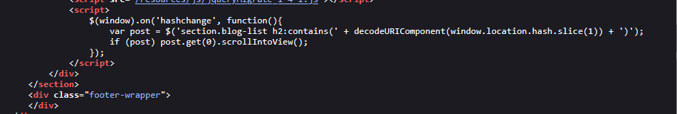
*Figure 9 — `<iframe>` with an `onload` handler that programmatically triggers `hashchange`, injecting the malicious hash payload.*

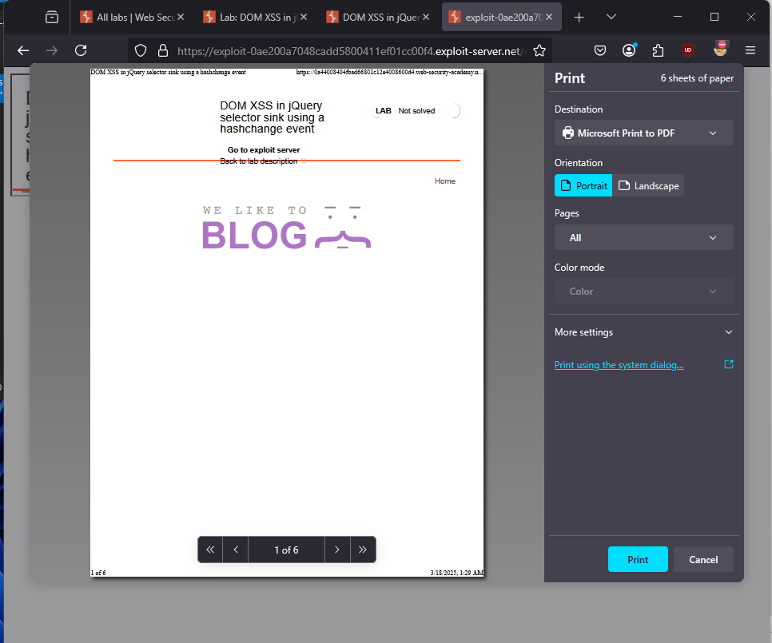
*Figure 10 — jQuery's `$()` selector resolving the malicious hash value, executing the injected `onerror` handler.*

Delivering the exploit (via the exploit server) to a simulated victim completed the lab.

### Lab 7 — Reflected XSS into Attribute with Angle Brackets HTML-Encoded (Apprentice)

The search term was reflected inside a double-quoted HTML attribute value. The suggested solution payload, `"onmouseover="alert(1)`, was tested but did not reproduce successfully in this attempt despite matching the documented solution approach.

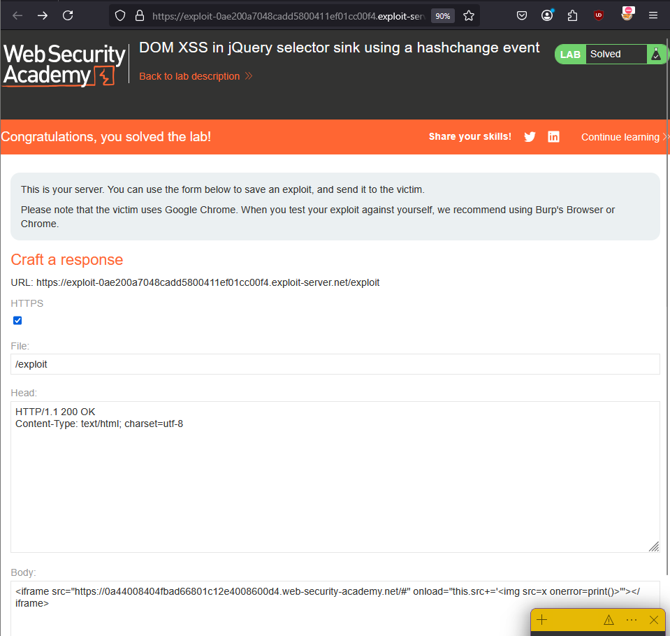
*Figure 11 — Search term placement confirmed inside a double-quoted HTML attribute value.*

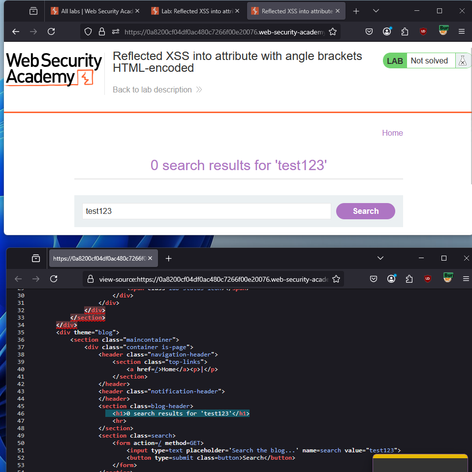
*Figure 12 — `"onmouseover="alert(1)` payload attempted per the documented solution; not reproduced successfully in this session.*

### Lab 8 — Stored XSS into Anchor `href` Attribute with Double Quotes HTML-Encoded (Apprentice)

A comment was posted with an alphanumeric "website" field value to confirm placement inside an anchor's `href`.

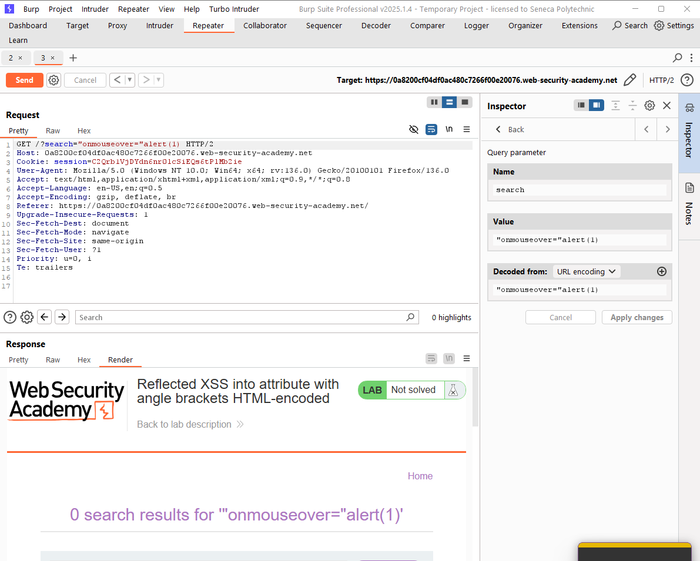
*Figure 13 — Test value confirming placement of the "website" comment field inside an `<a href="...">` attribute.*

Since the surrounding double quotes were HTML-encoded (preventing attribute breakout) but the `href` scheme itself was not validated, `javascript:alert(1)` was submitted as the website value — executing when a victim clicked the resulting link.

### Lab 9 — Reflected XSS into a JavaScript String with Angle Brackets HTML Encoded (Apprentice)

User input was embedded within a JavaScript string literal with angle brackets encoded but single quotes left unescaped. The payload `'-alert(1)-'` was designed to terminate the string and execute the alert function; the payload executed visibly (the alert appeared), but the lab's completion flag was not triggered in this attempt, and the "Copy URL" delivery method suggested by the lab also did not resolve the discrepancy.

### Lab 10 — DOM XSS in `document.write` Sink Using Source `location.search` Inside a Select Element (Practitioner)

Reviewing the client-side JavaScript revealed a `storeId` parameter extracted from `location.search` and written via `document.write` into a new `<option>` element within a `<select>`.

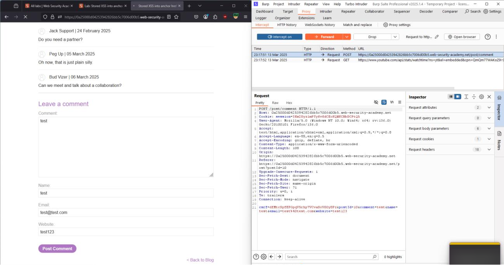
*Figure 14 — Client-side code confirming `storeId` is written unsanitized into a `<select>` element via `document.write`.*

Confirming placement with a test value verified the injection point sat inside the `<select>` element's generated markup.

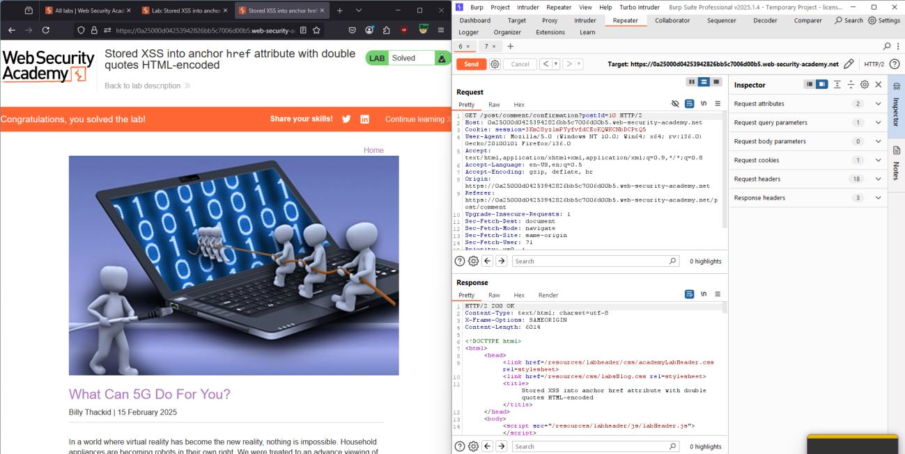
*Figure 15 — `storeId` parameter value rendered directly within the page's `<select>` element structure.*

The URL was then modified to `&storeId="></select>`, breaking out of the `<select>` context entirely and injecting a functional `` tag with an `onerror` handler.

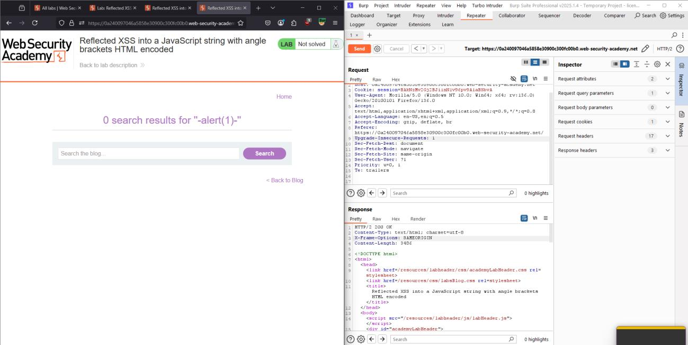
*Figure 16 — `"></select>` breaking out of the `<select>` element and executing the injected image's `onerror` handler.*

### Lab 11 — DOM XSS in AngularJS Expression with Angle Brackets and Double Quotes HTML-Encoded (Practitioner)

Page source confirmed the search string was rendered inside an element with an `ng-app` directive, indicating AngularJS was processing expressions within that scope.

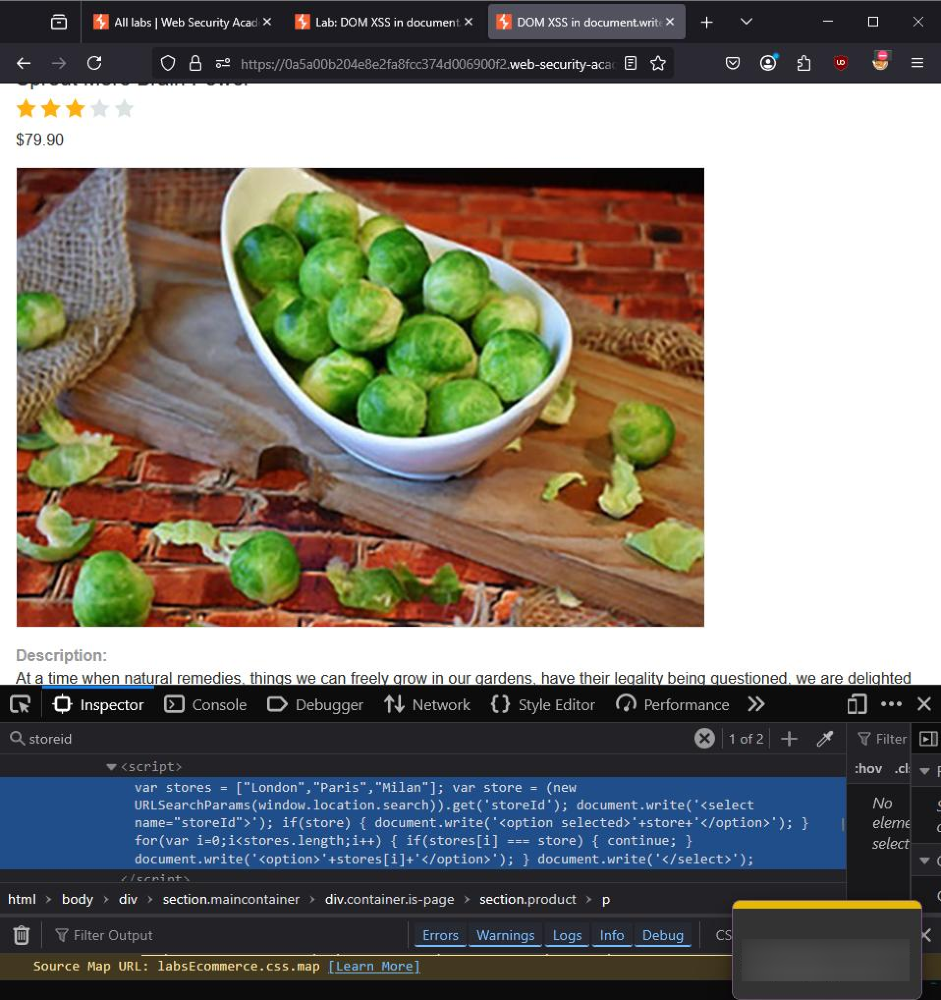
*Figure 17 — Reflected search value confirmed within an `ng-app`-scoped element, enabling AngularJS expression evaluation.*

The AngularJS sandbox-escape expression `{{$on.constructor('alert(1)')()}}` used the `$on` method's constructor to execute arbitrary code, bypassing HTML encoding entirely since the payload never used angle brackets or double quotes — it exploited AngularJS's own expression evaluator instead.

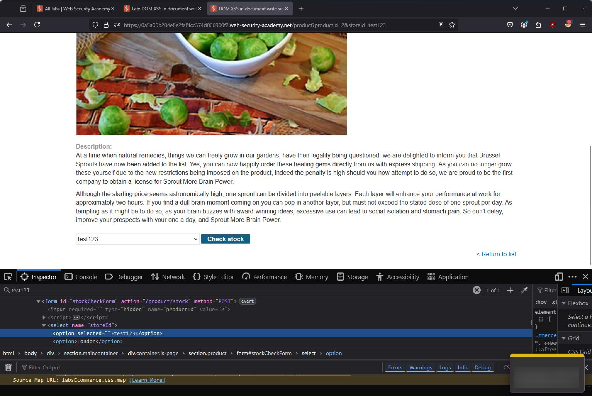
*Figure 18 — `{{$on.constructor('alert(1)')()}}` executing via AngularJS expression evaluation, bypassing HTML-encoding-based defenses entirely.*

### Lab 12 — Reflected DOM XSS (Practitioner)

A search submission was observed to be echoed back in JSON format.

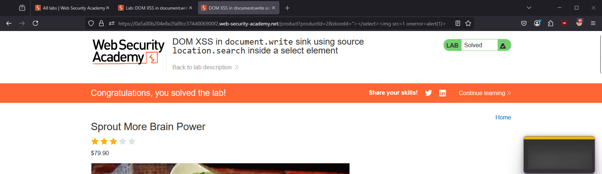
*Figure 19 — Search term reflected in a structured JSON response.*

Reviewing `searchResults.js` (located via Burp's Site Map) revealed the JSON response was passed to an `eval()` call — a dangerous sink. With certain characters blocked, iterative testing was required.

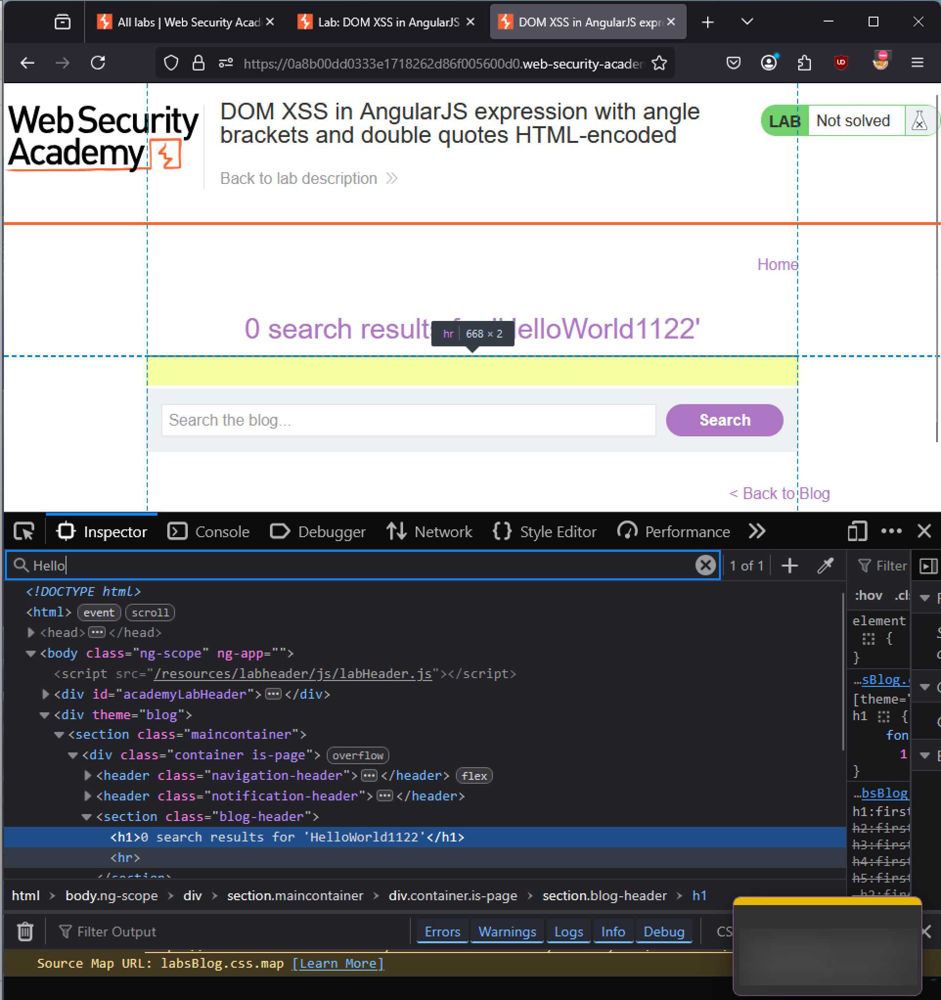
*Figure 20 — `searchResults.js` revealing an `eval()` call processing the JSON search response.*

The payload `\"-alert(1)}//` was tested: the visible `alert(1)` popup fired successfully in the browser, but the lab's completion flag was not awarded, suggesting the payload, while triggering *a* JavaScript execution, did not fully satisfy the lab's specific validation condition.

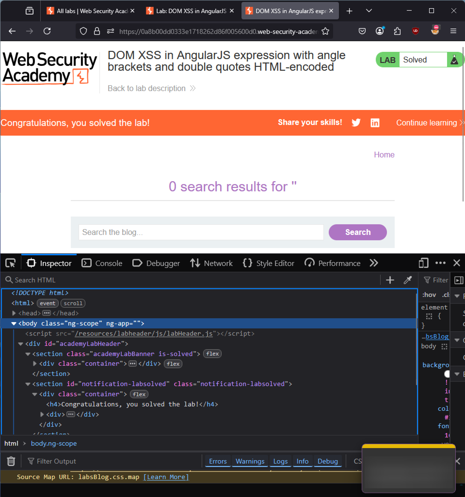
*Figure 21 — `\"-alert(1)}//` payload firing a visible alert, though the lab's completion criteria were not satisfied in this attempt.*

### Lab 13 — Stored DOM XSS (Practitioner)

User-submitted comments were stored server-side and later embedded into the page without sanitization. Submitting `` as a comment triggered the alert for any subsequent viewer, successfully completing the lab.

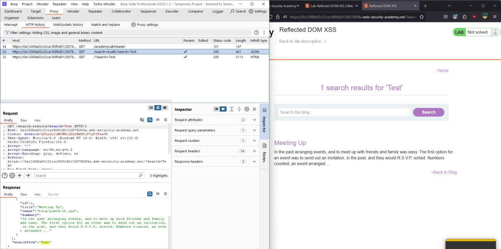
*Figure 22 — `` submitted as a comment, executing for all subsequent viewers.*

### Lab 14 — Reflected XSS into HTML Context with Most Tags and Attributes Blocked (Practitioner)

Following the PortSwigger XSS cheat sheet, Burp Intruder was used to fuzz the full tag list against the search function; `body` and several custom tags returned `200 OK`, indicating they passed the filter.

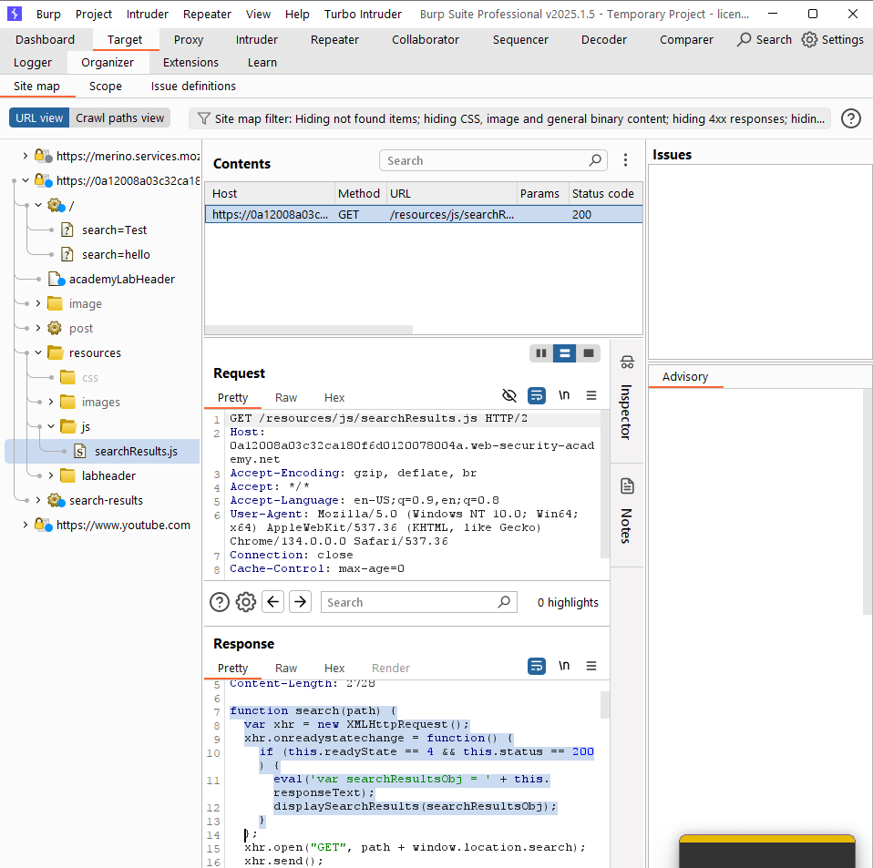
*Figure 23 — Cheat-sheet tag list fuzzed via Intruder, isolating `body` and custom tags as filter-permitted.*

With `body` confirmed as usable, event-handler attributes from the cheat sheet were combined and fuzzed as a second payload set, yielding several apparently successful combinations.

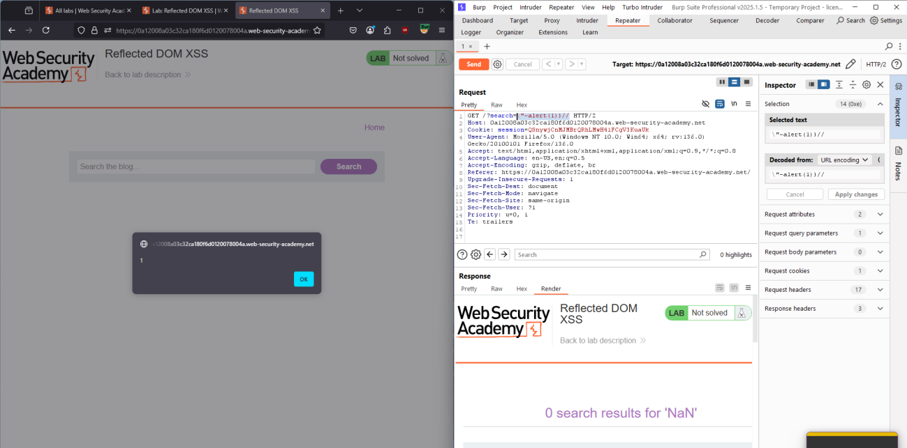
*Figure 24 — Event-handler attribute list fuzzed alongside the `body` tag, surfacing multiple apparently valid payloads.*

Delivery via the PortSwigger exploit server was attempted but did not function correctly in this session; further event-handler variants were tried without success, and this lab is recorded as incomplete due to what appeared to be an exploit-server-side issue rather than a flaw in the identified payload.

### Lab 15 — Reflected XSS into HTML Context with All Tags Blocked Except Custom Ones (Practitioner)

With all standard HTML tags filtered, only custom (non-standard) tags were permitted. The intended payload, `<custom-tag id='x' onfocus='alert(document.cookie)' tabindex='1'>` combined with a `#x` URL fragment (forcing the browser to auto-focus the element on load, firing `onfocus`), was constructed correctly per the lab's guidance. As with Lab 14, delivery via the exploit server did not complete successfully in this session, and the lab is recorded as incomplete for the same infrastructure-related reason.

## 5. Methodology and Walkthrough — Part B: Static Analysis with GitHub CodeQL

The OWASP **Juice Shop** application was forked to a personal GitHub repository to serve as a target for static analysis.

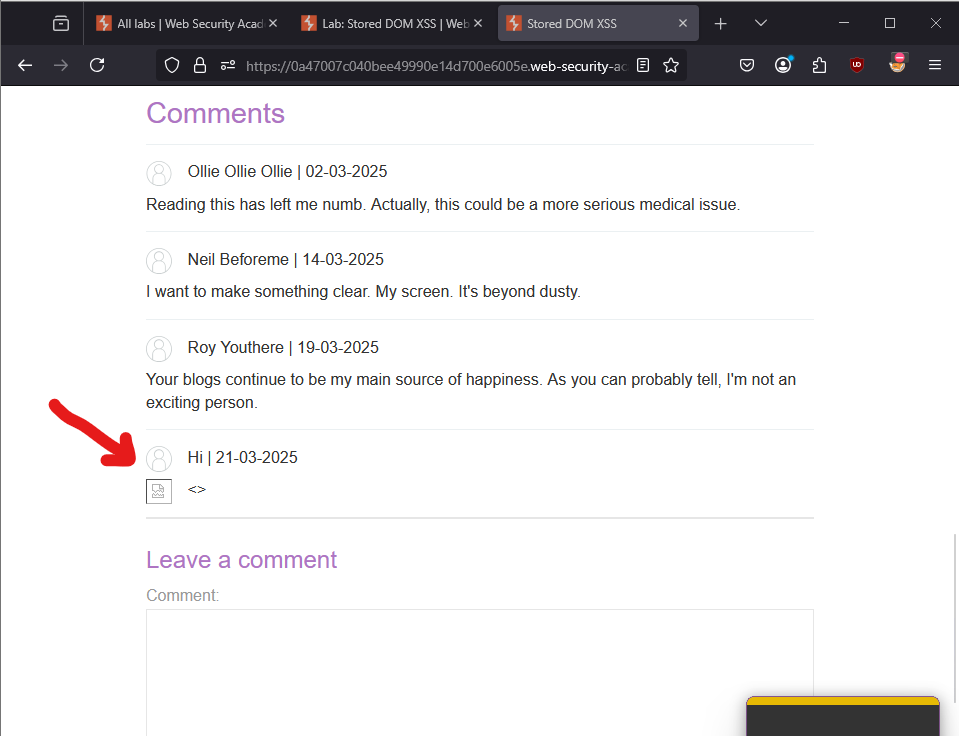
*Figure 25 — Juice Shop repository forked as the CodeQL scan target.*

Enabling GitHub's default CodeQL code scanning setup identified **89 instances** of potential vulnerabilities across the codebase.

*Figure 26 — CodeQL scan summary reporting 89 flagged findings across the Juice Shop codebase.*

Individual findings — including at least one rated critical — included a severity rating, associated CWE classification, and the specific code location and detection timestamp.

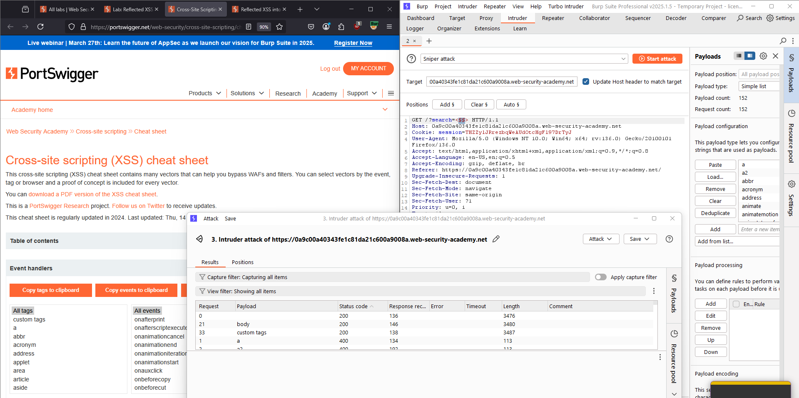
*Figure 27 — Example critical-severity CodeQL finding, showing CWE classification and precise code location.*

**Assessment:** CodeQL is a valuable tool for identifying code-level vulnerability patterns at scale and integrating security feedback directly into the development workflow, but it should be treated as one tool among several — not a sole source of assurance — since static analysis alone cannot substitute for manual review and dynamic testing of the kind performed throughout the labs in this report.

## 6. Findings / Observations

| # | Finding | Severity | Context |
|---|---|---|---|
| 1 | Unencoded reflection/storage of user input directly into HTML | Critical | Labs 1, 2, 13 |
| 2 | Unsanitized client-side sinks (`document.write`, `innerHTML`, jQuery selectors/attributes) processing URL-derived data | Critical | Labs 3–6, 10 |
| 3 | Attribute-context injection where quote encoding is present but scheme/event validation is absent | High | Labs 5, 7, 8 |
| 4 | Framework-specific sandbox escape (AngularJS expression evaluation) bypassing standard HTML encoding | Critical | Lab 11 |
| 5 | `eval()` used on a JSON response containing reflected user input | Critical | Lab 12 |
| 6 | Tag/attribute blocklists bypassable via permitted custom tags and event handlers | High (partially confirmed) | Labs 14, 15 |
| 7 | Static analysis (CodeQL) surfaces a large volume of candidate findings requiring manual triage | Informational | Part B |

## 7. Conclusion

This set of labs traced XSS across every major sink category — raw HTML, DOM properties, jQuery attribute/selector sinks, and framework-specific expression evaluators — and demonstrated that HTML encoding alone is insufficient whenever the actual sink is JavaScript-, attribute-, or framework-expression-based rather than plain markup. Labs 7, 9, 14, and 15 were not fully completed in this engagement (documented candidate payloads either did not trigger the lab's specific flag condition or were blocked by an apparent exploit-server issue) and are recorded as open items for follow-up. The Part B exercise reinforced that static analysis tools like CodeQL are a strong complement to — but not a replacement for — the manual, context-driven testing demonstrated throughout Part A.

## 8. References

[1] PortSwigger, "Cross-site scripting." [Online]. Available: https://portswigger.net/web-security/cross-site-scripting

[2] PortSwigger, "All labs — Cross-site scripting." [Online]. Available: https://portswigger.net/web-security/all-labs#cross-site-scripting

[3] GitHub, "Configuring default setup for code scanning." [Online]. Available: https://docs.github.com/en/code-security/code-scanning/enabling-code-scanning/configuring-default-setup-for-code-scanning

[4] I. Dehghani, "juice-shop (fork)." [Online]. Available: https://github.com/idehghani/juice-shop
